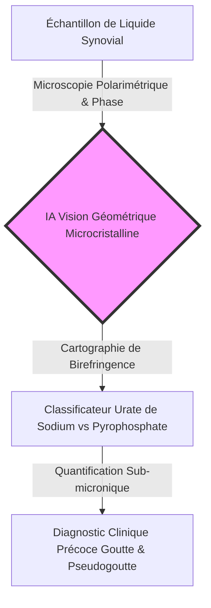
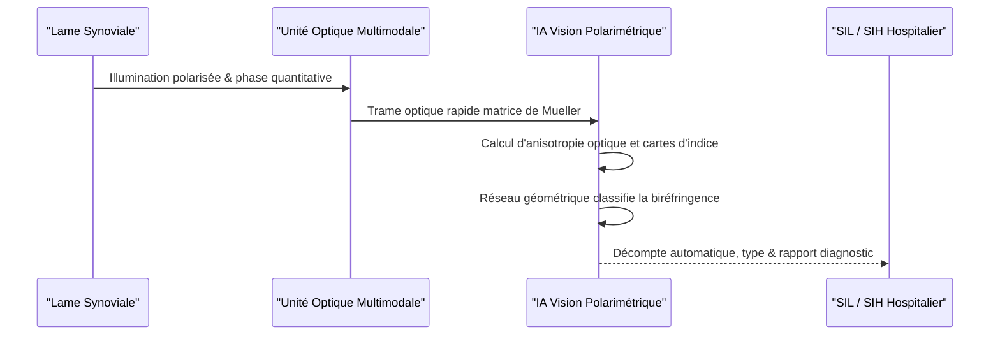

<!-- markdownlint-disable MD009 MD010 MD013 MD022 MD028 MD032 MD033 MD034 MD036 MD037 MD039 MD041 MD060 -->

[🇬🇧 English Version](./README.md)

# Polarimetric Microcrystal AI

> **Aperçu exécutif :** Polarimetric Microcrystal AI associe la microscopie polarimétrique multimodale super-résolue et l'imagerie de phase quantitative à l'IA de vision géométrique pour le diagnostic différentiel ultra-précoce des arthropathies microcristallines (goutte & chondrocalcinose).

---

## 1. Aperçu visuel & Effet Wahou

## 2. La thèse contrariante (Style Peter Thiel)

**Croyance populaire :** Le diagnostic des maladies microcristallines (goutte, chondrocalcinose) est un sujet médical classique résolu par une simple observation manuelle au microscope à lumière polarisée.
**Vérité cachée :** Plus de 30% des microcristaux au stade précoce sont sub-microniques, sous la limite de diffraction optique, et invisibles en microscopie classique, conduisant à des erreurs de diagnostic coûteuses. Combiner l'imagerie de phase quantitative et la polarimétrie de matrice de Mueller par IA permet d'identifier automatiquement et instantanément les microcristaux sub-microniques avant la destruction articulaire.

## 3. Le problème & La cible

**Modèle économique :** B2B
**Cible précise :** Laboratoires de biologie médicale, services hospitaliers de rhumatologie et biotechs développant des traitements anti-inflammatoires.
**Problème urgent :** L'analyse manuelle du liquide synovial est lente (20-30 min/échantillon), fortement dépendante de l'opérateur et incapable de détecter les microcristaux <1 µm, provoquant des erreurs de diagnostic entre goutte, chondrocalcinose et arthrite septique.

## 4. Architecture technique & Plomberie

## 5. Modèle économique & Viabilité financière

| Métrique                         | Valeur                                                                      |
| :------------------------------- | :-------------------------------------------------------------------------- |
| **Structure de Prix**            | Licence logicielle par scanner + Frais à l'acte (12 000 €/an + 5 €/test)    |
| **Cible à 12 Mois**              | 8 laboratoires hospitaliers régionaux et centres de diagnostic clinique     |
| **Calcul du Chiffre d'Affaires** | 8 installations labos @ ~13 000 € ARR = **104 000 € ARR**                   |
| **Marge Brute Estimée**          | 88 % (inférence logicielle pure sur station de calcul locale du microscope) |

## 6. Moteur de distribution & Fossé défensif

**Stratégie d'acquisition :** Vente directe aux laboratoires hospitaliers via des médecins rhumatologues leaders d'opinion (KOL) et publications d'essais de validation clinique dans _Annals of the Rheumatic Diseases_.
**Barrière à l'entrée (Moat) :** Base de données propriétaire de scans polarimétriques synchro matrice de Mueller et cartes de phase quantitatives. Les modèles de vision génériques échouent car la biréfringence nécessite la physique des transformations d'états optiques.

## 7. Grille d'évaluation détaillée

| Critères                            | Score VC (/100) | Score Terrain (/100) |
| :---------------------------------- | :-------------: | :------------------: |
| **Thèse & Monopole / Urgence**      |     22 / 25     |       22 / 25        |
| **Moat / Résistance aux LLMs**      |     23 / 25     |       22 / 25        |
| **Scalabilité / Friction adoption** |     20 / 25     |       21 / 25        |
| **Unit Economics / ROI direct**     |     22 / 25     |       23 / 25        |
| **TOTAL**                           |  **87 / 100**   |     **88 / 100**     |

> **Verdict VC :** Polarimetric Microcrystal AI automatise un créneau diagnostique sujet aux erreurs avec une barrière optique défendable. Les exigences réglementaires et la lenteur des achats hospitaliers sont les principaux freins d'adoption.
