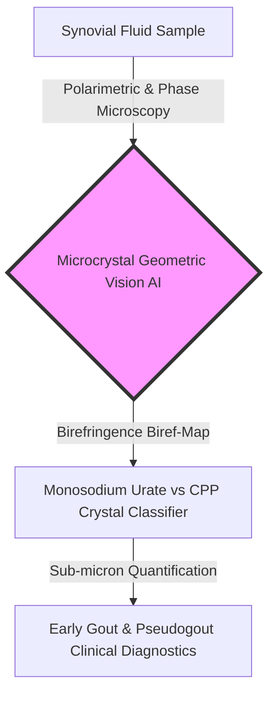
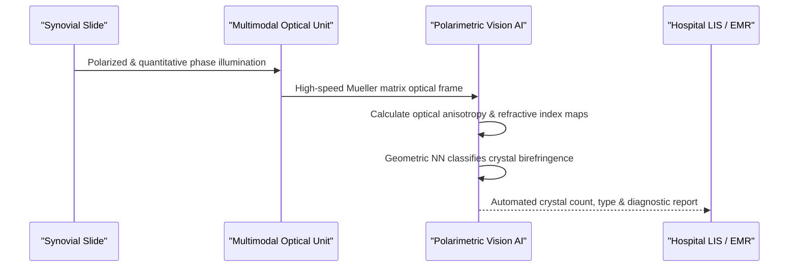

<!-- markdownlint-disable MD009 MD010 MD013 MD022 MD028 MD032 MD033 MD034 MD036 MD037 MD039 MD041 MD060 -->

[🇫🇷 Version Française](./README.fr.md)

# Polarimetric Microcrystal AI

> **Executive Summary:** Polarimetric Microcrystal AI integrates super-resolution multimodal polarimetry and quantitative phase imaging with geometric computer vision for ultra-early differential diagnosis of microcrystalline arthropathies (gout & pseudogout).

---

## 1. Visual Overview

## 2. Contrarian Thesis (Peter Thiel Style)

**Popular Belief:** Microcrystalline diseases like gout and CPPD (pseudogout) are routine, solved medical conditions requiring only standard polarized light microscopy manual checks by pathologists.
**Hidden Truth:** Over 30% of early-stage microcrystals in synovial fluids are smaller than optical diffraction limits and lack distinct morphology under classical light microscopes, leading to chronic misdiagnosis and inappropriate biologic therapy. Coupling quantitative phase imaging with polarimetric Mueller matrix AI unlocks instant, sub-micron automated microcrystal identification before joint destruction occurs.

## 3. Problem & Target Market

**Business Model:** B2B
**Precise Target:** Clinical pathology laboratories, rheumatology hospital departments, and biotechs developing anti-inflammatory gout therapeutics.
**Urgent Pain:** Manual synovial fluid analysis is time-consuming (20-30 mins/sample), highly operator-dependent, and misses early microcrystals (<1 µm), causing misdiagnosis between gout, CPPD, and septic arthritis.

## 4. Technical Architecture & Infrastructure

## 5. Business Model & Financial Viability

| Metric                                 | Value                                                                            |
| :------------------------------------- | :------------------------------------------------------------------------------- |
| **Pricing Structure**                  | Software License per Lab Scanner + Per-Test Usage Fee (12,000€/year + 5€/sample) |
| **12-Month Target**                    | 8 regional hospital laboratories and clinical diagnostic centers                 |
| **Revenue Calculation (100k€ Target)** | 8 lab installations @ ~13,000€ ARR = **104,000€ ARR**                            |
| **Estimated Gross Margin**             | 88% (pure software inference on edge microscope compute station)                 |

## 6. Distribution Engine & Moat

**Acquisition Strategy:** Direct sales to hospital pathology labs through key opinion leader (KOL) rheumatologists and clinical validation trials published in _Annals of the Rheumatic Diseases_.
**Moat (Barrier to Entry):** Proprietary database of synchronized Mueller-matrix polarimetric scans and quantitative phase maps of rare microcrystals. Standard vision LLMs fail because birefringence requires physical optical state transformations.

## 7. Detailed Evaluation Grid

| Criteria                             | VC Score (/100) | Market Score (/100) |
| :----------------------------------- | :-------------: | :-----------------: |
| **Thesis & Monopoly / Urgency**      |     22 / 25     |       22 / 25       |
| **Moat / Resistance to Native LLMs** |     23 / 25     |       22 / 25       |
| **Scalability / Adoption Friction**  |     20 / 25     |       21 / 25       |
| **Unit Economics / Direct ROI**      |     22 / 25     |       23 / 25       |
| **TOTAL**                            |  **87 / 100**   |    **88 / 100**     |

> **VC Verdict:** Polarimetric Microcrystal AI automates a high-error diagnostic niche with hardware-backed optical AI moats. Regulatory hurdles and conservative hospital procurement cycles represent the primary adoption speed bumps.
