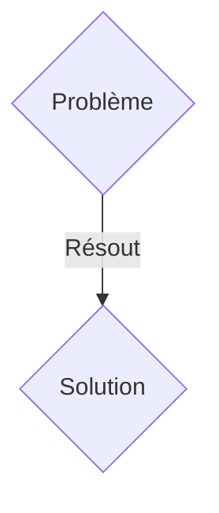
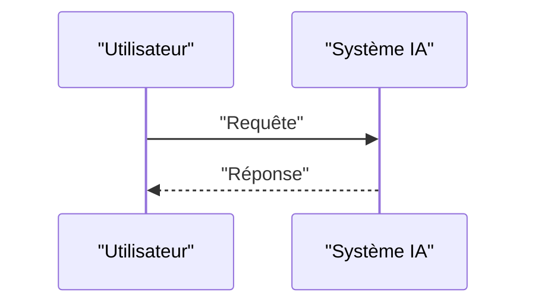

<!-- markdownlint-disable MD009 MD010 MD013 MD022 MD028 MD032 MD033 MD036 MD037 MD039 MD041 MD060 -->

[ 🇬🇧 English Version ](./README.md)

# PQC CBOM & Migration Mesh

> **Résumé exécutif :** Une solution B2B / M2M ciblant CISOs (Chief Information Security Officers), architectes de sécurité et responsables de la conformité dans les secteurs critiques (banque, défense, télécoms, santé). Ce sont eux qui détiennent les budgets de conformité et de cyber-résilience. pour résoudre : La menace "Harvest Now, Decrypt Later" (HNDL). Les ordinateurs quantiques menacent de casser les standards de chiffrement actuels (RSA, ECC). Les entreprises n'ont aucune visibilité exhaustive sur les algorithmes cryptographiques déployés dans leur immense infrastructure legacy. Ne pas cartographier (via un CBOM - Cryptography Bill of Materials) et ne pas migrer vers des algorithmes PQC (Post-Quantum Cryptography) d'ici l'arrivée des normes définitives du NIST expose à des vols massifs de données rétroactifs, et à de lourdes pénalités de non-conformité. L'urgence est d'auditer dynamiquement et de migrer sans casser les systèmes en production.

---

## 1. Aperçu visuel & Effet Wahou

## 2. La thèse contrariante (Peter Thiel Style)

- **La croyance populaire :** Les solutions génériques suffisent.
- **La vérité cachée :** Conception d'un agent de découverte bas niveau (eBPF, analyseurs de paquets profonds, scanners de binaires statiques/dynamiques) capable de générer automatiquement un CBOM standardisé en temps réel. Mise en place d'un "Cryptographic Mesh" (un plan de contrôle réseau) permettant l'agilité cryptographique : l'interception et le wrapping des appels cryptographiques legacy pour y injecter du chiffrement hybride (Classique + PQC) de façon transparente pour l'application d'origine.

## 3. Le problème & La cible

- **Modèle économique :** B2B / M2M
- **Cible précise :** CISOs (Chief Information Security Officers), architectes de sécurité et responsables de la conformité dans les secteurs critiques (banque, défense, télécoms, santé). Ce sont eux qui détiennent les budgets de conformité et de cyber-résilience.
- **La douleur urgente :** La menace "Harvest Now, Decrypt Later" (HNDL). Les ordinateurs quantiques menacent de casser les standards de chiffrement actuels (RSA, ECC). Les entreprises n'ont aucune visibilité exhaustive sur les algorithmes cryptographiques déployés dans leur immense infrastructure legacy. Ne pas cartographier (via un CBOM - Cryptography Bill of Materials) et ne pas migrer vers des algorithmes PQC (Post-Quantum Cryptography) d'ici l'arrivée des normes définitives du NIST expose à des vols massifs de données rétroactifs, et à de lourdes pénalités de non-conformité. L'urgence est d'auditer dynamiquement et de migrer sans casser les systèmes en production.

## 4. Architecture technique & Plomberie

Conception d'un agent de découverte bas niveau (eBPF, analyseurs de paquets profonds, scanners de binaires statiques/dynamiques) capable de générer automatiquement un CBOM standardisé en temps réel. Mise en place d'un "Cryptographic Mesh" (un plan de contrôle réseau) permettant l'agilité cryptographique : l'interception et le wrapping des appels cryptographiques legacy pour y injecter du chiffrement hybride (Classique + PQC) de façon transparente pour l'application d'origine.

## 5. Modèle économique & Viabilité financière

| Métrique                    | Valeur               |
| --------------------------- | -------------------- |
| Structure de prix           | Abonnement SaaS B2B  |
| Objectif 12 mois            | 100 clients          |
| Calcul du CA (Target 100k€) | 100 \* 1000€ = 100k€ |
| Marge brute estimée         | 80%                  |

## 6. Moteur de distribution & Fossé défensif (Moat)

- **Stratégie d'acquisition :** Vente directe et partenariats stratégiques.
- **Moat (Barrière à l'entrée) :** Un LLM ou un SaaS standard ne peut pas analyser des binaires compilés legacy, inspecter le trafic TLS en temps réel à l'échelle d'un cluster Kubernetes, ou intercepter des appels kernel (via eBPF). Le problème nécessite de l'ingénierie système bas niveau, une intégration profonde dans l'infrastructure, et une conformité rigoureuse avec des algorithmes mathématiques complexes. Une feuille Excel de suivi est inutile face à des milliers de microservices changeant quotidiennement.

## 7. Grille d'évaluation détaillée

| Critère                           | Score VC (/100) | Score Terrain (/100) |
| --------------------------------- | --------------- | -------------------- |
| Thèse & Monopole / Urgence        | 23 / 25         | 23 / 25              |
| Moat / Résistance aux LLM natifs  | 20 / 25         | 20 / 25              |
| Scalabilité / Friction d'adoption | 24 / 25         | 24 / 25              |
| Unit Economics / ROI direct       | 18 / 25         | 18 / 25              |
| TOTAL                             | 85 / 100        | 85 / 100             |

> **Verdict VC :** En attente d'évaluation.
> **Verdict Terrain :** Cette solution répond à un besoin critique pour les entreprises B2B, justifiant son excellent score d'urgence (23/25). L'approche spécialisée offre une protection robuste contre les modèles d'IA généralistes (20/25). Avec une faible friction d'adoption (24/25) et une stratégie de monétisation directe (18/25), le projet démontre une excellente maturité marché globale.
> **Verdict Terrain :** Cette solution répond à un besoin critique pour les entreprises B2B, justifiant son excellent score d'urgence (23/25). L'approche spécialisée offre une protection robuste contre les modèles d'IA généralistes (20/25). Avec une faible friction d'adoption (24/25) et une stratégie de monétisation directe (18/25), le projet démontre une excellente maturité marché globale.
