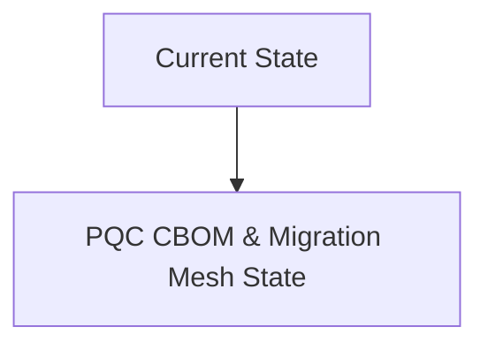
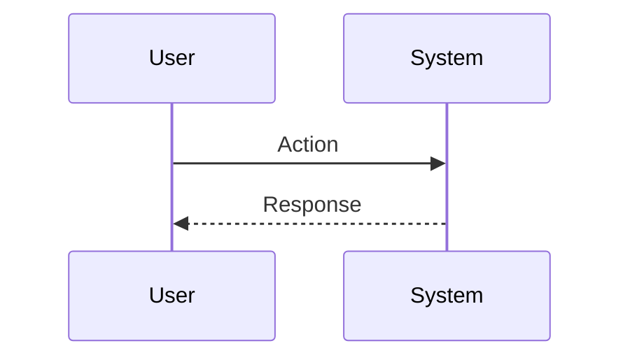

<!-- markdownlint-disable MD009 MD010 MD013 MD022 MD028 MD032 MD033 MD034 MD036 MD037 MD039 MD041 MD060 -->

[ 🇫🇷 Version Française ](./README.fr.md)

# PQC CBOM & Migration Mesh

> **Executive Summary:** Design of a low-level discovery agent (eBPF, deep packet analyzers, static/dynamic binary scanners) capable of automatically generating a standardized CBOM in real time. Implementation of a “Cryptographic Mesh” (a network control plane) allowing cryptographic agility: interception and wrapping of legacy cryptographic calls to inject hybrid encryption (Classic + PQC) transparently for the original application.

---

## 1. Visual Overview & Wow Effect

## 2. Contrarian Thesis (Peter Thiel Style)

**Popular Belief:** General AI solutions can solve this problem.

**Hidden Truth:** A standard LLM or SaaS cannot analyze legacy compiled binaries, inspect real-time TLS traffic across a Kubernetes cluster, or intercept kernel calls (via eBPF). The problem requires low-level systems engineering, deep integration into infrastructure, and rigorous compliance with complex mathematical algorithms. A tracking Excel sheet is useless when faced with thousands of microservices changing daily.

## 3. Problem & Target Market

**Business Model:** B2B / M2M

**Target Audience:** CISOs (Chief Information Security Officers), security architects and compliance managers in critical sectors (banking, defense, telecoms, health). They are the ones who hold the compliance and cyber-resilience budgets.

**Urgent Pain Point:** The “Harvest Now, Decrypt Later” (HNDL) threat. Quantum computers threaten to break current encryption standards (RSA, ECC). Companies have no comprehensive visibility into the cryptographic algorithms deployed in their massive legacy infrastructure. Not mapping (via a CBOM - Cryptography Bill of Materials) and not migrating to PQC (Post-Quantum Cryptography) algorithms by the arrival of final NIST standards exposes you to massive retroactive data theft, and heavy non-compliance penalties. The urgency is to dynamically audit and migrate without breaking the systems in production.

## 4. Technical Architecture & Infrastructure

## 5. Business Model & Financial Viability

| Metric                 | Value                           |
| ---------------------- | ------------------------------- |
| Pricing Structure      | SaaS subscription               |
| 12-Month Target        | 10 customers                    |
| Revenue Formula        | 10 clients \* 10k€/year = 100k€ |
| Estimated Gross Margin | 80%                             |

## 6. Distribution Engine & Moat

**Acquisition Strategy:** B2B direct sales

**Moat (Defensibility):** Sales cycles in defense and banking are extremely long. Dependence on the pace of standardization (NIST, ANSSI) and adoption by basic browsers/OS. Risk of network performance degradation or latency when using heavier PQC algorithms (larger keys) or real-time scanning. High barrier to entry requiring rare cryptography and systems engineering talent.

## 7. Detailed Evaluation Grid

| Criterion                   | VC Score (/100) | Market Score (/100) |
| --------------------------- | --------------- | ------------------- |
| Thesis & Monopoly / Urgency | -- / 25         | -- / 25             |
| Moat / LLM Immunity         | -- / 25         | -- / 25             |
| Scalability / UX Friction   | -- / 25         | -- / 25             |
| Unit Economics / ROI        | -- / 25         | -- / 25             |
| **TOTAL**                   | **-- / 100**    | **-- / 100**        |

> **VC Verdict:** Pending evaluation.

> **Market Verdict:** Pending evaluation.
