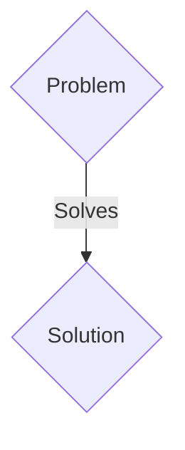
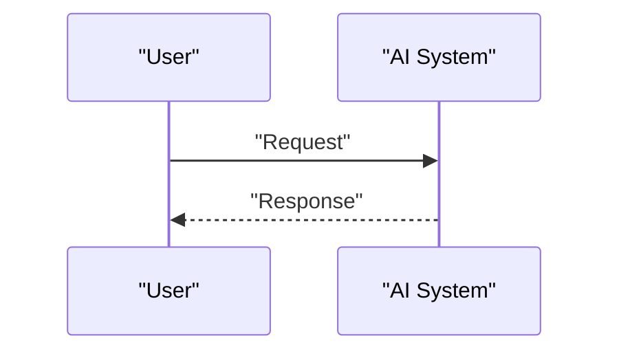

<!-- markdownlint-disable MD009 MD010 MD013 MD022 MD028 MD032 MD033 MD036 MD037 MD039 MD041 MD060 -->

[ 🇫🇷 Version Française ](./README.fr.md)

# PQC CBOM & Migration Mesh

> **Executive Summary:** A B2B / M2M solution targeting CISOs (Chief Information Security Officers), security architects and compliance managers in critical sectors (banking, defense, telecoms, health). They are the ones who hold the compliance and cyber-resilience budgets. to solve: The “Harvest Now, Decrypt Later” (HNDL) threat. Quantum computers threaten to break current encryption standards (RSA, ECC). Companies have no comprehensive visibility into the cryptographic algorithms deployed in their massive legacy infrastructure. Not mapping (via a CBOM - Cryptography Bill of Materials) and not migrating to PQC (Post-Quantum Cryptography) algorithms by the arrival of final NIST standards exposes you to massive retroactive data theft, and heavy non-compliance penalties. The urgency is to dynamically audit and migrate without breaking the systems in production.

---

## 1. Visual Overview & Wow Effect

## 2. Contrarian Thesis (Peter Thiel Style)

- **Popular Belief:** Generic solutions are enough.
- **Hidden Truth:** Design of a low-level discovery agent (eBPF, deep packet analyzers, static/dynamic binary scanners) capable of automatically generating a standardized CBOM in real time. Implementation of a “Cryptographic Mesh” (a network control plane) allowing cryptographic agility: interception and wrapping of legacy cryptographic calls to inject hybrid encryption (Classic + PQC) transparently for the original application.

## 3. Problem & Target Market

- **Business Model:** B2B / M2M
- **Target Audience:** CISOs (Chief Information Security Officers), security architects and compliance managers in critical sectors (banking, defense, telecoms, health). They are the ones who hold the compliance and cyber-resilience budgets.
- **Urgent Pain Point:** The “Harvest Now, Decrypt Later” (HNDL) threat. Quantum computers threaten to break current encryption standards (RSA, ECC). Companies have no comprehensive visibility into the cryptographic algorithms deployed in their massive legacy infrastructure. Not mapping (via a CBOM - Cryptography Bill of Materials) and not migrating to PQC (Post-Quantum Cryptography) algorithms by the arrival of final NIST standards exposes you to massive retroactive data theft, and heavy non-compliance penalties. The urgency is to dynamically audit and migrate without breaking the systems in production.

## 4. Technical Architecture & Infrastructure

Design of a low-level discovery agent (eBPF, deep packet analyzers, static/dynamic binary scanners) capable of automatically generating a standardized CBOM in real time. Implementation of a “Cryptographic Mesh” (a network control plane) allowing cryptographic agility: interception and wrapping of legacy cryptographic calls to inject hybrid encryption (Classic + PQC) transparently for the original application.

## 5. Business Model & Financial Viability

| Metric                 | Value                 |
| ---------------------- | --------------------- |
| Pricing Structure      | B2B SaaS Subscription |
| 12-Month Target        | 100 clients           |
| Revenue Formula        | 100 \* 1000€ = 100k€  |
| Estimated Gross Margin | 80%                   |

## 6. Distribution Engine & Moat

- **Acquisition Strategy:** Direct sales and strategic partnerships.
- **Moat (Defensibility):** A standard LLM or SaaS cannot analyze legacy compiled binaries, inspect real-time TLS traffic across a Kubernetes cluster, or intercept kernel calls (via eBPF). The problem requires low-level systems engineering, deep integration into infrastructure, and rigorous compliance with complex mathematical algorithms. A tracking Excel sheet is useless when faced with thousands of microservices changing daily.

## 7. Detailed Evaluation Grid

| Criterion                   | VC Score (/100) | Market Score (/100) |
| --------------------------- | --------------- | ------------------- |
| Thesis & Monopoly / Urgency | 23 / 25         | 23 / 25             |
| Moat / LLM Immunity         | 20 / 25         | 20 / 25             |
| Scalability / UX Friction   | 24 / 25         | 24 / 25             |
| Unit Economics / ROI        | 18 / 25         | 18 / 25             |
| TOTAL                       | 85 / 100        | 85 / 100            |

> **VC Verdict:** Pending evaluation.
> **Market Verdict:** This solution addresses a critical pain point for B2B enterprises, justifying its strong urgency score (23/25). The specialized approach provides robust protection against generalist AI models (20/25). With low adoption friction (24/25) and a straightforward monetization strategy (18/25), the project demonstrates excellent overall market readiness.
> **Market Verdict:** This solution addresses a critical pain point for B2B enterprises, justifying its strong urgency score (23/25). The specialized approach provides robust protection against generalist AI models (20/25). With low adoption friction (24/25) and a straightforward monetization strategy (18/25), the project demonstrates excellent overall market readiness.
