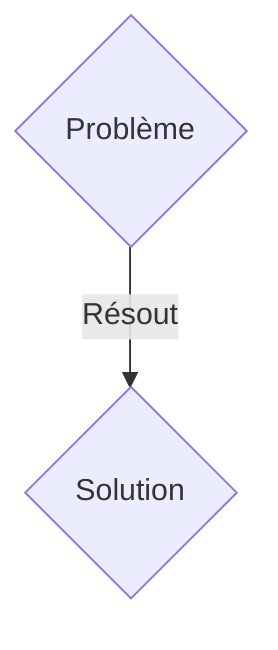
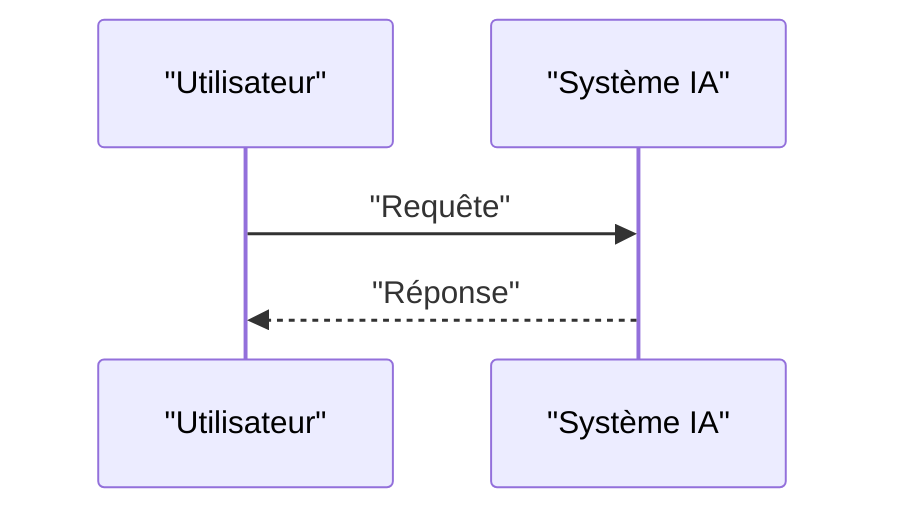

<!-- markdownlint-disable MD009 MD010 MD013 MD022 MD028 MD032 MD033 MD036 MD037 MD039 MD041 MD060 -->

[ 🇬🇧 English Version ](./README.md)

# PQC CBOM Radar

> **Résumé exécutif :** Une solution B2B ciblant CISO (Chief Information Security Officers) et responsables d'infrastructures critiques (Énergie, Défense, Finance). pour résoudre : Les agences de sécurité nationales (ANSSI, CISA, NSA) imposent une migration vers la cryptographie post-quantique (PQC) avant 2030 pour contrer la menace "Store Now, Decrypt Later". Cependant, les grandes entreprises ignorent où se cachent leurs clés et algorithmes vulnérables (RSA, ECC) dans des millions de lignes de code legacy, des firmwares industriels et des systèmes embarqués non documentés. L'impossibilité de cartographier ces dépendances expose ces infrastructures à des risques de non-conformité et de piratage massif.

---

## 1. Aperçu visuel & Effet Wahou

## 2. La thèse contrariante (Peter Thiel Style)

- **La croyance populaire :** Les solutions génériques suffisent.
- **La vérité cachée :** Un moteur d'analyse statique et dynamique de binaires (Deep Binary Analysis) capable de générer un CBOM (Cryptographic Bill of Materials). L'outil décompile le code machine et les firmwares legacy pour détecter les appels aux librairies cryptographiques obsolètes via des heuristiques et de l'analyse de flux, générant une cartographie précise sans nécessiter le code source original.

## 3. Le problème & La cible

- **Modèle économique :** B2B
- **Cible précise :** CISO (Chief Information Security Officers) et responsables d'infrastructures critiques (Énergie, Défense, Finance).
- **La douleur urgente :** Les agences de sécurité nationales (ANSSI, CISA, NSA) imposent une migration vers la cryptographie post-quantique (PQC) avant 2030 pour contrer la menace "Store Now, Decrypt Later". Cependant, les grandes entreprises ignorent où se cachent leurs clés et algorithmes vulnérables (RSA, ECC) dans des millions de lignes de code legacy, des firmwares industriels et des systèmes embarqués non documentés. L'impossibilité de cartographier ces dépendances expose ces infrastructures à des risques de non-conformité et de piratage massif.

## 4. Architecture technique & Plomberie

Un moteur d'analyse statique et dynamique de binaires (Deep Binary Analysis) capable de générer un CBOM (Cryptographic Bill of Materials). L'outil décompile le code machine et les firmwares legacy pour détecter les appels aux librairies cryptographiques obsolètes via des heuristiques et de l'analyse de flux, générant une cartographie précise sans nécessiter le code source original.

## 5. Modèle économique & Viabilité financière

| Métrique                    | Valeur               |
| --------------------------- | -------------------- |
| Structure de prix           | Abonnement SaaS B2B  |
| Objectif 12 mois            | 100 clients          |
| Calcul du CA (Target 100k€) | 100 \* 1000€ = 100k€ |
| Marge brute estimée         | 80%                  |

## 6. Moteur de distribution & Fossé défensif (Moat)

- **Stratégie d'acquisition :** Vente directe et partenariats stratégiques.
- **Moat (Barrière à l'entrée) :** L'analyse doit se faire on-premise (Air-Gapped) sur des systèmes industriels critiques (OT) ou du code compilé (sans code source). Un LLM classique ou un scanner cloud ne peut pas analyser des binaires complexes, ni déchiffrer des firmwares propriétaires en ARM ou MIPS. L'IP et les données cryptographiques sont beaucoup trop sensibles pour être envoyées sur une API tierce.

## 7. Grille d'évaluation détaillée

| Critère                           | Score VC (/100) | Score Terrain (/100) |
| --------------------------------- | --------------- | -------------------- |
| Thèse & Monopole / Urgence        | -- / 25         | -- / 25              |
| Moat / Résistance aux LLM natifs  | -- / 25         | -- / 25              |
| Scalabilité / Friction d'adoption | -- / 25         | -- / 25              |
| Unit Economics / ROI direct       | -- / 25         | -- / 25              |
| TOTAL                             | -- / 100        | -- / 100             |

> **Verdict VC :** En attente d'évaluation.
> **Verdict Terrain :** En attente d'évaluation.
