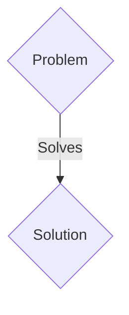
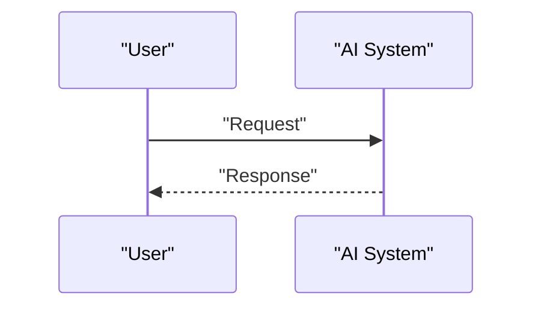

<!-- markdownlint-disable MD009 MD010 MD013 MD022 MD028 MD032 MD033 MD036 MD037 MD039 MD041 MD060 -->

[ 🇫🇷 Version Française ](./README.fr.md)

# PQC CBOM Radar

> **Executive Summary:** A B2B solution targeting CISO (Chief Information Security Officers) and critical infrastructure managers (Energy, Defense, Finance). to solve: National security agencies (ANSSI, CISA, NSA) are mandating a migration to post-quantum cryptography (PQC) before 2030 to counter the “Store Now, Decrypt Later” threat. However, large companies do not know where their vulnerable keys and algorithms (RSA, ECC) are hidden in millions of lines of legacy code, industrial firmware and undocumented embedded systems. The inability to map these dependencies exposes these infrastructures to the risks of non-compliance and massive hacking.

---

## 1. Visual Overview & Wow Effect

## 2. Contrarian Thesis (Peter Thiel Style)

- **Popular Belief:** Generic solutions are enough.
- **Hidden Truth:** A static and dynamic binary analysis engine (Deep Binary Analysis) capable of generating a CBOM (Cryptographic Bill of Materials). The tool decompiles machine code and legacy firmware to detect calls to obsolete cryptographic libraries via heuristics and flow analysis, generating an accurate mapping without requiring the original source code.

## 3. Problem & Target Market

- **Business Model:** B2B
- **Target Audience:** CISO (Chief Information Security Officers) and critical infrastructure managers (Energy, Defense, Finance).
- **Urgent Pain Point:** National security agencies (ANSSI, CISA, NSA) are mandating a migration to post-quantum cryptography (PQC) before 2030 to counter the “Store Now, Decrypt Later” threat. However, large companies do not know where their vulnerable keys and algorithms (RSA, ECC) are hidden in millions of lines of legacy code, industrial firmware and undocumented embedded systems. The inability to map these dependencies exposes these infrastructures to the risks of non-compliance and massive hacking.

## 4. Technical Architecture & Infrastructure

A static and dynamic binary analysis engine (Deep Binary Analysis) capable of generating a CBOM (Cryptographic Bill of Materials). The tool decompiles machine code and legacy firmware to detect calls to obsolete cryptographic libraries via heuristics and flow analysis, generating an accurate mapping without requiring the original source code.

## 5. Business Model & Financial Viability

| Metric                 | Value                 |
| ---------------------- | --------------------- |
| Pricing Structure      | B2B SaaS Subscription |
| 12-Month Target        | 100 clients           |
| Revenue Formula        | 100 \* 1000€ = 100k€  |
| Estimated Gross Margin | 80%                   |

## 6. Distribution Engine & Moat

- **Acquisition Strategy:** Direct sales and strategic partnerships.
- **Moat (Defensibility):** The analysis must be done on-premise (Air-Gapped) on critical industrial systems (OT) or compiled code (without source code). A traditional LLM or cloud scanner cannot analyze complex binaries, nor decipher proprietary firmware in ARM or MIPS. The IP and cryptographic data are far too sensitive to send over a third-party API.

## 7. Detailed Evaluation Grid

| Criterion                   | VC Score (/100) | Market Score (/100) |
| --------------------------- | --------------- | ------------------- |
| Thesis & Monopoly / Urgency | -- / 25         | -- / 25             |
| Moat / LLM Immunity         | -- / 25         | -- / 25             |
| Scalability / UX Friction   | -- / 25         | -- / 25             |
| Unit Economics / ROI        | -- / 25         | -- / 25             |
| TOTAL                       | -- / 100        | -- / 100            |

> **VC Verdict:** Pending evaluation.
> **Market Verdict:** Pending evaluation.
