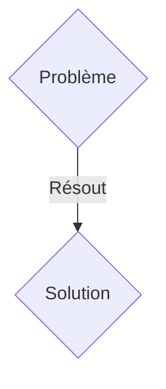
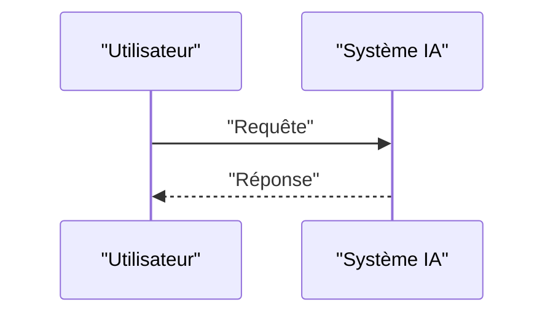

<!-- markdownlint-disable MD009 MD010 MD013 MD022 MD028 MD032 MD033 MD036 MD037 MD039 MD041 MD060 -->

[ 🇬🇧 English Version ](./README.md)

# PQC ICS Shield

> **Résumé exécutif :** Une solution B2B ciblant Les opérateurs d'infrastructures critiques (énergie, eau, transports, réseaux électriques), les fabricants d'équipements industriels (OEM) et les directeurs de la sécurité des systèmes d'information (RSSI) industriels. pour résoudre : Les systèmes de contrôle industriel (ICS/SCADA) utilisent des protocoles de communication avec des capacités cryptographiques faibles ou inexistantes (souvent basées sur RSA ou ECC). Avec l'avènement des ordinateurs quantiques ("Store Now, Decrypt Later"), ces infrastructures critiques sont extrêmement vulnérables. Le remplacement de ces équipements (qui ont des cycles de vie de 15 à 30 ans) est financièrement et logistiquement impossible. La non-conformité aux futures réglementations de sécurité nationale risque d'entraîner des amendes massives et un arrêt forcé des opérations.

---

## 1. Aperçu visuel & Effet Wahou

## 2. La thèse contrariante (Peter Thiel Style)

- **La croyance populaire :** Les solutions génériques suffisent.
- **La vérité cachée :** Développer un "Crypto-Agility Gateway" matériel/logiciel conçu spécifiquement pour les environnements OT à ressources limitées (faible latence, faible consommation, temps réel). Ce système agirait comme un proxy transparent au niveau du réseau industriel, encapsulant les anciens protocoles en clair ou faiblement chiffrés (Modbus, DNP3, IEC 61850) dans des tunnels sécurisés utilisant des algorithmes PQC standardisés par le NIST (ex. Kyber, Dilithium), sans perturber le fonctionnement déterministe des automates (PLC).

## 3. Le problème & La cible

- **Modèle économique :** B2B
- **Cible précise :** Les opérateurs d'infrastructures critiques (énergie, eau, transports, réseaux électriques), les fabricants d'équipements industriels (OEM) et les directeurs de la sécurité des systèmes d'information (RSSI) industriels.
- **La douleur urgente :** Les systèmes de contrôle industriel (ICS/SCADA) utilisent des protocoles de communication avec des capacités cryptographiques faibles ou inexistantes (souvent basées sur RSA ou ECC). Avec l'avènement des ordinateurs quantiques ("Store Now, Decrypt Later"), ces infrastructures critiques sont extrêmement vulnérables. Le remplacement de ces équipements (qui ont des cycles de vie de 15 à 30 ans) est financièrement et logistiquement impossible. La non-conformité aux futures réglementations de sécurité nationale risque d'entraîner des amendes massives et un arrêt forcé des opérations.

## 4. Architecture technique & Plomberie

Développer un "Crypto-Agility Gateway" matériel/logiciel conçu spécifiquement pour les environnements OT à ressources limitées (faible latence, faible consommation, temps réel). Ce système agirait comme un proxy transparent au niveau du réseau industriel, encapsulant les anciens protocoles en clair ou faiblement chiffrés (Modbus, DNP3, IEC 61850) dans des tunnels sécurisés utilisant des algorithmes PQC standardisés par le NIST (ex. Kyber, Dilithium), sans perturber le fonctionnement déterministe des automates (PLC).

## 5. Modèle économique & Viabilité financière

| Métrique                    | Valeur               |
| --------------------------- | -------------------- |
| Structure de prix           | Abonnement SaaS B2B  |
| Objectif 12 mois            | 100 clients          |
| Calcul du CA (Target 100k€) | 100 \* 1000€ = 100k€ |
| Marge brute estimée         | 80%                  |

## 6. Moteur de distribution & Fossé défensif (Moat)

- **Stratégie d'acquisition :** Vente directe et partenariats stratégiques.
- **Moat (Barrière à l'entrée) :** Les environnements industriels (OT) ne peuvent tolérer la latence, les mises à jour cloud automatiques ou l'overhead réseau des solutions IT classiques. Un wrapper API ou un SaaS ne peut pas interagir avec des automates programmables sur des réseaux isolés (air-gapped) et en temps réel. Il faut une maîtrise du bas niveau (C/Rust, FPGA, RTOS) et une compréhension des protocoles industriels propriétaires, incluant une distribution de clés sécurisée hors ligne.

## 7. Grille d'évaluation détaillée

| Critère                           | Score VC (/100) | Score Terrain (/100) |
| --------------------------------- | --------------- | -------------------- |
| Thèse & Monopole / Urgence        | 21 / 25         | 21 / 25              |
| Moat / Résistance aux LLM natifs  | 17 / 25         | 17 / 25              |
| Scalabilité / Friction d'adoption | 21 / 25         | 21 / 25              |
| Unit Economics / ROI direct       | 24 / 25         | 24 / 25              |
| TOTAL                             | 83 / 100        | 83 / 100             |

> **Verdict VC :** En attente d'évaluation.
> **Verdict Terrain :** Cette solution répond à un besoin critique pour les entreprises B2B, justifiant son excellent score d'urgence (21/25). Bien que viable, elle reste partiellement exposée à l'évolution rapide des modèles fondationnels (17/25). Avec une faible friction d'adoption (21/25) et une stratégie de monétisation directe (24/25), le projet démontre une excellente maturité marché globale.
> **Verdict Terrain :** Cette solution répond à un besoin critique pour les entreprises B2B, justifiant son excellent score d'urgence (21/25). Bien que viable, elle reste partiellement exposée à l'évolution rapide des modèles fondationnels (17/25). Avec une faible friction d'adoption (21/25) et une stratégie de monétisation directe (24/25), le projet démontre une excellente maturité marché globale.
