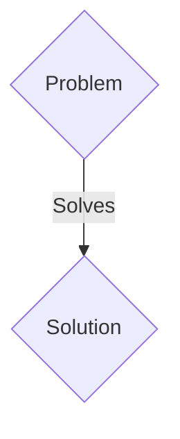
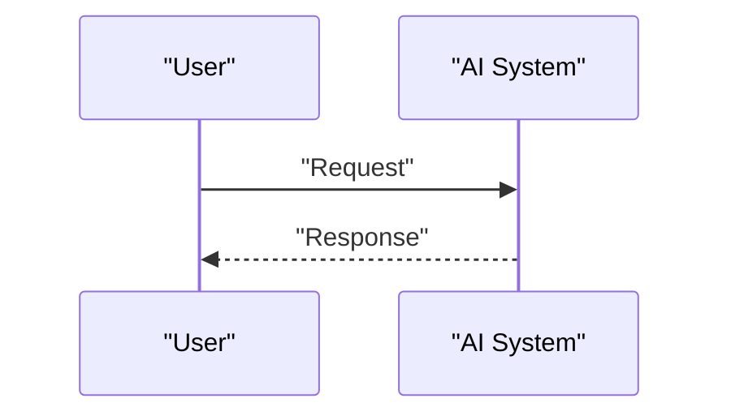

<!-- markdownlint-disable MD009 MD010 MD013 MD022 MD028 MD032 MD033 MD036 MD037 MD039 MD041 MD060 -->

[ 🇫🇷 Version Française ](./README.fr.md)

# PQC ICS Shield

> **Executive Summary:** A B2B solution targeting Critical infrastructure operators (energy, water, transportation, power grids), industrial equipment manufacturers (OEMs) and industrial information systems security directors (CISOs). to solve: Industrial control systems (ICS/SCADA) use communication protocols with weak or no cryptographic capabilities (often based on RSA or ECC). With the advent of quantum computers (“Store Now, Decrypt Later”), these critical infrastructures are extremely vulnerable. Replacing this equipment (which has life cycles of 15 to 30 years) is financially and logistically impossible. Non-compliance with future national security regulations risks massive fines and a forced shutdown of operations.

---

## 1. Visual Overview & Wow Effect

## 2. Contrarian Thesis (Peter Thiel Style)

- **Popular Belief:** Generic solutions are enough.
- **Hidden Truth:** Develop a hardware/software “Crypto-Agility Gateway” designed specifically for resource-constrained OT environments (low latency, low consumption, real-time). This system would act as a transparent proxy at the industrial network level, encapsulating old plain or weakly encrypted protocols (Modbus, DNP3, IEC 61850) in secure tunnels using PQC algorithms standardized by NIST (e.g. Kyber, Dilithium), without disrupting the deterministic operation of PLCs.

## 3. Problem & Target Market

- **Business Model:** B2B
- **Target Audience:** Critical infrastructure operators (energy, water, transportation, power grids), industrial equipment manufacturers (OEMs) and industrial information systems security directors (CISOs).
- **Urgent Pain Point:** Industrial control systems (ICS/SCADA) use communication protocols with weak or no cryptographic capabilities (often based on RSA or ECC). With the advent of quantum computers (“Store Now, Decrypt Later”), these critical infrastructures are extremely vulnerable. Replacing this equipment (which has life cycles of 15 to 30 years) is financially and logistically impossible. Non-compliance with future national security regulations risks massive fines and a forced shutdown of operations.

## 4. Technical Architecture & Infrastructure

Develop a hardware/software “Crypto-Agility Gateway” designed specifically for resource-constrained OT environments (low latency, low consumption, real-time). This system would act as a transparent proxy at the industrial network level, encapsulating old plain or weakly encrypted protocols (Modbus, DNP3, IEC 61850) in secure tunnels using PQC algorithms standardized by NIST (e.g. Kyber, Dilithium), without disrupting the deterministic operation of PLCs.

## 5. Business Model & Financial Viability

| Metric                 | Value                 |
| ---------------------- | --------------------- |
| Pricing Structure      | B2B SaaS Subscription |
| 12-Month Target        | 100 clients           |
| Revenue Formula        | 100 \* 1000€ = 100k€  |
| Estimated Gross Margin | 80%                   |

## 6. Distribution Engine & Moat

- **Acquisition Strategy:** Direct sales and strategic partnerships.
- **Moat (Defensibility):** Industrial (OT) environments cannot tolerate the latency, automatic cloud updates or network overhead of traditional IT solutions. An API wrapper or SaaS cannot interact with programmable controllers on isolated networks (air-gapped) and in real time. It requires low-level mastery (C/Rust, FPGA, RTOS) and an understanding of proprietary industrial protocols, including secure offline key distribution.

## 7. Detailed Evaluation Grid

| Criterion                   | VC Score (/100) | Market Score (/100) |
| --------------------------- | --------------- | ------------------- |
| Thesis & Monopoly / Urgency | 21 / 25         | 21 / 25             |
| Moat / LLM Immunity         | 17 / 25         | 17 / 25             |
| Scalability / UX Friction   | 21 / 25         | 21 / 25             |
| Unit Economics / ROI        | 24 / 25         | 24 / 25             |
| TOTAL                       | 83 / 100        | 83 / 100            |

> **VC Verdict:** Pending evaluation.
> **Market Verdict:** This solution addresses a critical pain point for B2B enterprises, justifying its strong urgency score (21/25). While viable, it remains somewhat exposed to the rapid evolution of foundational models (17/25). With low adoption friction (21/25) and a straightforward monetization strategy (24/25), the project demonstrates excellent overall market readiness.
> **Market Verdict:** This solution addresses a critical pain point for B2B enterprises, justifying its strong urgency score (21/25). While viable, it remains somewhat exposed to the rapid evolution of foundational models (17/25). With low adoption friction (21/25) and a straightforward monetization strategy (24/25), the project demonstrates excellent overall market readiness.
