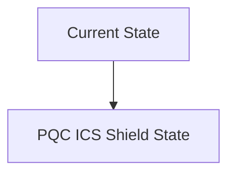
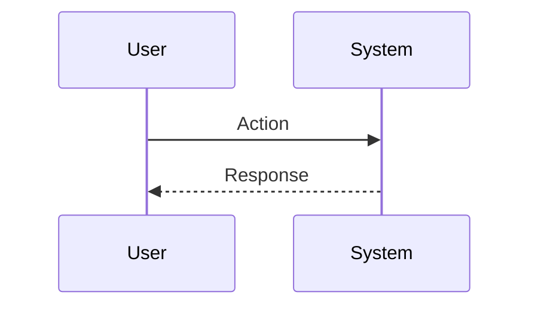

<!-- markdownlint-disable MD009 MD010 MD013 MD022 MD028 MD032 MD033 MD034 MD036 MD037 MD039 MD041 MD060 -->

[ 🇫🇷 Version Française ](./README.fr.md)

# PQC ICS Shield

> **Executive Summary:** Develop a hardware/software “Crypto-Agility Gateway” designed specifically for resource-constrained OT environments (low latency, low consumption, real-time). This system would act as a transparent proxy at the industrial network level, encapsulating old plain or weakly encrypted protocols (Modbus, DNP3, IEC 61850) in secure tunnels using PQC algorithms standardized by NIST (e.g. Kyber, Dilithium), without disrupting the deterministic operation of PLCs.

---

## 1. Visual Overview & Wow Effect

## 2. Contrarian Thesis (Peter Thiel Style)

**Popular Belief:** General AI solutions can solve this problem.

**Hidden Truth:** Industrial (OT) environments cannot tolerate the latency, automatic cloud updates or network overhead of traditional IT solutions. An API wrapper or SaaS cannot interact with programmable controllers on isolated networks (air-gapped) and in real time. It requires low-level mastery (C/Rust, FPGA, RTOS) and an understanding of proprietary industrial protocols, including secure offline key distribution.

## 3. Problem & Target Market

**Business Model:** B2B

**Target Audience:** Critical infrastructure operators (energy, water, transportation, power grids), industrial equipment manufacturers (OEMs) and industrial information systems security directors (CISOs).

**Urgent Pain Point:** Industrial control systems (ICS/SCADA) use communication protocols with weak or no cryptographic capabilities (often based on RSA or ECC). With the advent of quantum computers (“Store Now, Decrypt Later”), these critical infrastructures are extremely vulnerable. Replacing this equipment (which has life cycles of 15 to 30 years) is financially and logistically impossible. Non-compliance with future national security regulations risks massive fines and a forced shutdown of operations.

## 4. Technical Architecture & Infrastructure

## 5. Business Model & Financial Viability

| Metric                 | Value                           |
| ---------------------- | ------------------------------- |
| Pricing Structure      | SaaS subscription               |
| 12-Month Target        | 10 customers                    |
| Revenue Formula        | 10 clients \* 10k€/year = 100k€ |
| Estimated Gross Margin | 80%                             |

## 6. Distribution Engine & Moat

**Acquisition Strategy:** B2B direct sales

**Moat (Defensibility):** The still ongoing standardization of certain PQC algorithms, the cost of hardware integration in hostile environments (extreme temperatures, vibrations), the very long sales cycles (12-24 months) in industrial B2B, and the need to prove that there is no latency introduced (which could cause a physical malfunction).

## 7. Detailed Evaluation Grid

| Criterion                   | VC Score (/100) | Market Score (/100) |
| --------------------------- | --------------- | ------------------- |
| Thesis & Monopoly / Urgency | -- / 25         | -- / 25             |
| Moat / LLM Immunity         | -- / 25         | -- / 25             |
| Scalability / UX Friction   | -- / 25         | -- / 25             |
| Unit Economics / ROI        | -- / 25         | -- / 25             |
| **TOTAL**                   | **-- / 100**    | **-- / 100**        |

> **VC Verdict:** Pending evaluation.

> **Market Verdict:** Pending evaluation.
