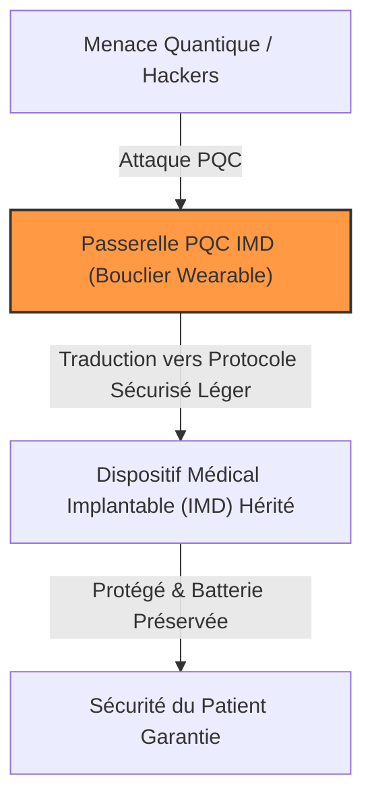
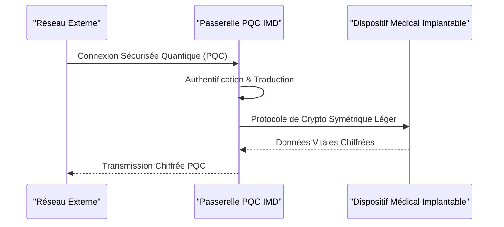

<!-- markdownlint-disable MD009 MD010 MD013 MD022 MD028 MD032 MD033 MD034 MD036 MD037 MD039 MD041 MD058 MD060 -->

[ 🇬🇧 English Version ](./README.md)

# PQC IMD Gateway

> **Résumé exécutif :** Une passerelle matérielle et logicielle à très basse consommation agissant comme un bouclier cryptographique post-quantique (PQC) pour les dispositifs médicaux implantables (IMD), répondant aux normes imminentes de la FDA.

---

## 1. Aperçu visuel & Effet Wahou

## 2. La thèse contrariante (Peter Thiel Style)

**La croyance populaire :** Pour sécuriser les dispositifs médicaux contre les menaces quantiques, nous devons concevoir de nouvelles puces très puissantes capables d'exécuter des algorithmes PQC directement à l'intérieur du corps du patient.
**La vérité cachée :** Exécuter des algorithmes PQC complexes dans le corps viderait la batterie d'un pacemaker en quelques semaines au lieu de plusieurs années. La solution est une passerelle de traduction externe à très basse consommation qui protège l'implant sans toucher à son firmware critique ni à sa batterie.

## 3. Le problème & La cible

**Modèle économique :** B2B2C
**Cible précise :** Les fabricants de dispositifs médicaux implantables (pacemakers, neurostimulateurs) et les hôpitaux.
**La douleur urgente :** Les implants actuels utilisent une cryptographie classique (RSA/ECC) vulnérable aux attaques quantiques ("Harvest Now, Decrypt Later"). Mettre à jour le firmware d'un dispositif implanté pour supporter le PQC est physiquement impossible en raison des contraintes critiques de mémoire et de batterie.

## 4. Architecture technique & Plomberie

## 5. Modèle économique & Viabilité financière

| Métrique                        | Valeur                                            |
| :------------------------------ | :------------------------------------------------ |
| **Structure de prix**           | Licence OEM par unité + Maintenance               |
| **Objectif 12 mois**            | 1 partenariat avec un fabricant MedTech de rang 1 |
| **Calcul du CA (Target 100k€)** | 1 contrat OEM (NRE + avance) = 150k€ ARR          |
| **Marge brute estimée**         | 80% (Principalement de la licence IP & Firmware)  |

## 6. Moteur de distribution & Fossé défensif (Moat)

**Stratégie d'acquisition :** Ventes B2B directes aux grands fabricants MedTech (Medtronic, Abbott), en s'appuyant sur les échéances strictes de conformité de la FDA/MDR.
**Moat (Barrière à l'entrée) :** Optimisation extrême du firmware sous les contraintes strictes des dispositifs médicaux. Un SaaS générique ne peut pas interagir avec du matériel sous-cutané ni gérer des protocoles vitaux à latence ultra-faible.

## 7. Grille d'évaluation détaillée

| Critère                               | Score VC (/100) | Score Terrain (/100) |
| :------------------------------------ | :-------------- | :------------------- |
| **Thèse & Monopole / Urgence**        | 21 / 25         | -- / 25              |
| **Moat / Résistance aux LLM natifs**  | 22 / 25         | -- / 25              |
| **Scalabilité / Friction d'adoption** | 23 / 25         | -- / 25              |
| **Unit Economics / ROI direct**       | 19 / 25         | -- / 25              |
| **TOTAL**                             | **85 / 100**    | **-- / 100**         |

> **Verdict VC :** Capitalise brillamment sur l'urgence des futures réglementations de la FDA concernant le matériel médical critique. L'intégration aux systèmes vitaux à très faible consommation crée des coûts de changement drastiques et un énorme fossé défensif. La scalabilité est excellente sur le parc de dispositifs.

> **Verdict Terrain :** En attente d'évaluation.
