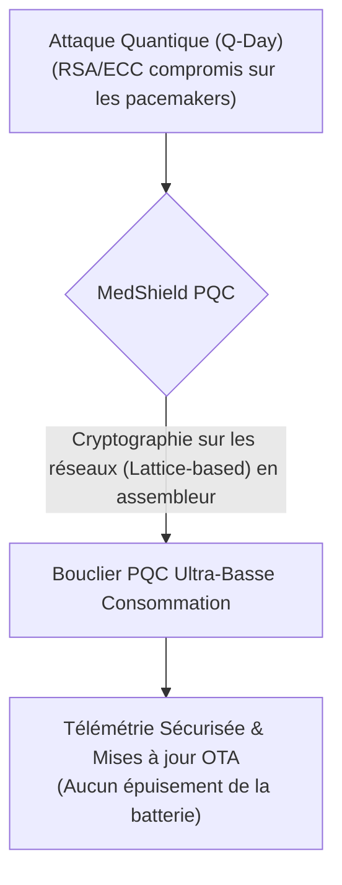
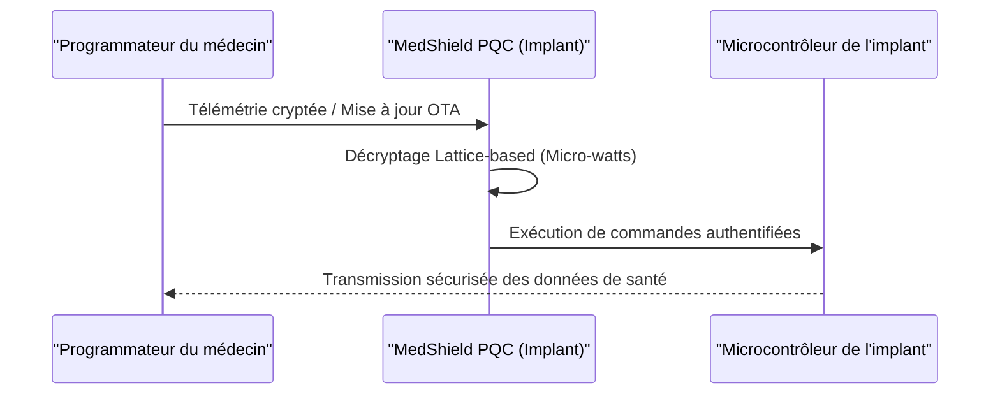

<!-- markdownlint-disable MD009 MD010 MD013 MD022 MD028 MD032 MD033 MD034 MD036 MD037 MD039 MD041 MD060 -->

[ 🇬🇧 English Version ](./README.md)

# MedShield PQC

> **Résumé exécutif :** MedShield PQC fournit une bibliothèque logicielle de cryptographie post-quantique (PQC) ultra-légère conçue spécifiquement pour les dispositifs médicaux implantables actifs, les protégeant contre les menaces quantiques via des mises à jour OTA (Over-The-Air) sans épuiser leurs batteries limitées.

---

## 1. Aperçu visuel & Effet Wahou

## 2. La thèse contrariante (Peter Thiel Style)

**La croyance populaire :** La cryptographie post-quantique sera résolue en standardisant des algorithmes (comme ceux du NIST) et en mettant à niveau les serveurs cloud et le matériel standard pour les exécuter.
**La vérité cachée :** Les bibliothèques PQC standards sont trop massives et gourmandes en énergie pour les environnements contraints des implants médicaux actifs (pacemakers). Il est physiquement impossible de mettre à niveau le matériel d'un dispositif déjà implanté dans le cœur d'un patient. La véritable solution réside dans des mathématiques PQC hautement optimisées au niveau de l'assembleur, s'exécutant localement avec quelques micro-watts d'énergie, et déployées via des mises à jour logicielles OTA (Over-The-Air).

## 3. Le problème & La cible

**Modèle économique :** B2B
**Cible précise :** Fabricants de dispositifs médicaux implantables actifs (pacemakers, pompes à insuline, neurostimulateurs) comme Medtronic, Abbott, Boston Scientific.
**La douleur urgente :** Avec l'avènement imminent de l'informatique quantique (Q-Day), les algorithmes cryptographiques asymétriques actuels (RSA, ECC) protégeant les communications télémétriques des implants médicaux deviendront obsolètes. Une faille permettrait des attaques fatales (altération du rythme cardiaque, surdose d'insuline). Le remplacement matériel post-implantation étant impossible, il faut une solution logicielle ultra-légère.

## 4. Architecture technique & Plomberie

## 5. Modèle économique & Viabilité financière

| Métrique                | Valeur                                                        |
| ----------------------- | ------------------------------------------------------------- |
| **Structure de prix**   | Licence OEM par dispositif fabriqué                           |
| **Objectif 12 mois**    | 1 contrat majeur d'intégration R&D avec un fabricant du Top 3 |
| **Calcul du CA**        | 1 Contrat \* 150 000€ NRE (Non-Recurring Engineering)         |
| **Marge brute estimée** | >95% (IP purement logicielle)                                 |

## 6. Moteur de distribution & Fossé défensif (Moat)

**Stratégie d'acquisition :** Ventes techniques directes en OEM et partenariats avec les organismes de réglementation (FDA/MDR) pour faire de MedShield la norme de conformité en sécurité médicale post-quantique.
**Moat (Barrière à l'entrée) :** Les bibliothèques PQC standards (comme celles du NIST) sont trop lourdes en termes d'empreinte mémoire et de consommation énergétique pour fonctionner sur l'architecture minimale d'un pacemaker. Un SaaS cloud est inutile : le calcul cryptographique doit se faire en local, sur la puce de l'implant, avec une consommation mesurée en micro-watts. L'optimisation extrême en langage assembleur bas niveau de la cryptographie basée sur les réseaux (Lattice), couplée aux énormes barrières réglementaires (certification FDA/MDR pour dispositifs de Classe III), crée une barrière à l'entrée insurmontable.

## 7. Grille d'évaluation détaillée

| Critère                               | Score VC (/100) | Score Terrain (/100) |
| ------------------------------------- | --------------- | -------------------- |
| **Thèse & Monopole / Urgence**        | -- / 25         | -- / 25              |
| **Moat / Résistance aux LLM natifs**  | -- / 25         | -- / 25              |
| **Scalabilité / Friction d'adoption** | -- / 25         | -- / 25              |
| **Unit Economics / ROI direct**       | -- / 25         | -- / 25              |
| **TOTAL**                             | -- / 100        | -- / 100             |

> **Verdict VC :** En attente d'évaluation.
> **Verdict Terrain :** En attente d'évaluation.
