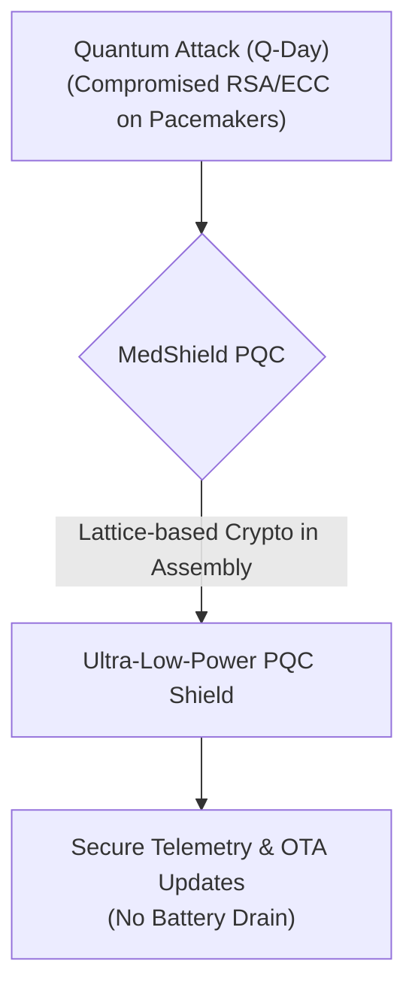
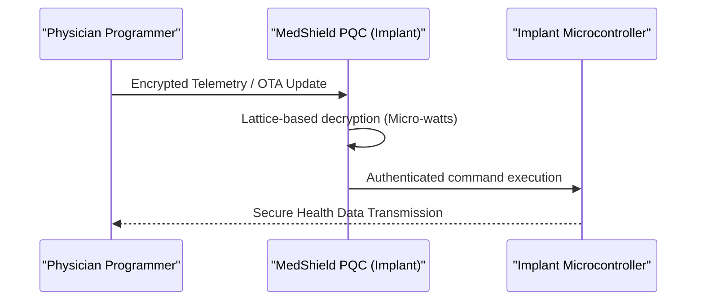

<!-- markdownlint-disable MD009 MD010 MD013 MD022 MD028 MD032 MD033 MD034 MD036 MD037 MD039 MD041 MD060 -->

[ 🇫🇷 Version Française ](./README.fr.md)

# MedShield PQC

> **Executive Summary:** MedShield PQC provides a specialized, ultra-lightweight Post-Quantum Cryptography (PQC) software library designed for active implantable medical devices, securing them against quantum computing threats via Over-The-Air updates without draining their limited batteries.

---

## 1. Visual Overview & Wow Effect

## 2. Contrarian Thesis (Peter Thiel Style)

**Popular Belief:** Post-quantum cryptography will be solved by standardizing algorithms (like those from NIST) and upgrading cloud servers and standard hardware to run them.
**Hidden Truth:** Standard PQC libraries are too massive and energy-hungry for the constrained environments of active medical implants (pacemakers). You cannot physically upgrade the hardware of a device already inside a patient's heart. The true solution is highly optimized, assembly-level PQC math that runs locally on micro-watts of power, delivered via Over-The-Air updates.

## 3. Problem & Target Market

**Business Model:** B2B
**Target Audience:** Manufacturers of active implantable medical devices (pacemakers, insulin pumps, neurostimulators) like Medtronic, Abbott, and Boston Scientific.
**Urgent Pain Point:** With the imminent arrival of quantum computing (Q-Day), current asymmetric cryptographic algorithms (RSA, ECC) protecting the telemetry communications of medical implants will become obsolete. A breach would allow fatal attacks (altering heart rhythms, insulin overdoses). Since post-implantation hardware replacement is impossible, an ultra-lightweight software solution is desperately needed.

## 4. Technical Architecture & Infrastructure

## 5. Business Model & Financial Viability

| Metric                     | Value                                                      |
| -------------------------- | ---------------------------------------------------------- |
| **Pricing Structure**      | OEM Licensing per device manufactured                      |
| **12-Month Target**        | 1 major R&D integration contract with a Top 3 manufacturer |
| **Revenue Formula**        | 1 Contract \* €150k NRE (Non-Recurring Engineering)        |
| **Estimated Gross Margin** | >95% (Pure software IP)                                    |

## 6. Distribution Engine & Moat

**Acquisition Strategy:** Direct OEM technical sales and partnering with FDA/MDR regulatory bodies to establish MedShield as the compliance standard for post-quantum medical security.
**Moat (Defensibility):** Standard PQC libraries (like those from NIST) are too heavy in terms of memory footprint and energy consumption to run on the minimal architecture of a pacemaker. A cloud SaaS is useless: cryptographic calculation must be done locally on the implant's chip. The extreme low-level assembly optimization of lattice-based cryptography, coupled with the massive regulatory hurdle (FDA/MDR Class III device certification), creates an incredibly high barrier to entry.

## 7. Detailed Evaluation Grid

| Criterion                       | VC Score (/100) | Market Score (/100) |
| ------------------------------- | --------------- | ------------------- |
| **Thesis & Monopoly / Urgency** | -- / 25         | -- / 25             |
| **Moat / LLM Immunity**         | -- / 25         | -- / 25             |
| **Scalability / UX Friction**   | -- / 25         | -- / 25             |
| **Unit Economics / ROI**        | -- / 25         | -- / 25             |
| **TOTAL**                       | -- / 100        | -- / 100            |

> **VC Verdict:** Pending evaluation.
> **Market Verdict:** Pending evaluation.
