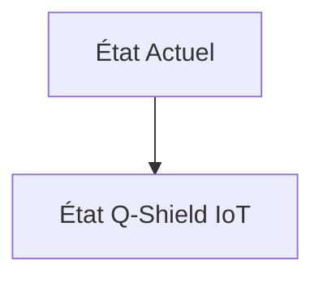
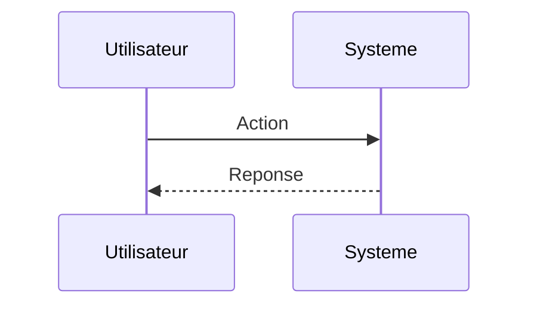

<!-- markdownlint-disable MD009 MD010 MD013 MD022 MD028 MD032 MD033 MD034 MD036 MD037 MD039 MD041 MD060 -->

[ 🇬🇧 English Version ](./README.md)

# Q-Shield IoT

> **Résumé exécutif :** Une implémentation ultra-allégée (bare-metal) et accélérée matériellement (ou par co-design HW/SW) d'algorithmes PQC spécifiques (ex: cristaux-Kyber) packagée comme un RTOS (Real-Time Operating System) minimaliste ou un firmware bootloader pour l'IIoT legacy et futur, permettant l'échange de clés asymétriques sécurisées sous contrainte de micro-watts et de kilo-octets.

---

## 1. Aperçu visuel & Effet Wahou

## 2. La thèse contrariante (Peter Thiel Style)

**La croyance populaire :** Les solutions généralistes IA peuvent résoudre ce problème.

**La vérité cachée :** Les solutions de cybersécurité classiques opèrent au niveau applicatif ou réseau (firewalls, proxys) et requièrent des agents lourds (Linux/Windows). Ici le défi est mathématique, bas niveau (C/Rust sur ARM Cortex-M), et soumis à des contraintes physiques (énergie, latence temps-réel) inaccessibles aux SaaS cloud.

## 3. Le problème & La cible

**Modèle économique :** M2M / B2B

**Cible précise :** Industriels des infrastructures critiques (réseaux électriques, traitement des eaux, dispositifs médicaux implantables).

**La douleur urgente :** Q-Day (le moment où un ordinateur quantique cassera le chiffrement RSA/ECC) approche. Des milliards de capteurs et d'actuateurs industriels (IIoT) avec très peu de mémoire et de puissance de calcul (microcontrôleurs) ne peuvent pas faire tourner les algorithmes cryptographiques post-quantiques (PQC) standards récemment approuvés par le NIST (trop lourds). "Store now, decrypt later" expose déjà leurs données de télémétrie actuelles.

## 4. Architecture technique & Plomberie

## 5. Modèle économique & Viabilité financière

| Métrique                    | Valeur                        |
| --------------------------- | ----------------------------- |
| Structure de prix           | Abonnement SaaS               |
| Objectif 12 mois            | 10 clients                    |
| Calcul du CA (Target 100k€) | 10 clients \* 10k€/an = 100k€ |
| Marge brute estimée         | 80%                           |

## 6. Moteur de distribution & Fossé défensif (Moat)

**Stratégie d'acquisition :** Vente directe B2B

**Moat (Barrière à l'entrée) :** Adoption lente du marché due aux cycles de vie de 10-20 ans du matériel industriel. Dépendance à l'évolution de la standardisation NIST et à la capacité de mettre à jour le firmware de systèmes déployés sans les briquer.

## 7. Grille d'évaluation détaillée

| Critère                           | Score VC (/100) | Score Terrain (/100) |
| --------------------------------- | --------------- | -------------------- |
| Thèse & Monopole / Urgence        | -- / 25         | -- / 25              |
| Moat / Résistance aux LLM natifs  | -- / 25         | -- / 25              |
| Scalabilité / Friction d'adoption | -- / 25         | -- / 25              |
| Unit Economics / ROI direct       | -- / 25         | -- / 25              |
| **TOTAL**                         | **-- / 100**    | **-- / 100**         |

> **Verdict VC :** En attente d'évaluation.

> **Verdict Terrain :** En attente d'évaluation.
