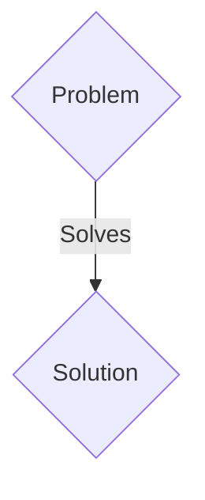
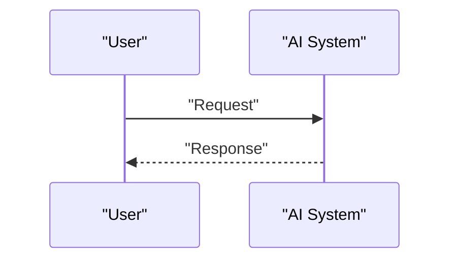

<!-- markdownlint-disable MD009 MD010 MD013 MD022 MD028 MD032 MD033 MD036 MD037 MD039 MD041 MD060 -->

[ 🇫🇷 Version Française ](./README.fr.md)

# Q-Shield IoT

> **Executive Summary:** A M2M / B2B solution targeting Critical infrastructure manufacturers (electricity networks, water treatment, implantable medical devices). to solve: Q-Day (the moment when a quantum computer breaks RSA/ECC encryption) is approaching. Billions of industrial sensors and actuators (IIoT) with very little memory and computing power (microcontrollers) cannot run the standard post-quantum cryptographic (PQC) algorithms recently approved by NIST (too heavy). “Store now, decrypt later” already exposes their current telemetry data.

---

## 1. Visual Overview & Wow Effect

## 2. Contrarian Thesis (Peter Thiel Style)

- **Popular Belief:** Generic solutions are enough.
- **Hidden Truth:** An ultra-light (bare-metal) and hardware-accelerated (or by HW/SW co-design) implementation of specific PQC algorithms (e.g.: crystals-Kyber) packaged as a minimalist RTOS (Real-Time Operating System) or bootloader firmware for legacy and future IIoT, allowing the exchange of secure asymmetric keys under micro-watt and kilobyte constraints.

## 3. Problem & Target Market

- **Business Model:** M2M / B2B
- **Target Audience:** Critical infrastructure manufacturers (electricity networks, water treatment, implantable medical devices).
- **Urgent Pain Point:** Q-Day (the moment when a quantum computer breaks RSA/ECC encryption) is approaching. Billions of industrial sensors and actuators (IIoT) with very little memory and computing power (microcontrollers) cannot run the standard post-quantum cryptographic (PQC) algorithms recently approved by NIST (too heavy). “Store now, decrypt later” already exposes their current telemetry data.

## 4. Technical Architecture & Infrastructure

An ultra-light (bare-metal) and hardware-accelerated (or by HW/SW co-design) implementation of specific PQC algorithms (e.g.: crystals-Kyber) packaged as a minimalist RTOS (Real-Time Operating System) or bootloader firmware for legacy and future IIoT, allowing the exchange of secure asymmetric keys under micro-watt and kilobyte constraints.

## 5. Business Model & Financial Viability

| Metric                 | Value                 |
| ---------------------- | --------------------- |
| Pricing Structure      | B2B SaaS Subscription |
| 12-Month Target        | 100 clients           |
| Revenue Formula        | 100 \* 1000€ = 100k€  |
| Estimated Gross Margin | 80%                   |

## 6. Distribution Engine & Moat

- **Acquisition Strategy:** Direct sales and strategic partnerships.
- **Moat (Defensibility):** Classic cybersecurity solutions operate at the application or network level (firewalls, proxies) and require heavy agents (Linux/Windows). Here the challenge is mathematical, low level (C/Rust on ARM Cortex-M), and subject to physical constraints (energy, real-time latency) inaccessible to cloud SaaS.

## 7. Detailed Evaluation Grid

| Criterion                   | VC Score (/100) | Market Score (/100) |
| --------------------------- | --------------- | ------------------- |
| Thesis & Monopoly / Urgency | -- / 25         | -- / 25             |
| Moat / LLM Immunity         | -- / 25         | -- / 25             |
| Scalability / UX Friction   | -- / 25         | -- / 25             |
| Unit Economics / ROI        | -- / 25         | -- / 25             |
| TOTAL                       | -- / 100        | -- / 100            |

> **VC Verdict:** Pending evaluation.
> **Market Verdict:** Pending evaluation.
