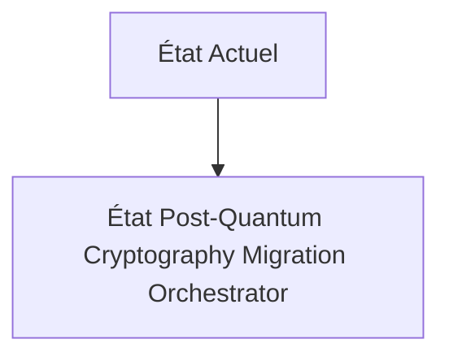
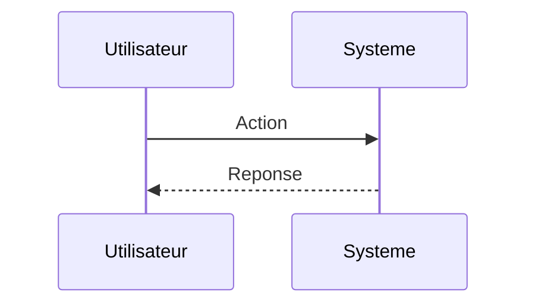

<!-- markdownlint-disable MD009 MD010 MD013 MD022 MD028 MD032 MD033 MD034 MD036 MD037 MD039 MD041 MD060 -->

[ 🇬🇧 English Version ](./README.md)

# Post-Quantum Cryptography Migration Orchestrator

> **Résumé exécutif :** Un moteur d'analyse bas niveau de flux réseau et de SBOM (Software Bill of Materials) cryptographique, qui identifie chaque instance de crypto vulnérable (dans les binaires, API, firmwares), et injecte de manière dynamique des couches de crypto-agilité (algorithmes PQC comme Kyber ou Dilithium) via des proxys ou des patchs automatisés sans downtime.

---

## 1. Aperçu visuel & Effet Wahou

## 2. La thèse contrariante (Peter Thiel Style)

**La croyance populaire :** Les solutions généralistes IA peuvent résoudre ce problème.

**La vérité cachée :** Un simple scanner de vulnérabilités SaaS ne détecte pas les bibliothèques cryptographiques compilées en dur dans des systèmes legacy ou des contrôleurs industriels. Il faut une analyse statique de binaires et une inspection profonde de paquets (DPI) pour repérer les échanges d'échange de clés asymétriques cachés.

## 3. Le problème & La cible

**Modèle économique :** B2B

**Cible précise :** Banques systémiques, organismes gouvernementaux, opérateurs d'infrastructures critiques (OIV), et réseaux de télécommunications.

**La douleur urgente :** La menace "Harvest Now, Decrypt Later" (récolter aujourd'hui, décrypter plus tard) expose les secrets d'État et financiers aux futurs ordinateurs quantiques. Les gouvernements (NIST, ANSSI) exigent une migration d'ici 2030, mais les architectures IT actuelles contiennent des milliers de certificats et dépendances RSA/ECC entremêlés, sans inventaire précis.

## 4. Architecture technique & Plomberie

## 5. Modèle économique & Viabilité financière

| Métrique                    | Valeur                        |
| --------------------------- | ----------------------------- |
| Structure de prix           | Abonnement SaaS               |
| Objectif 12 mois            | 10 clients                    |
| Calcul du CA (Target 100k€) | 10 clients \* 10k€/an = 100k€ |
| Marge brute estimée         | 80%                           |

## 6. Moteur de distribution & Fossé défensif (Moat)

**Stratégie d'acquisition :** Vente directe B2B

**Moat (Barrière à l'entrée) :** L'évolution des normes du NIST (si les algorithmes PQC choisis s'avèrent vulnérables, ce qui est déjà arrivé). Les performances (les clés PQC sont beaucoup plus grandes, ce qui peut saturer les bandes passantes réseau et ralentir les systèmes embarqués).

## 7. Grille d'évaluation détaillée

| Critère                           | Score VC (/100) | Score Terrain (/100) |
| --------------------------------- | --------------- | -------------------- |
| Thèse & Monopole / Urgence        | -- / 25         | -- / 25              |
| Moat / Résistance aux LLM natifs  | -- / 25         | -- / 25              |
| Scalabilité / Friction d'adoption | -- / 25         | -- / 25              |
| Unit Economics / ROI direct       | -- / 25         | -- / 25              |
| **TOTAL**                         | **-- / 100**    | **-- / 100**         |

> **Verdict VC :** En attente d'évaluation.

> **Verdict Terrain :** En attente d'évaluation.
