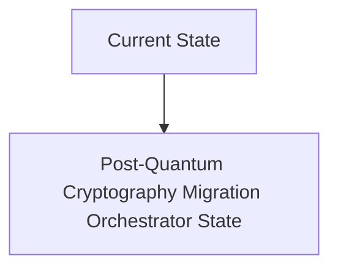
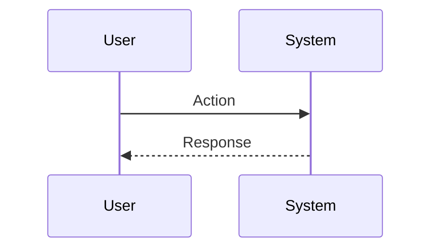

<!-- markdownlint-disable MD009 MD010 MD013 MD022 MD028 MD032 MD033 MD034 MD036 MD037 MD039 MD041 MD060 -->

[ 🇫🇷 Version Française ](./README.fr.md)

# Post-Quantum Cryptography Migration Orchestrator

> **Executive Summary:** A low-level analysis engine for network flows and cryptographic SBOM (Software Bill of Materials), which identifies each instance of vulnerable crypto (in binaries, API, firmware), and dynamically injects layers of crypto-agility (PQC algorithms like Kyber or Dilithium) via proxies or automated patches without downtime.

---

## 1. Visual Overview & Wow Effect

## 2. Contrarian Thesis (Peter Thiel Style)

**Popular Belief:** General AI solutions can solve this problem.

**Hidden Truth:** A simple SaaS vulnerability scanner does not detect hard-compiled cryptographic libraries in legacy systems or industrial controllers. It requires static binary analysis and deep packet inspection (DPI) to spot hidden asymmetric key exchanges.

## 3. Problem & Target Market

**Business Model:** B2B

**Target Audience:** Systemic banks, government agencies, critical infrastructure operators (CIOs), and telecommunications networks.

**Urgent Pain Point:** The “Harvest Now, Decrypt Later” threat exposes state and financial secrets to future quantum computers. Governments (NIST, ANSSI) are demanding migration by 2030, but current IT architectures contain thousands of intertwined RSA/ECC certificates and dependencies, with no precise inventory.

## 4. Technical Architecture & Infrastructure

## 5. Business Model & Financial Viability

| Metric                 | Value                           |
| ---------------------- | ------------------------------- |
| Pricing Structure      | SaaS subscription               |
| 12-Month Target        | 10 customers                    |
| Revenue Formula        | 10 clients \* 10k€/year = 100k€ |
| Estimated Gross Margin | 80%                             |

## 6. Distribution Engine & Moat

**Acquisition Strategy:** B2B direct sales

**Moat (Defensibility):** The evolution of NIST standards (if the chosen PQC algorithms prove vulnerable, which has already happened). Performance (PQC keys are much larger, which can saturate network bandwidths and slow down embedded systems).

## 7. Detailed Evaluation Grid

| Criterion                   | VC Score (/100) | Market Score (/100) |
| --------------------------- | --------------- | ------------------- |
| Thesis & Monopoly / Urgency | -- / 25         | -- / 25             |
| Moat / LLM Immunity         | -- / 25         | -- / 25             |
| Scalability / UX Friction   | -- / 25         | -- / 25             |
| Unit Economics / ROI        | -- / 25         | -- / 25             |
| **TOTAL**                   | **-- / 100**    | **-- / 100**        |

> **VC Verdict:** Pending evaluation.

> **Market Verdict:** Pending evaluation.
