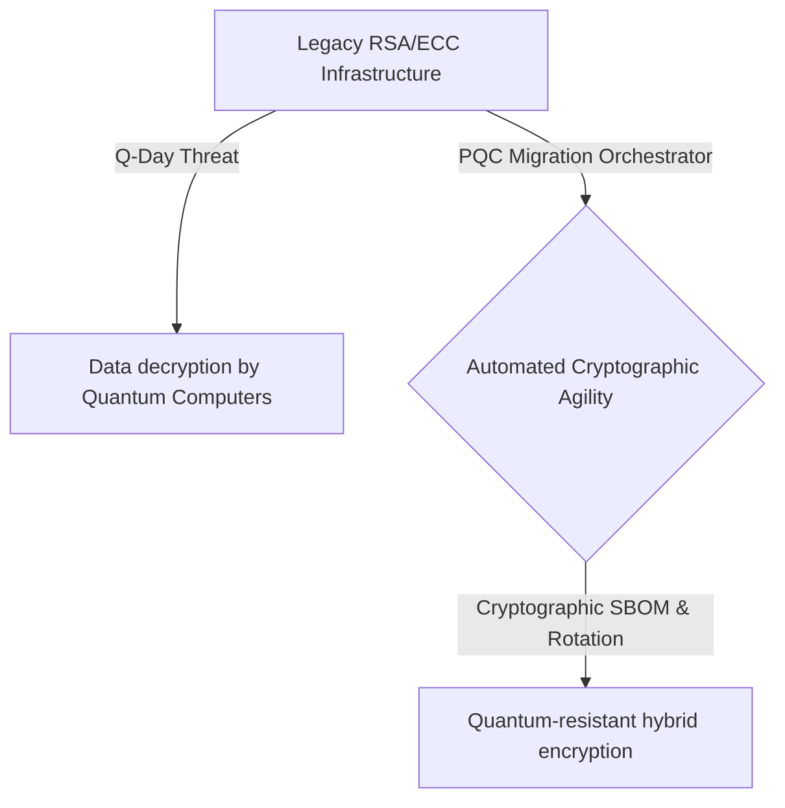
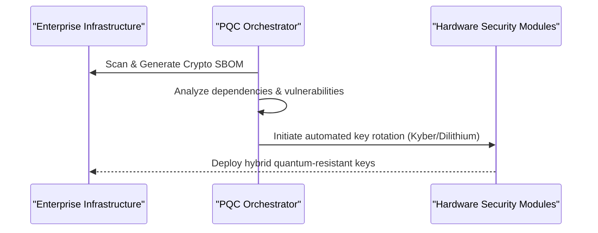

<!-- markdownlint-disable MD009 MD010 MD013 MD022 MD028 MD032 MD033 MD034 MD036 MD037 MD039 MD041 MD058 MD060 -->

[🇫🇷 Version Française](./README.fr.md)

# Post-Quantum Cryptography (PQC) Migration Orchestrator

> **Executive Summary:** An orchestration platform for cryptographic agility, automating the mapping and rotation of encryption keys to quantum-resistant algorithms across massive infrastructures.

---

## 1. Visual Overview & Wow Effect

```mermaid
graph TD
    %% Problem vs Solution or Architecture Diagram
    A[Legacy RSA/ECC Infrastructure] -->|Q-Day Threat| B[Data decryption by Quantum Computers]
    A -->|PQC Migration Orchestrator| C{Automated Cryptographic Agility}
    C -->|Cryptographic SBOM & Rotation| D[Quantum-resistant hybrid encryption]
```

## 2. Contrarian Thesis (Peter Thiel Style)

Popular Belief: Upgrading to Post-Quantum Cryptography is just a matter of running standard software updates when the NIST standards are finalized.
Hidden Truth: Replacing core cryptographic algorithms requires rewriting source code, re-certifying Hardware Security Modules (HSMs), and handling massive increases in key sizes that break standard network protocols. A simple software update cannot solve this; it requires a specialized orchestration engine.

## 3. Problem & Target Market

Business Model: B2B
Target Audience: Banks, financial institutions, governments, defense, and large SaaS enterprises.
Urgent Pain Point: The "Store now, decrypt later" strategy means critical data stolen today will be readable when fault-tolerant quantum computers arrive (Q-Day). Migrating massive legacy infrastructures to PQC standards is a logistical and technical nightmare.

## 4. Technical Architecture & Infrastructure

```mermaid
sequenceDiagram
    %% Sequence diagram or system flow
    participant Infra as "Enterprise Infrastructure"
    participant Orch as "PQC Orchestrator"
    participant HSM as "Hardware Security Modules"
    Orch->>Infra: Scan & Generate Crypto SBOM
    Orch->>Orch: Analyze dependencies & vulnerabilities
    Orch->>HSM: Initiate automated key rotation (Kyber/Dilithium)
    HSM-->>Infra: Deploy hybrid quantum-resistant keys
```

## 5. Business Model & Financial Viability

| Metric                 | Value                                                  |
| ---------------------- | ------------------------------------------------------ |
| Pricing Structure      | Annual subscription based on infrastructure nodes/HSMs |
| 12-Month Target        | 2 to 3 large financial or government contracts         |
| Revenue Formula        | 2 \* 50k = 100k                                        |
| Estimated Gross Margin | 85%                                                    |

## 6. Distribution Engine & Moat

Acquisition Strategy: Direct enterprise sales, partnerships with cybersecurity auditing firms and HSM manufacturers.
Moat (Defensibility): The deep integration required with legacy architectures and HSMs, combined with the zero-tolerance for implementation bugs in cryptography, creates a massive moat. Generating a dynamic cryptographic SBOM across complex, air-gapped networks cannot be easily replicated by standard SaaS platforms.

## 7. Detailed Evaluation Grid

| Criterion                   | VC Score (/100) | Market Score (/100) |
| --------------------------- | --------------- | ------------------- |
| Thesis & Monopoly / Urgency | -- / 25         | -- / 25             |
| Moat / LLM Immunity         | -- / 25         | -- / 25             |
| Scalability / UX Friction   | -- / 25         | -- / 25             |
| Unit Economics / ROI        | -- / 25         | -- / 25             |
| **TOTAL**                   | **-- / 100**    | **-- / 100**        |

> **VC Verdict:** Pending evaluation.

> **Market Verdict:** Pending evaluation.
