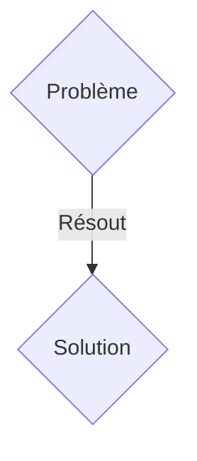
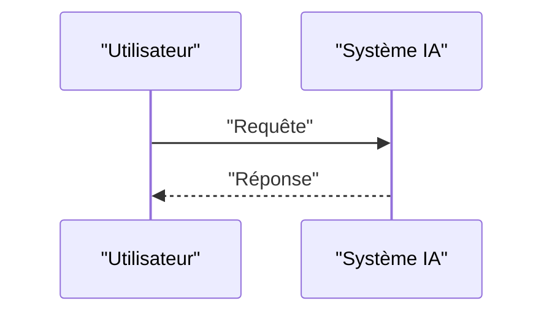

<!-- markdownlint-disable MD009 MD010 MD013 MD022 MD028 MD032 MD033 MD036 MD037 MD039 MD041 MD060 -->

[ 🇬🇧 English Version ](./README.md)

# PQC Optical Interceptor

> **Résumé exécutif :** Une solution B2B / B2G ciblant Banques centrales, agences de renseignement, grandes institutions financières, opérateurs de datacenters. pour résoudre : L'attaque "Store Now, Decrypt Later" (SNDL). Des acteurs étatiques aspirent massivement le trafic internet chiffré aujourd'hui dans l'espoir de le déchiffrer demain avec des ordinateurs quantiques. La cryptographie RSA/ECC actuelle sera brisée (algorithme de Shor), exposant rétroactivement des secrets d'État, des transactions financières et des propriétés intellectuelles.

---

## 1. Aperçu visuel & Effet Wahou

## 2. La thèse contrariante (Peter Thiel Style)

- **La croyance populaire :** Les solutions génériques suffisent.
- **La vérité cachée :** Un boîtier d'interception et de ré-encapsulation hardware (Appliance réseau de couche 1/2) qui s'installe directement sur la fibre optique (Data Center Interconnects - DCI). Il intercepte le trafic TLS existant et applique de manière transparente une couche de chiffrement post-quantique (Post-Quantum Cryptography - algorithmes NIST comme CRYSTALS-Kyber) à très haut débit (Tbps) sans modifier les applications métiers.

## 3. Le problème & La cible

- **Modèle économique :** B2B / B2G
- **Cible précise :** Banques centrales, agences de renseignement, grandes institutions financières, opérateurs de datacenters.
- **La douleur urgente :** L'attaque "Store Now, Decrypt Later" (SNDL). Des acteurs étatiques aspirent massivement le trafic internet chiffré aujourd'hui dans l'espoir de le déchiffrer demain avec des ordinateurs quantiques. La cryptographie RSA/ECC actuelle sera brisée (algorithme de Shor), exposant rétroactivement des secrets d'État, des transactions financières et des propriétés intellectuelles.

## 4. Architecture technique & Plomberie

Un boîtier d'interception et de ré-encapsulation hardware (Appliance réseau de couche 1/2) qui s'installe directement sur la fibre optique (Data Center Interconnects - DCI). Il intercepte le trafic TLS existant et applique de manière transparente une couche de chiffrement post-quantique (Post-Quantum Cryptography - algorithmes NIST comme CRYSTALS-Kyber) à très haut débit (Tbps) sans modifier les applications métiers.

## 5. Modèle économique & Viabilité financière

| Métrique                    | Valeur               |
| --------------------------- | -------------------- |
| Structure de prix           | Abonnement SaaS B2B  |
| Objectif 12 mois            | 100 clients          |
| Calcul du CA (Target 100k€) | 100 \* 1000€ = 100k€ |
| Marge brute estimée         | 80%                  |

## 6. Moteur de distribution & Fossé défensif (Moat)

- **Stratégie d'acquisition :** Vente directe et partenariats stratégiques.
- **Moat (Barrière à l'entrée) :** L'implémentation de PQC au niveau applicatif (SaaS) requiert des années de refonte du code legacy. Ce problème nécessite une solution au niveau du silicium (FPGA/ASIC) capable de traiter des flux optiques massifs en temps réel avec une latence quasi-nulle, impliquant des compétences pointues en cryptographie matérielle et en photonique.

## 7. Grille d'évaluation détaillée

| Critère                           | Score VC (/100) | Score Terrain (/100) |
| --------------------------------- | --------------- | -------------------- |
| Thèse & Monopole / Urgence        | -- / 25         | -- / 25              |
| Moat / Résistance aux LLM natifs  | -- / 25         | -- / 25              |
| Scalabilité / Friction d'adoption | -- / 25         | -- / 25              |
| Unit Economics / ROI direct       | -- / 25         | -- / 25              |
| TOTAL                             | -- / 100        | -- / 100             |

> **Verdict VC :** En attente d'évaluation.
> **Verdict Terrain :** En attente d'évaluation.
