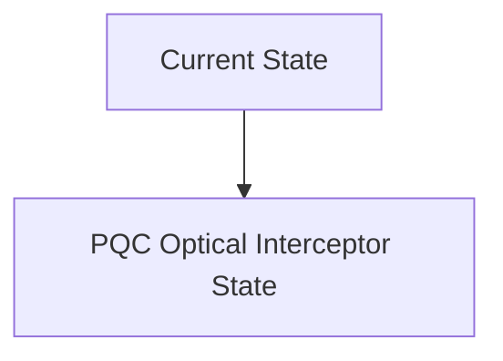
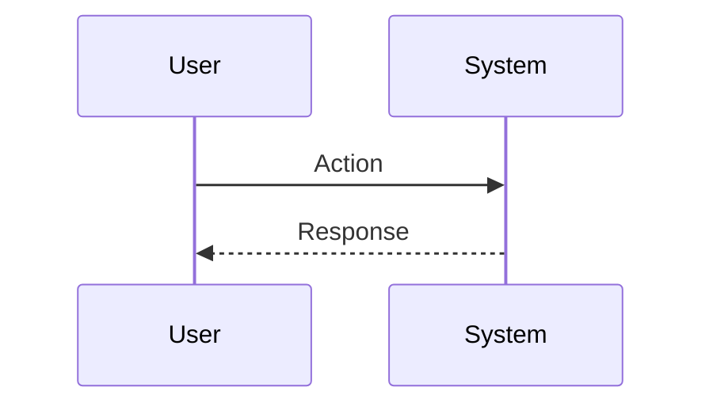

<!-- markdownlint-disable MD009 MD010 MD013 MD022 MD028 MD032 MD033 MD034 MD036 MD037 MD039 MD041 MD060 -->

[ 🇫🇷 Version Française ](./README.fr.md)

# PQC Optical Interceptor

> **Executive Summary:** A hardware interception and re-encapsulation box (Layer 1/2 network appliance) which is installed directly on the optical fiber (Data Center Interconnects - DCI). It intercepts existing TLS traffic and transparently applies a post-quantum encryption layer (Post-Quantum Cryptography - NIST algorithms such as CRYSTALS-Kyber) at very high speed (Tbps) without modifying business applications.

---

## 1. Visual Overview & Wow Effect

## 2. Contrarian Thesis (Peter Thiel Style)

**Popular Belief:** General AI solutions can solve this problem.

**Hidden Truth:** Implementing PQC at the application level (SaaS) requires years of legacy code overhaul. This problem requires a silicon-level solution (FPGA/ASIC) capable of processing massive optical flows in real time with near-zero latency, involving advanced skills in hardware cryptography and photonics.

## 3. Problem & Target Market

**Business Model:** B2B / B2G

**Target Audience:** Central banks, intelligence agencies, large financial institutions, data center operators.

**Urgent Pain Point:** The “Store Now, Decrypt Later” (SNDL) attack. State actors are massively sucking up internet traffic encrypted today in the hope of decrypting it tomorrow with quantum computers. Current RSA/ECC cryptography will be broken (Shor's algorithm), retroactively exposing state secrets, financial transactions and intellectual properties.

## 4. Technical Architecture & Infrastructure

## 5. Business Model & Financial Viability

| Metric                 | Value                           |
| ---------------------- | ------------------------------- |
| Pricing Structure      | SaaS subscription               |
| 12-Month Target        | 10 customers                    |
| Revenue Formula        | 10 clients \* 10k€/year = 100k€ |
| Estimated Gross Margin | 80%                             |

## 6. Distribution Engine & Moat

**Acquisition Strategy:** B2B direct sales

**Moat (Defensibility):** Rapid evolution of NIST cryptographic standards, buyer resistance to "black box hardware", extreme complexity of very high speed FPGA chip design.

## 7. Detailed Evaluation Grid

| Criterion                   | VC Score (/100) | Market Score (/100) |
| --------------------------- | --------------- | ------------------- |
| Thesis & Monopoly / Urgency | -- / 25         | -- / 25             |
| Moat / LLM Immunity         | -- / 25         | -- / 25             |
| Scalability / UX Friction   | -- / 25         | -- / 25             |
| Unit Economics / ROI        | -- / 25         | -- / 25             |
| **TOTAL**                   | **-- / 100**    | **-- / 100**        |

> **VC Verdict:** Pending evaluation.

> **Market Verdict:** Pending evaluation.
