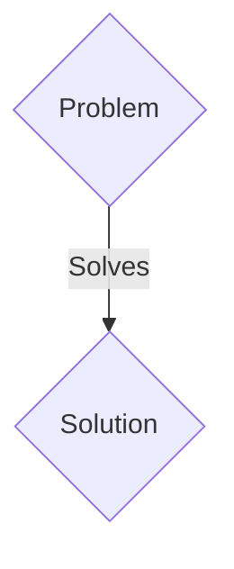
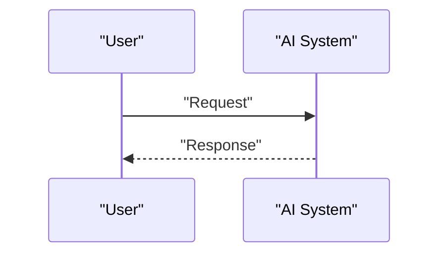

<!-- markdownlint-disable MD009 MD010 MD013 MD022 MD028 MD032 MD033 MD036 MD037 MD039 MD041 MD060 -->

[ 🇫🇷 Version Française ](./README.fr.md)

# Post-Quantum OT Gateway (PQC OT Gateway)

> **Executive Summary:** A B2B solution targeting OIV (Operators of Vital Importance), managers of electricity networks, water treatment plants, and heavy industrial infrastructure. to solve: Industrial control systems (ICS/SCADA) use legacy clear or weakly encrypted communication protocols. The imminent arrival of quantum computers (Q-Day) threatens to break current asymmetric encryptions, making these critical infrastructures vulnerable to “Store Now, Decrypt Later” attacks. Hardware replacement of all PLCs is financially impossible and would require unacceptable production shutdowns.

---

## 1. Visual Overview & Wow Effect

## 2. Contrarian Thesis (Peter Thiel Style)

- **Popular Belief:** Generic solutions are enough.
- **Hidden Truth:** A hardware/software gateway (edge ​​gateway) deployed upstream of legacy equipment. It acts as a post-quantum IPsec/TLS tunnel, encapsulating insecure industrial traffic (Modbus, DNP3) in quantum-resistant cryptography algorithms (e.g. Kyber/Dilithium) for inter-site and cloud communications, without requiring updates to the underlying PLCs.

## 3. Problem & Target Market

- **Business Model:** B2B
- **Target Audience:** OIV (Operators of Vital Importance), managers of electricity networks, water treatment plants, and heavy industrial infrastructure.
- **Urgent Pain Point:** Industrial control systems (ICS/SCADA) use legacy clear or weakly encrypted communication protocols. The imminent arrival of quantum computers (Q-Day) threatens to break current asymmetric encryptions, making these critical infrastructures vulnerable to “Store Now, Decrypt Later” attacks. Hardware replacement of all PLCs is financially impossible and would require unacceptable production shutdowns.

## 4. Technical Architecture & Infrastructure

A hardware/software gateway (edge ​​gateway) deployed upstream of legacy equipment. It acts as a post-quantum IPsec/TLS tunnel, encapsulating insecure industrial traffic (Modbus, DNP3) in quantum-resistant cryptography algorithms (e.g. Kyber/Dilithium) for inter-site and cloud communications, without requiring updates to the underlying PLCs.

## 5. Business Model & Financial Viability

| Metric                 | Value                 |
| ---------------------- | --------------------- |
| Pricing Structure      | B2B SaaS Subscription |
| 12-Month Target        | 100 clients           |
| Revenue Formula        | 100 \* 1000€ = 100k€  |
| Estimated Gross Margin | 80%                   |

## 6. Distribution Engine & Moat

- **Acquisition Strategy:** Direct sales and strategic partnerships.
- **Moat (Defensibility):** This problem requires deep integration at the physical network level (L2/L3), strict low latency so as not to disrupt real-time industrial processes, and compatibility with very specific OT protocols. A simple LLM prompt or a cloud SaaS cannot physically secure a data flow coming from a 1990 PLC in an isolated factory without modifying the hardware.

## 7. Detailed Evaluation Grid

| Criterion                   | VC Score (/100) | Market Score (/100) |
| --------------------------- | --------------- | ------------------- |
| Thesis & Monopoly / Urgency | -- / 25         | -- / 25             |
| Moat / LLM Immunity         | -- / 25         | -- / 25             |
| Scalability / UX Friction   | -- / 25         | -- / 25             |
| Unit Economics / ROI        | -- / 25         | -- / 25             |
| TOTAL                       | -- / 100        | -- / 100            |

> **VC Verdict:** Pending evaluation.
> **Market Verdict:** Pending evaluation.
