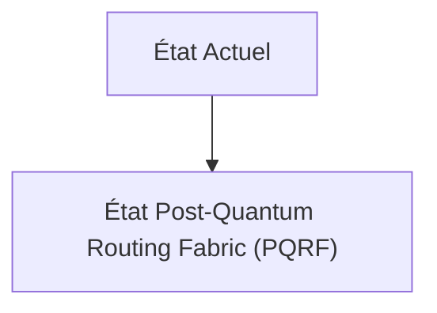
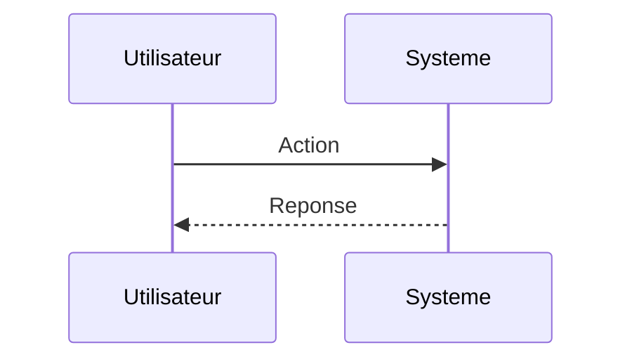

<!-- markdownlint-disable MD009 MD010 MD013 MD022 MD028 MD032 MD033 MD034 MD036 MD037 MD039 MD041 MD060 -->

[ 🇬🇧 English Version ](./README.md)

# Post-Quantum Routing Fabric (PQRF)

> **Résumé exécutif :** Implémentation de routeurs SDN (Software-Defined Networking) hybrides qui encapsulent et découpent le trafic de bout en bout en temps réel à très haut débit en utilisant les algorithmes standardisés NIST PQC (CRYSTALS-Kyber/Dilithium), sans pénaliser la latence.

---

## 1. Aperçu visuel & Effet Wahou

## 2. La thèse contrariante (Peter Thiel Style)

**La croyance populaire :** Les solutions généralistes IA peuvent résoudre ce problème.

**La vérité cachée :** Un simple patch logiciel au niveau de la couche applicative (L7) est insuffisant, il faut chiffrer massivement au niveau des couches réseau (L2/L3) avec une accélération matérielle (FPGA/ASIC) pour supporter des térabits de trafic sans goulet d'étranglement.

## 3. Le problème & La cible

**Modèle économique :** B2B (Enterprise/Telco)

**Cible précise :** Opérateurs télécoms de niveau 1 (Tier-1), grandes banques, datacenters cloud (AWS, Azure), gouvernements.

**La douleur urgente :** La menace "Harvest Now, Decrypt Later" (HNDL). Les attaquants stockent actuellement le trafic réseau chiffré (RSA/ECC) pour le déchiffrer dès qu'un ordinateur quantique tolérant aux pannes sera disponible, compromettant les secrets d'État et bancaires d'aujourd'hui.

## 4. Architecture technique & Plomberie

## 5. Modèle économique & Viabilité financière

| Métrique                    | Valeur                        |
| --------------------------- | ----------------------------- |
| Structure de prix           | Abonnement SaaS               |
| Objectif 12 mois            | 10 clients                    |
| Calcul du CA (Target 100k€) | 10 clients \* 10k€/an = 100k€ |
| Marge brute estimée         | 80%                           |

## 6. Moteur de distribution & Fossé défensif (Moat)

**Stratégie d'acquisition :** Vente directe B2B

**Moat (Barrière à l'entrée) :** Les algorithmes PQC génèrent des clés et des signatures plus larges, ce qui peut saturer les buffers des routeurs existants. Dépendance forte aux standards en cours d'évolution et à la compatibilité matérielle legacy.

## 7. Grille d'évaluation détaillée

| Critère                           | Score VC (/100) | Score Terrain (/100) |
| --------------------------------- | --------------- | -------------------- |
| Thèse & Monopole / Urgence        | -- / 25         | -- / 25              |
| Moat / Résistance aux LLM natifs  | -- / 25         | -- / 25              |
| Scalabilité / Friction d'adoption | -- / 25         | -- / 25              |
| Unit Economics / ROI direct       | -- / 25         | -- / 25              |
| **TOTAL**                         | **-- / 100**    | **-- / 100**         |

> **Verdict VC :** En attente d'évaluation.

> **Verdict Terrain :** En attente d'évaluation.
