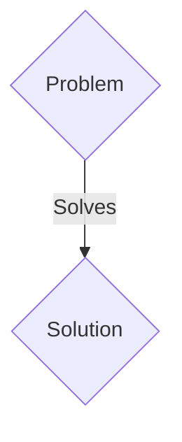
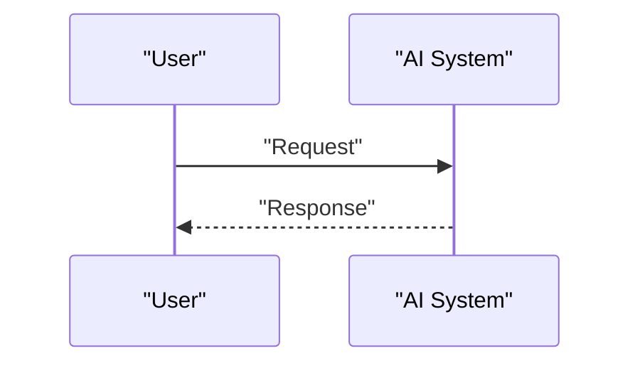

<!-- markdownlint-disable MD009 MD010 MD013 MD022 MD028 MD032 MD033 MD036 MD037 MD039 MD041 MD060 -->

[ 🇫🇷 Version Française ](./README.fr.md)

# Post-Quantum Routing Fabric (PQRF)

> **Executive Summary:** A B2B (Enterprise/Telco) solution targeting Tier 1 telecom operators, large banks, cloud data centers (AWS, Azure), governments. to solve: The “Harvest Now, Decrypt Later” (HNDL) threat. Attackers are currently storing encrypted network traffic (RSA/ECC) to decrypt it as soon as a fault-tolerant quantum computer becomes available, compromising today's state and banking secrets.

---

## 1. Visual Overview & Wow Effect

## 2. Contrarian Thesis (Peter Thiel Style)

- **Popular Belief:** Generic solutions are enough.
- **Hidden Truth:** Implementation of hybrid SDN (Software-Defined Networking) routers that encapsulate and slice end-to-end traffic in real time at very high throughput using standardized NIST PQC (CRYSTALS-Kyber/Dilithium) algorithms, without penalizing latency.

## 3. Problem & Target Market

- **Business Model:** B2B (Enterprise/Telco)
- **Target Audience:** Tier 1 telecom operators, large banks, cloud data centers (AWS, Azure), governments.
- **Urgent Pain Point:** The “Harvest Now, Decrypt Later” (HNDL) threat. Attackers are currently storing encrypted network traffic (RSA/ECC) to decrypt it as soon as a fault-tolerant quantum computer becomes available, compromising today's state and banking secrets.

## 4. Technical Architecture & Infrastructure

Implementation of hybrid SDN (Software-Defined Networking) routers that encapsulate and slice end-to-end traffic in real time at very high throughput using standardized NIST PQC (CRYSTALS-Kyber/Dilithium) algorithms, without penalizing latency.

## 5. Business Model & Financial Viability

| Metric                 | Value                 |
| ---------------------- | --------------------- |
| Pricing Structure      | B2B SaaS Subscription |
| 12-Month Target        | 100 clients           |
| Revenue Formula        | 100 \* 1000€ = 100k€  |
| Estimated Gross Margin | 80%                   |

## 6. Distribution Engine & Moat

- **Acquisition Strategy:** Direct sales and strategic partnerships.
- **Moat (Defensibility):** A simple software patch at the application layer (L7) is insufficient; massive encryption is required at the network layers (L2/L3) with hardware acceleration (FPGA/ASIC) to support terabits of traffic without a bottleneck.

## 7. Detailed Evaluation Grid

| Criterion                   | VC Score (/100) | Market Score (/100) |
| --------------------------- | --------------- | ------------------- |
| Thesis & Monopoly / Urgency | -- / 25         | -- / 25             |
| Moat / LLM Immunity         | -- / 25         | -- / 25             |
| Scalability / UX Friction   | -- / 25         | -- / 25             |
| Unit Economics / ROI        | -- / 25         | -- / 25             |
| TOTAL                       | -- / 100        | -- / 100            |

> **VC Verdict:** Pending evaluation.
> **Market Verdict:** Pending evaluation.
