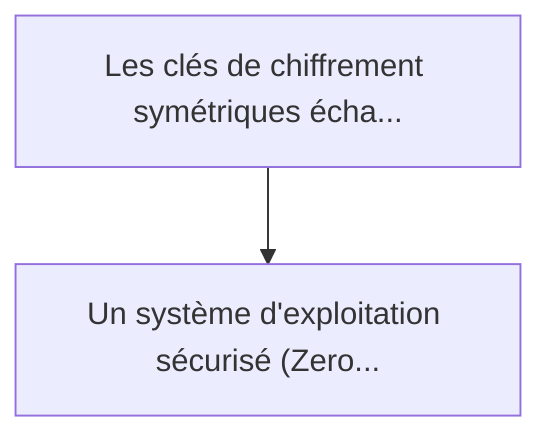
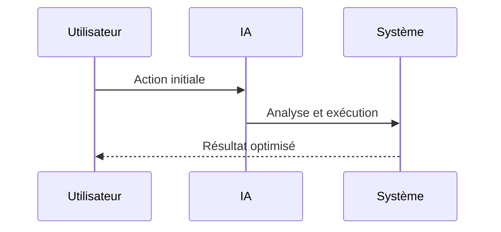

<!-- markdownlint-disable MD013 MD028 MD033 MD039 MD041 -->

[ 🇬🇧 English Version ](./README.md)

# PQC Satellite HSM (Hardware Security Module) Mesh

> **Résumé exécutif :** Un système d'exploitation sécurisé (Zero-Trust) couplé à un accélérateur matériel (FPGA/ASIC) optimisé pour l'espace et dédié exclusivement aux opé...

---

## 1. Aperçu visuel & Effet Wahou

## 2. La thèse contrariante (Peter Thiel Style)

La croyance populaire : Les solutions génériques peuvent résoudre cela.
La vérité cachée : C'est un problème d'architecture matérielle et de contraintes de l'environnement spatial (radiations, limites de puissance). Un simple patch logiciel PQC sur les CPU rad-hard existants des satellites s'effondrerait sous le poids computationnel ou consommerait trop de batterie orbitale.

## 3. Le problème & La cible

Modèle économique : B2B / M2M
Cible précise : Opérateurs de constellations satellites (Starlink, Kuiper), fournisseurs de cloud gouvernemental, et institutions financières globales.
La douleur urgente : Les clés de chiffrement symétriques échangées par les constellations satellites (LEO) pour sécuriser le trafic global sont vulnérables aux futures attaques quantiques (SNDL - Store Now, Decrypt Later). Mettre à jour l'infrastructure spatiale avec des algorithmes Post-Quantique (PQC) est un cauchemar car le hardware spatial (HSM) existant est sous-dimensionné pour la lourdeur des signatures PQC (ex: Dilithium, Falcon), entraînant des latences fatales pour le routage orbital inter-satellites (ISL).

## 4. Architecture technique & Plomberie

## 5. Modèle économique & Viabilité financière

| Métrique                    | Valeur             |
| --------------------------- | ------------------ |
| Structure de prix           | Prix sur mesure    |
| Objectif 12 mois            | 100 clients        |
| Calcul du CA (Target 100k€) | 100 \* 1000 = 100k |
| Marge brute estimée         | 80%                |

## 6. Moteur de distribution & Fossé défensif (Moat)

Stratégie d'acquisition : Vente B2B directe
Moat (Barrière à l'entrée) : C'est un problème d'architecture matérielle et de contraintes de l'environnement spatial (radiations, limites de puissance). Un simple patch logiciel PQC sur les CPU rad-hard existants des satellites s'effondrerait sous le poids computationnel ou consommerait trop de batterie orbitale.

## 7. Grille d'évaluation détaillée

| Critère                           | Score VC (/100) | Score Terrain (/100) |
| --------------------------------- | --------------- | -------------------- |
| Thèse & Monopole / Urgence        | -- / 25         | -- / 25              |
| Moat / Résistance aux LLM natifs  | -- / 25         | -- / 25              |
| Scalabilité / Friction d'adoption | -- / 25         | -- / 25              |
| Unit Economics / ROI direct       | -- / 25         | -- / 25              |
| **TOTAL**                         | **-- / 100**    | **-- / 100**         |

> **Verdict VC :** En attente d'évaluation.

> **Verdict Terrain :** En attente d'évaluation.
