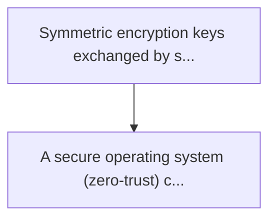
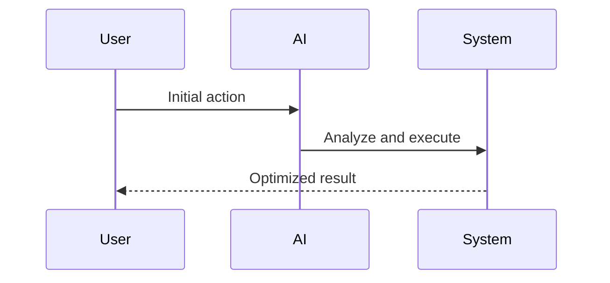

<!-- markdownlint-disable MD013 MD028 MD033 MD039 MD041 -->

[ 🇫🇷 Version Française ](./README.fr.md)

# Pqc satellite hsm (hardware security module) mesh

> **Executive Summary:** A secure operating system (zero-trust) coupled with a hardware accelerator (fpga/asic) optimised for space and dedicated exclusively to operating operations.

---

## 1. Visual Overview & Wow Effect

## 2. Contrarian Thesis (Peter Thiel Style)

Popular Belief: Generic solutions can solve this.
Hidden Truth: It is a problem of material architecture and constraints of the space environment (radiations, limits of power). a simple pqc software patch on existing satellite rad-hard cpus would collapse under computational weight or consume too much orbital battery.

## 3. Problem & Target Market

Business Model: B2B / M2M
Target Audience: Satellite constellation operators (starlink, kuiper), government cloud providers, and global financial institutions.
Urgent Pain Point: Symmetric encryption keys exchanged by satellite constellations (leo) to secure global traffic are vulnerable to future quantum attacks (sndl - store now, decrypt later). updating the space infrastructure with post-quantical algorithms (pqc) is a nightmare because existing space hardware (hsm) is undersized for the heavyness of pqc signatures (e.g., dilithium, falcon), resulting in fatal latency for intersatellite orbital routing (isl).

## 4. Technical Architecture & Infrastructure

## 5. Business Model & Financial Viability

| Metric                 | Value              |
| ---------------------- | ------------------ |
| Pricing Structure      | Custom Pricing     |
| 12-Month Target        | 100 customers      |
| Revenue Formula        | 100 \* 1000 = 100k |
| Estimated Gross Margin | 80%                |

## 6. Distribution Engine & Moat

Acquisition Strategy: Direct B2B Sales
Moat (Defensibility): It is a problem of material architecture and constraints of the space environment (radiations, limits of power). a simple pqc software patch on existing satellite rad-hard cpus would collapse under computational weight or consume too much orbital battery.

## 7. Detailed Evaluation Grid

| Criterion                   | VC Score (/100) | Market Score (/100) |
| --------------------------- | --------------- | ------------------- |
| Thesis & Monopoly / Urgency | 25 / 25         | -- / 25             |
| Moat / LLM Immunity         | 23 / 25         | -- / 25             |
| Scalability / UX Friction   | 17 / 25         | -- / 25             |
| Unit Economics / ROI        | 21 / 25         | -- / 25             |
| **TOTAL**                   | **86 / 100**    | **-- / 100**        |

> **VC Verdict:** PQC Satellite HSM addresses a high-stakes, imminent threat: the 'harvest now, decrypt later' quantum computing risk to global space infrastructure. By embedding post-quantum cryptography directly into specialized, space-grade hardware (FPGAs/ASICs), it creates an impenetrable moat against software-only solutions. The massive capital requirements and long sales cycles are offset by the absolute necessity of securing trillion-dollar orbital assets.

> **Market Verdict:** Pending evaluation.
