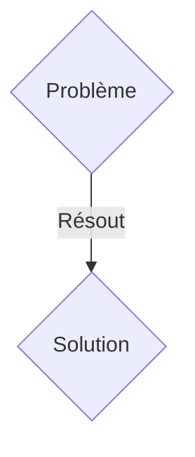
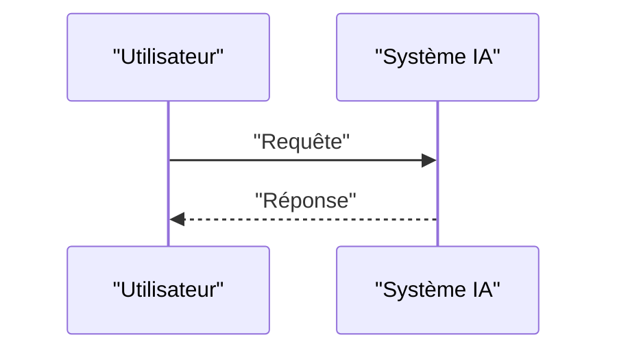

<!-- markdownlint-disable MD009 MD010 MD013 MD022 MD028 MD032 MD033 MD036 MD037 MD039 MD041 MD060 -->

[ 🇬🇧 English Version ](./README.md)

# Quantum Safe SBOM

> **Résumé exécutif :** Une solution B2B ciblant Editeurs de logiciels gouvernementaux, sous-traitants défense, institutions financières (DevSecOps, CISO). pour résoudre : Il est impossible de garantir qu'une bibliothèque open-source tierce insérée dans une chaîne de CI/CD ne contient pas de portes dérobées ou que sa signature cryptographique n'a pas été compromise face aux futures menaces quantiques.

---

## 1. Aperçu visuel & Effet Wahou

## 2. La thèse contrariante (Peter Thiel Style)

- **La croyance populaire :** Les solutions génériques suffisent.
- **La vérité cachée :** Une plateforme d'analyse d'AST (Abstract Syntax Tree) sémantique qui trace la provenance du code source jusqu'au binaire final, en signant de manière indélébile chaque étape de la compilation via un registre distribué utilisant la cryptographie Post-Quantique.

## 3. Le problème & La cible

- **Modèle économique :** B2B
- **Cible précise :** Editeurs de logiciels gouvernementaux, sous-traitants défense, institutions financières (DevSecOps, CISO).
- **La douleur urgente :** Il est impossible de garantir qu'une bibliothèque open-source tierce insérée dans une chaîne de CI/CD ne contient pas de portes dérobées ou que sa signature cryptographique n'a pas été compromise face aux futures menaces quantiques.

## 4. Architecture technique & Plomberie

Une plateforme d'analyse d'AST (Abstract Syntax Tree) sémantique qui trace la provenance du code source jusqu'au binaire final, en signant de manière indélébile chaque étape de la compilation via un registre distribué utilisant la cryptographie Post-Quantique.

## 5. Modèle économique & Viabilité financière

| Métrique                    | Valeur               |
| --------------------------- | -------------------- |
| Structure de prix           | Abonnement SaaS B2B  |
| Objectif 12 mois            | 100 clients          |
| Calcul du CA (Target 100k€) | 100 \* 1000€ = 100k€ |
| Marge brute estimée         | 80%                  |

## 6. Moteur de distribution & Fossé défensif (Moat)

- **Stratégie d'acquisition :** Vente directe et partenariats stratégiques.
- **Moat (Barrière à l'entrée) :** Les scanners de vulnérabilités classiques (SCA) se contentent de comparer des versions de packages avec une base de données de CVE connue, sans comprendre la structure du code ou détecter des malwares "zero-day" insérés lors de la compilation.

## 7. Grille d'évaluation détaillée

| Critère                           | Score VC (/100) | Score Terrain (/100) |
| --------------------------------- | --------------- | -------------------- |
| Thèse & Monopole / Urgence        | -- / 25         | -- / 25              |
| Moat / Résistance aux LLM natifs  | -- / 25         | -- / 25              |
| Scalabilité / Friction d'adoption | -- / 25         | -- / 25              |
| Unit Economics / ROI direct       | -- / 25         | -- / 25              |
| TOTAL                             | -- / 100        | -- / 100             |

> **Verdict VC :** En attente d'évaluation.
> **Verdict Terrain :** En attente d'évaluation.
