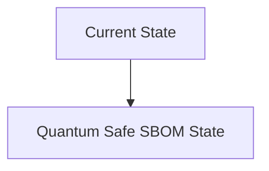
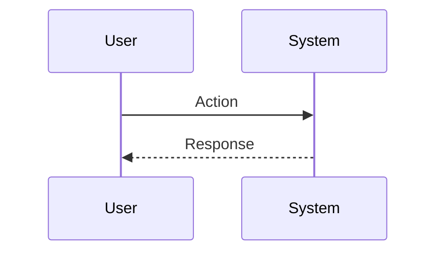

<!-- markdownlint-disable MD009 MD010 MD013 MD022 MD028 MD032 MD033 MD034 MD036 MD037 MD039 MD041 MD060 -->

[ 🇫🇷 Version Française ](./README.fr.md)

# Quantum Safe SBOM

> **Executive Summary:** A semantic AST (Abstract Syntax Tree) analysis platform that traces provenance from source code to the final binary, indelibly signing each step of compilation via a distributed ledger using Post-Quantum cryptography.

---

## 1. Visual Overview & Wow Effect

## 2. Contrarian Thesis (Peter Thiel Style)

**Popular Belief:** General AI solutions can solve this problem.

**Hidden Truth:** Traditional vulnerability scanners (SCA) simply compare package versions against a database of known CVEs, without understanding the structure of the code or detecting zero-day malware inserted during compilation.

## 3. Problem & Target Market

**Business Model:** B2B

**Target Audience:** Government software publishers, defense subcontractors, financial institutions (DevSecOps, CISO).

**Urgent Pain Point:** It is impossible to guarantee that a third-party open-source library inserted into a CI/CD chain does not contain backdoors or that its cryptographic signature has not been compromised in the face of future quantum threats.

## 4. Technical Architecture & Infrastructure

## 5. Business Model & Financial Viability

| Metric                 | Value                           |
| ---------------------- | ------------------------------- |
| Pricing Structure      | SaaS subscription               |
| 12-Month Target        | 10 customers                    |
| Revenue Formula        | 10 clients \* 10k€/year = 100k€ |
| Estimated Gross Margin | 80%                             |

## 6. Distribution Engine & Moat

**Acquisition Strategy:** B2B direct sales

**Moat (Defensibility):** Adoption of PQC standards, complex integration into the fragmented ecosystem of CI/CD tools (GitHub, GitLab, Jenkins), need to convince open-source developers to adopt the standard.

## 7. Detailed Evaluation Grid

| Criterion                   | VC Score (/100) | Market Score (/100) |
| --------------------------- | --------------- | ------------------- |
| Thesis & Monopoly / Urgency | -- / 25         | -- / 25             |
| Moat / LLM Immunity         | -- / 25         | -- / 25             |
| Scalability / UX Friction   | -- / 25         | -- / 25             |
| Unit Economics / ROI        | -- / 25         | -- / 25             |
| **TOTAL**                   | **-- / 100**    | **-- / 100**        |

> **VC Verdict:** Pending evaluation.

> **Market Verdict:** Pending evaluation.
