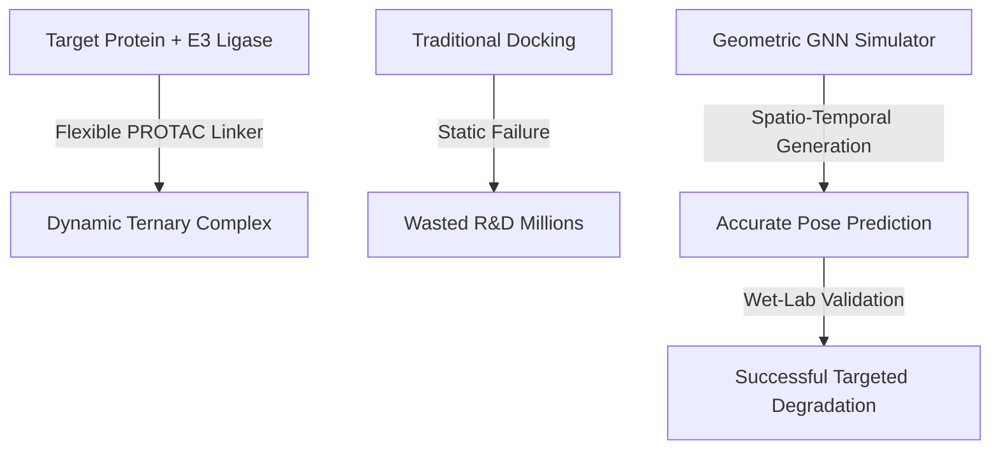
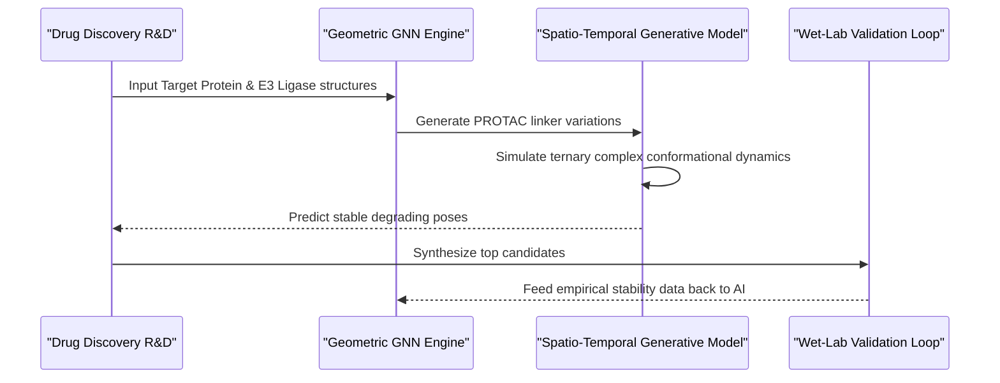

<!-- markdownlint-disable MD009 MD010 MD013 MD022 MD028 MD032 MD033 MD034 MD036 MD037 MD039 MD041 MD060 -->

[ 🇫🇷 Version Française ](./README.fr.md)

# PROTAC Ternary Complex Sim

> **Executive Summary:** A spatio-temporal generative model and geometric GNN platform to simulate and predict the conformational dynamics of massive PROTAC ternary complexes for targeted protein degradation.

---

## 1. Visual Overview & Wow Effect

## 2. Contrarian Thesis (Peter Thiel Style)

- **Popular Belief:** Protein structure prediction tools like AlphaFold have solved drug discovery; we just need to dock molecules into static pockets.
- **Hidden Truth:** For targeted protein degraders (PROTACs), static docking is useless. The entire mechanism relies on highly flexible linkers forming a dynamic "ternary complex" that traditional physics engines and static AI models cannot compute, representing the true bottleneck in modern pharma.

## 3. Problem & Target Market

- **Business Model:** B2B
- **Target Audience:** Pharmaceutical companies, drug discovery startups, and Contract Research Organizations (CROs).
- **Urgent Pain Point:** Discovering targeted protein degraders (PROTACs) is extremely costly (millions per hit). The major difficulty is not finding the binders, but accurately predicting the dynamic stability and formation of the massive ternary complex (Target Protein - PROTAC - Ligase) in vivo.

## 4. Technical Architecture & Infrastructure

## 5. Business Model & Financial Viability

| Metric                     | Value                                                    |
| -------------------------- | -------------------------------------------------------- |
| **Pricing Structure**      | Joint Development Agreements (JDA) + Milestone Royalties |
| **12-Month Target**        | 1-2 pilot JDAs with pharma companies                     |
| **Revenue Formula**        | 1 JDA \* 100k€ initial milestone                         |
| **Estimated Gross Margin** | ~90% (Software/Data)                                     |

## 6. Distribution Engine & Moat

- **Acquisition Strategy:** B2B direct sales and strategic partnerships with biotech firms, heavily relying on published empirical success in wet-lab validations.
- **Moat (Defensibility):** Traditional docking tools are too slow and fail miserably on flexible PROTAC linkers. Standard LLMs cannot do molecular dynamics. The proprietary dataset generated by the closed-loop wet-lab validation of ternary complexes creates a massive biological and computational moat.

## 7. Detailed Evaluation Grid

| Criterion                   | VC Score (/100) | Market Score (/100) |
| --------------------------- | --------------- | ------------------- |
| Thesis & Monopoly / Urgency | 23 / 25         | -- / 25             |
| Moat / LLM Immunity         | 24 / 25         | -- / 25             |
| Scalability / UX Friction   | 25 / 25         | -- / 25             |
| Unit Economics / ROI        | 22 / 25         | -- / 25             |
| **TOTAL**                   | **94 / 100**    | **-- / 100**        |

> **VC Verdict:** PROTACs are the future of therapeutics, and owning the simulation engine means taxing the entire ecosystem. The geometric GNN approach creates a proprietary data moat that compounds with every simulation. Highly scalable and directly monetizable through pharma licensing.

> **Market Verdict:** Pending evaluation.
