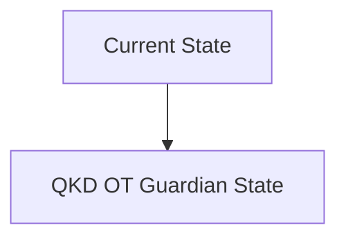
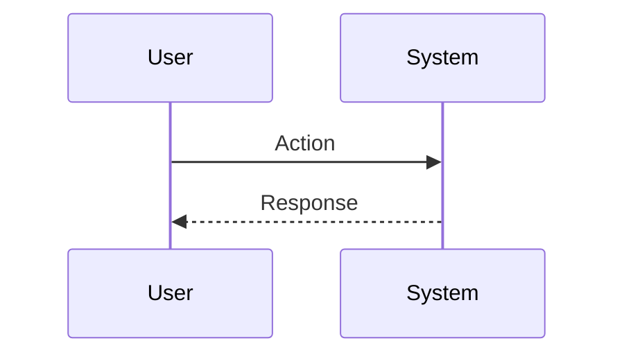

<!-- markdownlint-disable MD009 MD010 MD013 MD022 MD028 MD032 MD033 MD034 MD036 MD037 MD039 MD041 MD060 -->

[ 🇫🇷 Version Française ](./README.fr.md)

# QKD OT Guardian

> **Executive Summary:** A quantum key distribution (QKD) and post-quantum cryptography (PQC) network orchestrator acting as a security overlay (Zero-Trust hardware gateway) placed in front of existing OT networks without modifying the end terminals.

---

## 1. Visual Overview & Wow Effect

## 2. Contrarian Thesis (Peter Thiel Style)

**Popular Belief:** General AI solutions can solve this problem.

**Hidden Truth:** Traditional security VPN/SaaS add too much latency for real-time industrial control (which requires response times < 5ms) and rely on classic cryptography (RSA/ECC) which is destined to become obsolete.

## 3. Problem & Target Market

**Business Model:** B2B

**Target Audience:** Critical infrastructure operators (electricity networks, nuclear power plants, wastewater treatment plants) (CISO, OT Security Managers).

**Urgent Pain Point:** Operational networks (OT/ICS) use legacy industrial protocols vulnerable to “Store Now, Decrypt Later” attacks by future quantum computers. Hardware updating of PLCs is financially and physically impossible on a large scale.

## 4. Technical Architecture & Infrastructure

## 5. Business Model & Financial Viability

| Metric                 | Value                           |
| ---------------------- | ------------------------------- |
| Pricing Structure      | SaaS subscription               |
| 12-Month Target        | 10 customers                    |
| Revenue Formula        | 10 clients \* 10k€/year = 100k€ |
| Estimated Gross Margin | 80%                             |

## 6. Distribution Engine & Moat

**Acquisition Strategy:** B2B direct sales

**Moat (Defensibility):** PQC (NIST) standardization still in progress, material cost of QKD gateways, need for strict industrial certifications (IEC 62443).

## 7. Detailed Evaluation Grid

| Criterion                   | VC Score (/100) | Market Score (/100) |
| --------------------------- | --------------- | ------------------- |
| Thesis & Monopoly / Urgency | -- / 25         | -- / 25             |
| Moat / LLM Immunity         | -- / 25         | -- / 25             |
| Scalability / UX Friction   | -- / 25         | -- / 25             |
| Unit Economics / ROI        | -- / 25         | -- / 25             |
| **TOTAL**                   | **-- / 100**    | **-- / 100**        |

> **VC Verdict:** Pending evaluation.

> **Market Verdict:** Pending evaluation.
