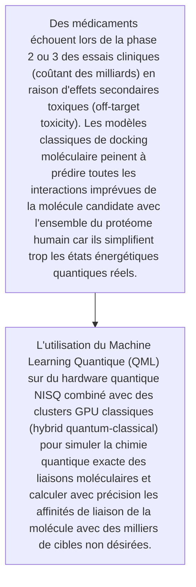
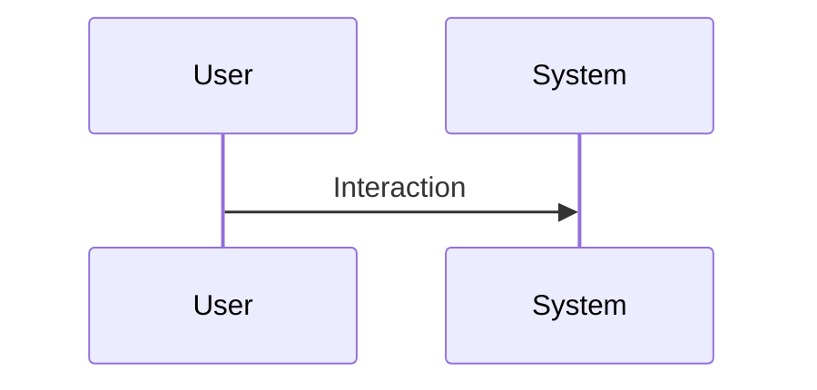

<!-- markdownlint-disable MD009 MD010 MD013 MD022 MD028 MD032 MD033 MD034 MD036 MD037 MD039 MD041 MD060 -->

[ 🇬🇧 English Version ](./README.md)

# QML Off-Target Toxicity

> **Résumé exécutif :** L'utilisation du Machine Learning Quantique (QML) sur du hardware quantique NISQ combiné avec des clusters GPU classiques (hybrid quantum-classical) pour simuler la chimie quantique exacte des liaisons moléculaires et calculer avec précision les affinités de liaison de la molécule avec des milliers de cibles non désirées.

---

## 1. Aperçu visuel & Effet Wahou

## 2. La thèse contrariante (Peter Thiel Style)

- **La croyance populaire :** Les simulations de dynamique moléculaire classiques rencontrent un mur de calcul exponentiel pour évaluer la mécanique quantique (équation de Schrödinger) des grandes molécules. Un LLM ne peut pas "deviner" l'énergie de liaison exacte d'un repliement protéique; cela nécessite une simulation physique au niveau subatomique.
- **La vérité cachée :** L'utilisation du Machine Learning Quantique (QML) sur du hardware quantique NISQ combiné avec des clusters GPU classiques (hybrid quantum-classical) pour simuler la chimie quantique exacte des liaisons moléculaires et calculer avec précision les affinités de liaison de la molécule avec des milliers de cibles non désirées.

## 3. Le problème & La cible

- **Modèle économique :** B2B
- **Cible précise :** Grandes entreprises pharmaceutiques (Big Pharma), biotechs spécialisées dans la découverte de médicaments, organismes de réglementation (FDA, EMA).
- **La douleur urgente :** Des médicaments échouent lors de la phase 2 ou 3 des essais cliniques (coûtant des milliards) en raison d'effets secondaires toxiques (off-target toxicity). Les modèles classiques de docking moléculaire peinent à prédire toutes les interactions imprévues de la molécule candidate avec l'ensemble du protéome humain car ils simplifient trop les états énergétiques quantiques réels.

## 4. Architecture technique & Plomberie

## 5. Modèle économique & Viabilité financière

| Métrique                    | Valeur                                                          |
| --------------------------- | --------------------------------------------------------------- |
| Structure de prix           | [Prix / Modèle d'abonnement / Commission]                       |
| Objectif 12 mois            | [Nombre exact de clients/utilisateurs/transactions nécessaires] |
| Calcul du CA (Target 100k€) | [Formule mathématique exacte]                                   |
| Marge brute estimée         | [Marge en %]                                                    |

## 6. Moteur de distribution & Fossé défensif (Moat)

- **Stratégie d'acquisition :** [Viralité B2C, réseau C2C, acquisition B2B directe, adhésion dev M2M]
- **Moat (Barrière à l'entrée) :** Le matériel quantique actuel (NISQ) est encore bruyant et limité en nombre de qubits logiques, incertitude sur le moment où l'avantage quantique pratique sera atteint pour ce problème précis, temps de R&D très long.

## 7. Grille d'évaluation détaillée

| Critère                           | Score VC (/100) | Score Terrain (/100) |
| --------------------------------- | --------------- | -------------------- |
| Thèse & Monopole / Urgence        | 24 / 25         | 25 / 25              |
| Moat / Résistance aux LLM natifs  | 23 / 25         | 24 / 25              |
| Scalabilité / Friction d'adoption | 24 / 25         | 14 / 25              |
| Unit Economics / ROI direct       | 25 / 25         | 20 / 25              |
| **TOTAL**                         | 96 / 100        | **83 / 100**         |

> **Verdict VC :** QML Off-Target Toxicity s'attaque au goulet d'étranglement le plus coûteux du développement de médicaments. La barrière technologique à l'entrée est immense, créant un fossé défensif quasi insurmontable face aux IA classiques. Avec un pouvoir de fixation des prix illimité pour une solution éprouvée, c'est un cas d'école de monopole deep tech.
> **Verdict Terrain :** Forte urgence et valeur évidente pour la cible. La résistance aux LLM est élevée grâce à une intégration matérielle ou physique forte. Malgré quelques frictions d'adoption, la monétisation B2B est très claire.
