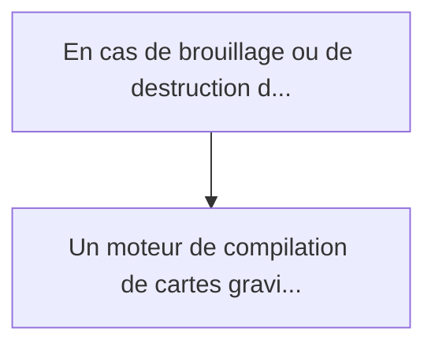
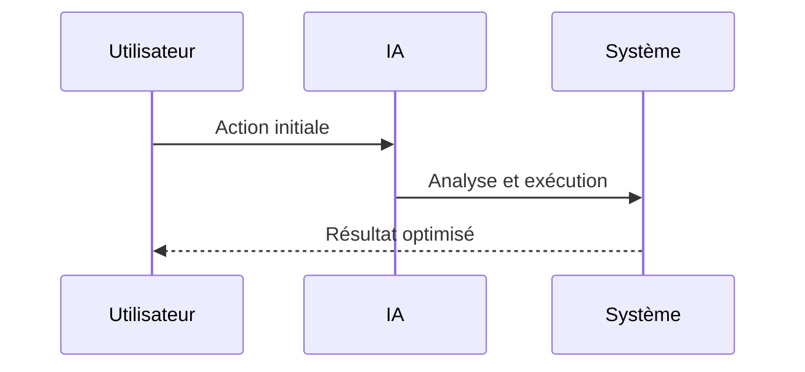

<!-- markdownlint-disable MD013 MD028 MD033 MD039 MD041 -->

[ 🇬🇧 English Version ](./README.md)

# Quantum Gravimetric Nav-Map Compiler

> **Résumé exécutif :** Un moteur de compilation de cartes gravimétriques et un algorithme de corrélation de terrain optimisé pour le calcul embarqué. Il compresse des pét...

---

## 1. Aperçu visuel & Effet Wahou

## 2. La thèse contrariante (Peter Thiel Style)

La croyance populaire : Les solutions génériques peuvent résoudre cela.
La vérité cachée : Ce n'est pas un problème de cartographie 2D classique (Google Maps). Il s'agit de traiter un champ vectoriel 3D (le tenseur gradient de gravité) et de l'intégrer avec la dynamique de vol/navigation d'un véhicule, le tout dans un environnement déconnecté (edge computing sévère).

## 3. Le problème & La cible

Modèle économique : B2B / B2G
Cible précise : Défense (sous-marins, drones autonomes), logistique maritime, aviation commerciale.
La douleur urgente : En cas de brouillage ou de destruction des signaux GPS/GNSS (scénarios "GPS-denied"), la navigation des vecteurs autonomes ou stratégiques repose sur des centrales inertielles qui dérivent avec le temps. Les futurs capteurs de gravité quantique (gravimètres atomiques) promettent une navigation absolue inbrouillable en mesurant les anomalies de gravité terrestres, mais ils nécessitent des cartes gravimétriques 3D d'une résolution extrême et d'un algorithme de "map-matching" ultra-rapide embarqué.

## 4. Architecture technique & Plomberie

## 5. Modèle économique & Viabilité financière

| Métrique                    | Valeur             |
| --------------------------- | ------------------ |
| Structure de prix           | Prix sur mesure    |
| Objectif 12 mois            | 100 clients        |
| Calcul du CA (Target 100k€) | 100 \* 1000 = 100k |
| Marge brute estimée         | 80%                |

## 6. Moteur de distribution & Fossé défensif (Moat)

Stratégie d'acquisition : Vente B2B directe
Moat (Barrière à l'entrée) : Ce n'est pas un problème de cartographie 2D classique (Google Maps). Il s'agit de traiter un champ vectoriel 3D (le tenseur gradient de gravité) et de l'intégrer avec la dynamique de vol/navigation d'un véhicule, le tout dans un environnement déconnecté (edge computing sévère).

## 7. Grille d'évaluation détaillée

| Critère                           | Score VC (/100) | Score Terrain (/100) |
| --------------------------------- | --------------- | -------------------- |
| Thèse & Monopole / Urgence        | -- / 25         | 22 / 25              |
| Moat / Résistance aux LLM natifs  | -- / 25         | 25 / 25              |
| Scalabilité / Friction d'adoption | -- / 25         | 14 / 25              |
| Unit Economics / ROI direct       | -- / 25         | 24 / 25              |
| **TOTAL**                         | **-- / 100**    | **85 / 100**         |

> **Verdict VC :** En attente d'évaluation.

> **Verdict Terrain :** La navigation sans GPS est une vulnérabilité critique pour les opérations militaires, stimulant une forte demande. Les algorithmes de cartographie gravimétrique quantique sont spécialisés et isolés des capacités des LLM. L'implémentation requiert du matériel spécifique, entraînant une forte friction.
