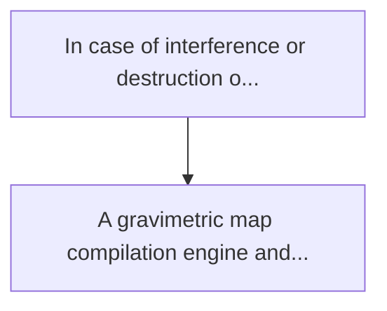
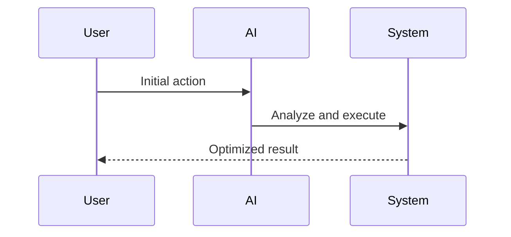

<!-- markdownlint-disable MD013 MD028 MD033 MD039 MD041 -->

[ 🇫🇷 Version Française ](./README.fr.md)

# Quantum gravimetric nav-map compiler

> **Executive Summary:** A gravimetric map compilation engine and a field correlation algorithm optimized for on-board calculation. he's compressing pet...

---

## 1. Visual Overview & Wow Effect

## 2. Contrarian Thesis (Peter Thiel Style)

Popular Belief: Generic solutions can solve this.
Hidden Truth: This is not a classic 2d mapping problem (google maps). this involves processing a 3d vector field (the gravity gradient tensor) and integrating it with the flight/navigation dynamics of a vehicle, all in a disconnected environment (severe edge computing).

## 3. Problem & Target Market

Business Model: B2B / B2G
Target Audience: Defence (submarines, autonomous drones), maritime logistics, commercial aviation.
Urgent Pain Point: In case of interference or destruction of gps/gnss signals (scenarios "gps-denied"), navigation of autonomous or strategic vectors is based on inertial power stations that drift over time. future quantum gravity sensors (atomic gravimeters) promise unbreakable absolute navigation by measuring terrestrial gravity anomalies, but require 3d gravimetric maps with extreme resolution and ultra-fast "map-matching" algorithm.

## 4. Technical Architecture & Infrastructure

## 5. Business Model & Financial Viability

| Metric                 | Value              |
| ---------------------- | ------------------ |
| Pricing Structure      | Custom Pricing     |
| 12-Month Target        | 100 customers      |
| Revenue Formula        | 100 \* 1000 = 100k |
| Estimated Gross Margin | 80%                |

## 6. Distribution Engine & Moat

Acquisition Strategy: Direct B2B Sales
Moat (Defensibility): This is not a classic 2d mapping problem (google maps). this involves processing a 3d vector field (the gravity gradient tensor) and integrating it with the flight/navigation dynamics of a vehicle, all in a disconnected environment (severe edge computing).

## 7. Detailed Evaluation Grid

| Criterion                   | VC Score (/100) | Market Score (/100) |
| --------------------------- | --------------- | ------------------- |
| Thesis & Monopoly / Urgency | -- / 25         | -- / 25             |
| Moat / LLM Immunity         | -- / 25         | -- / 25             |
| Scalability / UX Friction   | -- / 25         | -- / 25             |
| Unit Economics / ROI        | -- / 25         | -- / 25             |
| **TOTAL**                   | **-- / 100**    | **-- / 100**        |

> **VC Verdict:** Pending evaluation.

> **Market Verdict:** Pending evaluation.
