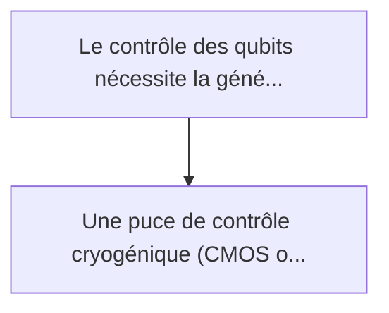
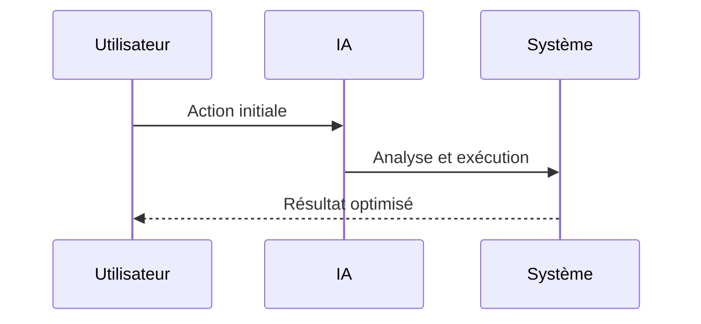

<!-- markdownlint-disable MD013 MD028 MD033 MD039 MD041 -->

[🇬🇧 English Version](./README.md)

# Quantum Cryo-RL Controller

> **Résumé exécutif :** Une puce de contrôle cryogénique (CMOS opérant à 4 Kelvin) intégrant un algorithme d'Apprentissage par Renforcement (RL). Ce contrôleur RL embarqué...

---

## 1. Aperçu visuel & Effet Wahou

## 2. La thèse contrariante (Peter Thiel Style)

La croyance populaire : Les solutions génériques peuvent résoudre cela.
La vérité cachée : C'est de l'ingénierie mixte cryogénique/hardware/algorithmique. L'algorithme de contrôle doit tourner in situ (à 4K) avec une contrainte de dissipation de puissance stricte (quelques milliwatts max), rendant impossible l'utilisation de serveurs de calcul distants ou d'architectures von Neumann classiques non optimisées.

## 3. Le problème & La cible

Modèle économique : B2B
Cible précise : Fabricants d'ordinateurs quantiques (supraconducteurs, spin qubits), laboratoires de recherche quantique.
La douleur urgente : Le contrôle des qubits nécessite la génération et l'acheminement de milliers de signaux micro-ondes ultra-précis à l'intérieur du cryostat (à des températures proches du zéro absolu, ~10 milliKelvin). Actuellement, l'électronique de contrôle est à température ambiante, et chaque qubit requiert des câbles encombrants, créant un goulot d'étranglement thermique (chaleur par conduction) et spatial ("wiring bottleneck") qui empêche le passage à des millions de qubits.

## 4. Architecture technique & Plomberie

## 5. Modèle économique & Viabilité financière

| Métrique                    | Valeur             |
| --------------------------- | ------------------ |
| Structure de prix           | Prix sur mesure    |
| Objectif 12 mois            | 100 clients        |
| Calcul du CA (Target 100k€) | 100 \* 1000 = 100k |
| Marge brute estimée         | 80%                |

## 6. Moteur de distribution & Fossé défensif (Moat)

Stratégie d'acquisition : Vente B2B directe
Moat (Barrière à l'entrée) : C'est de l'ingénierie mixte cryogénique/hardware/algorithmique. L'algorithme de contrôle doit tourner in situ (à 4K) avec une contrainte de dissipation de puissance stricte (quelques milliwatts max), rendant impossible l'utilisation de serveurs de calcul distants ou d'architectures von Neumann classiques non optimisées.

## 7. Grille d'évaluation détaillée

| Critère                           | Score VC (/100) | Score Terrain (/100) |
| --------------------------------- | --------------- | -------------------- |
| Thèse & Monopole / Urgence        | -- / 25         | -- / 25              |
| Moat / Résistance aux LLM natifs  | -- / 25         | -- / 25              |
| Scalabilité / Friction d'adoption | -- / 25         | -- / 25              |
| Unit Economics / ROI direct       | -- / 25         | -- / 25              |
| **TOTAL**                         | **-- / 100**    | **-- / 100**         |

> **Verdict VC :** En attente d'évaluation.

> **Verdict Terrain :** En attente d'évaluation.
