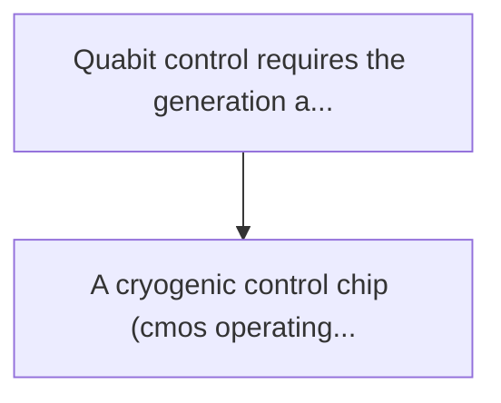
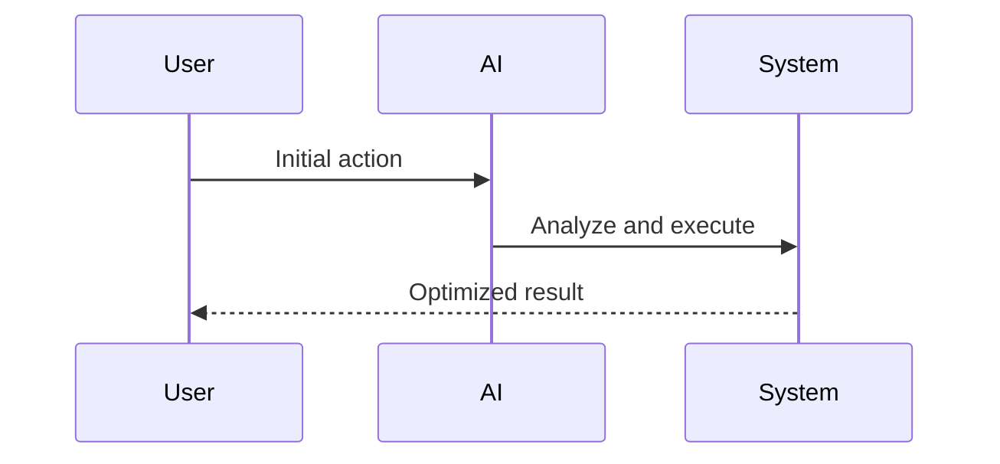

<!-- markdownlint-disable MD013 MD028 MD033 MD039 MD041 -->

[🇫🇷 Version Française](./README.fr.md)

# Quantum cryo-rl controller

> **Executive Summary:** A cryogenic control chip (cmos operating at 4 kelvin) incorporating a reinforcement learning algorithm (rl). this rl controller on board...

---

## 1. Visual Overview & Wow Effect

## 2. Contrarian Thesis (Peter Thiel Style)

Popular Belief: Generic solutions can solve this.
Hidden Truth: This is mixed cryogenic/hardware/algorithmic engineering. the control algorithm must run in situ (at 4k) with a strict power dissipation stress (a few milliwatts max), making it impossible to use remote computing servers or unoptimized classical von neumann architectures.

## 3. Problem & Target Market

Business Model: B2B
Target Audience: Quantum computer manufacturers (supraconductors, spin qubits), quantum research laboratories.
Urgent Pain Point: Quabit control requires the generation and routing of thousands of ultra-precise microwave signals inside the cryostat (at temperatures close to absolute zero, ~10 millikelvin). currently, the control electronics are at room temperature, and every qubit requires bulky cables, creating a thermal (conductive heat) and spatial ("wiring bottleneck") bottleneck that prevents the switch to millions of qubits.

## 4. Technical Architecture & Infrastructure

## 5. Business Model & Financial Viability

| Metric                 | Value              |
| ---------------------- | ------------------ |
| Pricing Structure      | Custom Pricing     |
| 12-Month Target        | 100 customers      |
| Revenue Formula        | 100 \* 1000 = 100k |
| Estimated Gross Margin | 80%                |

## 6. Distribution Engine & Moat

Acquisition Strategy: Direct B2B Sales
Moat (Defensibility): This is mixed cryogenic/hardware/algorithmic engineering. the control algorithm must run in situ (at 4k) with a strict power dissipation stress (a few milliwatts max), making it impossible to use remote computing servers or unoptimized classical von neumann architectures.

## 7. Detailed Evaluation Grid

| Criterion                   | VC Score (/100) | Market Score (/100) |
| --------------------------- | --------------- | ------------------- |
| Thesis & Monopoly / Urgency | -- / 25         | -- / 25             |
| Moat / LLM Immunity         | -- / 25         | -- / 25             |
| Scalability / UX Friction   | -- / 25         | -- / 25             |
| Unit Economics / ROI        | -- / 25         | -- / 25             |
| **TOTAL**                   | **-- / 100**    | **-- / 100**        |

> **VC Verdict:** Pending evaluation.

> **Market Verdict:** Pending evaluation.
