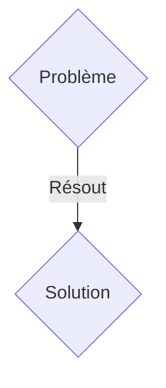
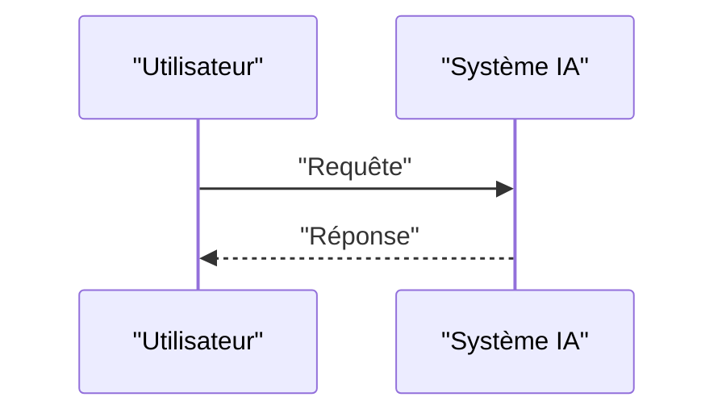

<!-- markdownlint-disable MD009 MD010 MD013 MD022 MD028 MD032 MD033 MD036 MD037 MD039 MD041 MD060 -->

[ 🇬🇧 English Version ](./README.md)

# Quantum Defect Sensor

> **Résumé exécutif :** Une solution B2B ciblant Fonderies de semi-conducteurs (TSMC, Intel, Samsung), fabricants de batteries solides, industrie de précision optique. pour résoudre : À des finesses de gravure sub-nanométriques (ex: 2nm), les défauts cristallins microscopiques ou les impuretés chimiques ruinent les rendements de fabrication (yield) des puces ou provoquent des défaillances de batteries de nouvelle génération. La métrologie classique (microscopie électronique, optique) atteint ses limites physiques de résolution et détruit souvent les échantillons.

---

## 1. Aperçu visuel & Effet Wahou

## 2. La thèse contrariante (Peter Thiel Style)

- **La croyance populaire :** Les solutions génériques suffisent.
- **La vérité cachée :** Un microscope/capteur exploitant les centres NV (Nitrogen-Vacancy) dans le diamant artificiel. Ces "défauts quantiques" agissent comme des qubits ultra-sensibles capables de mesurer des champs magnétiques, électriques et thermiques avec une résolution nanométrique, cartographiant les défauts internes des matériaux de manière non destructive.

## 3. Le problème & La cible

- **Modèle économique :** B2B
- **Cible précise :** Fonderies de semi-conducteurs (TSMC, Intel, Samsung), fabricants de batteries solides, industrie de précision optique.
- **La douleur urgente :** À des finesses de gravure sub-nanométriques (ex: 2nm), les défauts cristallins microscopiques ou les impuretés chimiques ruinent les rendements de fabrication (yield) des puces ou provoquent des défaillances de batteries de nouvelle génération. La métrologie classique (microscopie électronique, optique) atteint ses limites physiques de résolution et détruit souvent les échantillons.

## 4. Architecture technique & Plomberie

Un microscope/capteur exploitant les centres NV (Nitrogen-Vacancy) dans le diamant artificiel. Ces "défauts quantiques" agissent comme des qubits ultra-sensibles capables de mesurer des champs magnétiques, électriques et thermiques avec une résolution nanométrique, cartographiant les défauts internes des matériaux de manière non destructive.

## 5. Modèle économique & Viabilité financière

| Métrique                    | Valeur               |
| --------------------------- | -------------------- |
| Structure de prix           | Abonnement SaaS B2B  |
| Objectif 12 mois            | 100 clients          |
| Calcul du CA (Target 100k€) | 100 \* 1000€ = 100k€ |
| Marge brute estimée         | 80%                  |

## 6. Moteur de distribution & Fossé défensif (Moat)

- **Stratégie d'acquisition :** Vente directe et partenariats stratégiques.
- **Moat (Barrière à l'entrée) :** C'est un pur défi de physique de la matière condensée et de hardware quantique, impliquant des lasers, des champs micro-ondes, et l'interprétation de la décohérence quantique. Aucun logiciel traditionnel ni IA pure ne peut remplacer l'acquisition physique de signaux quantiques pour révéler ces anomalies structurelles.

## 7. Grille d'évaluation détaillée

| Critère                           | Score VC (/100) | Score Terrain (/100) |
| --------------------------------- | --------------- | -------------------- |
| Thèse & Monopole / Urgence        | -- / 25         | -- / 25              |
| Moat / Résistance aux LLM natifs  | -- / 25         | -- / 25              |
| Scalabilité / Friction d'adoption | -- / 25         | -- / 25              |
| Unit Economics / ROI direct       | -- / 25         | -- / 25              |
| TOTAL                             | -- / 100        | -- / 100             |

> **Verdict VC :** En attente d'évaluation.
> **Verdict Terrain :** En attente d'évaluation.
