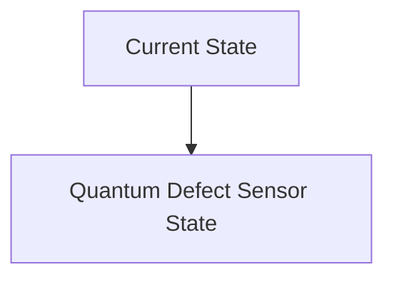
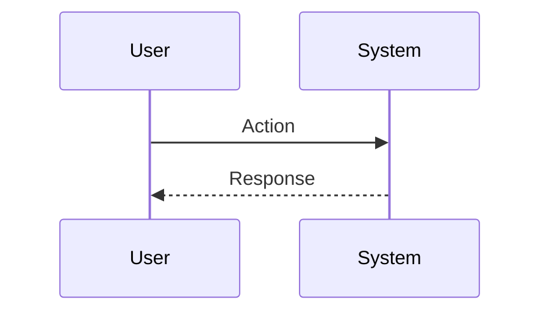

<!-- markdownlint-disable MD009 MD010 MD013 MD022 MD028 MD032 MD033 MD034 MD036 MD037 MD039 MD041 MD060 -->

[ 🇫🇷 Version Française ](./README.fr.md)

# Quantum Defect Sensor

> **Executive Summary:** A microscope/sensor exploiting NV (Nitrogen-Vacancy) centers in artificial diamond. These “quantum defects” act as ultra-sensitive qubits capable of measuring magnetic, electric and thermal fields with nanometer resolution, mapping internal defects in materials non-destructively.

---

## 1. Visual Overview & Wow Effect

## 2. Contrarian Thesis (Peter Thiel Style)

**Popular Belief:** General AI solutions can solve this problem.

**Hidden Truth:** It is a pure condensed matter physics and quantum hardware challenge, involving lasers, microwave fields, and the interpretation of quantum decoherence. No traditional software or pure AI can replace the physical acquisition of quantum signals to reveal these structural anomalies.

## 3. Problem & Target Market

**Business Model:** B2B

**Target Audience:** Semiconductor foundries (TSMC, Intel, Samsung), solid-state battery manufacturers, optical precision industry.

**Urgent Pain Point:** At sub-nanometric engraving finenesses (e.g. 2nm), microscopic crystalline defects or chemical impurities ruin chip manufacturing yields or cause failures of new generation batteries. Classic metrology (electron, optical microscopy) reaches its physical limits of resolution and often destroys samples.

## 4. Technical Architecture & Infrastructure

## 5. Business Model & Financial Viability

| Metric                 | Value                           |
| ---------------------- | ------------------------------- |
| Pricing Structure      | SaaS subscription               |
| 12-Month Target        | 10 customers                    |
| Revenue Formula        | 10 clients \* 10k€/year = 100k€ |
| Estimated Gross Margin | 80%                             |

## 6. Distribution Engine & Moat

**Acquisition Strategy:** B2B direct sales

**Moat (Defensibility):** Complexity of manufacturing and miniaturization of the sensor (quantum packaging), very long integration time in industrial metrology chains (which are extremely conservative), and prohibitive hardware development cost.

## 7. Detailed Evaluation Grid

| Criterion                   | VC Score (/100) | Market Score (/100) |
| --------------------------- | --------------- | ------------------- |
| Thesis & Monopoly / Urgency | -- / 25         | -- / 25             |
| Moat / LLM Immunity         | -- / 25         | -- / 25             |
| Scalability / UX Friction   | -- / 25         | -- / 25             |
| Unit Economics / ROI        | -- / 25         | -- / 25             |
| **TOTAL**                   | **-- / 100**    | **-- / 100**        |

> **VC Verdict:** Pending evaluation.

> **Market Verdict:** Pending evaluation.
