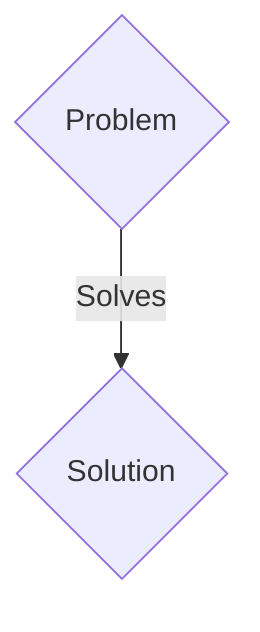
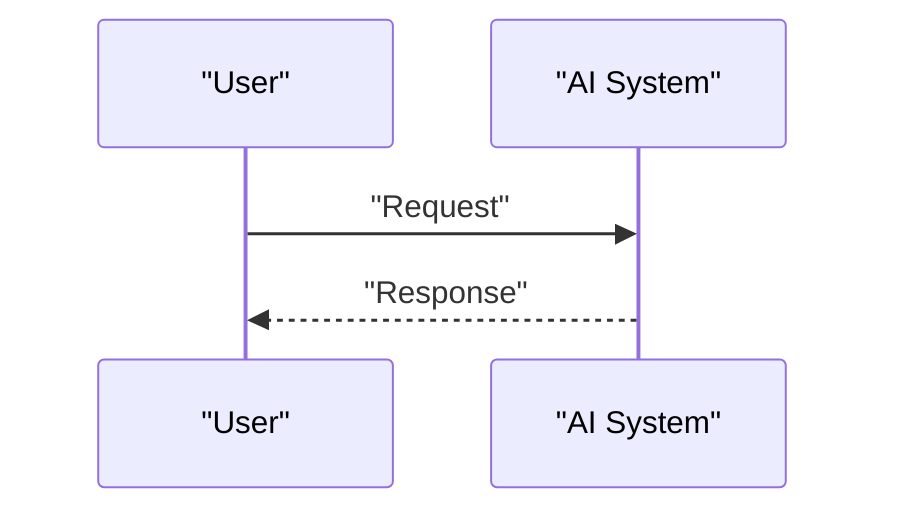

<!-- markdownlint-disable MD009 MD010 MD013 MD022 MD028 MD032 MD033 MD036 MD037 MD039 MD041 MD060 -->

[ 🇫🇷 Version Française ](./README.fr.md)

# Quantum Defect Sensor

> **Executive Summary:** A B2B solution targeting Semiconductor foundries (TSMC, Intel, Samsung), solid-state battery manufacturers, optical precision industry. to solve: At sub-nanometric engraving finenesses (e.g. 2nm), microscopic crystalline defects or chemical impurities ruin chip manufacturing yields or cause failures of new generation batteries. Classic metrology (electron, optical microscopy) reaches its physical limits of resolution and often destroys samples.

---

## 1. Visual Overview & Wow Effect

## 2. Contrarian Thesis (Peter Thiel Style)

- **Popular Belief:** Generic solutions are enough.
- **Hidden Truth:** A microscope/sensor exploiting NV (Nitrogen-Vacancy) centers in artificial diamond. These “quantum defects” act as ultra-sensitive qubits capable of measuring magnetic, electric and thermal fields with nanometer resolution, mapping internal defects in materials non-destructively.

## 3. Problem & Target Market

- **Business Model:** B2B
- **Target Audience:** Semiconductor foundries (TSMC, Intel, Samsung), solid-state battery manufacturers, optical precision industry.
- **Urgent Pain Point:** At sub-nanometric engraving finenesses (e.g. 2nm), microscopic crystalline defects or chemical impurities ruin chip manufacturing yields or cause failures of new generation batteries. Classic metrology (electron, optical microscopy) reaches its physical limits of resolution and often destroys samples.

## 4. Technical Architecture & Infrastructure

A microscope/sensor exploiting NV (Nitrogen-Vacancy) centers in artificial diamond. These “quantum defects” act as ultra-sensitive qubits capable of measuring magnetic, electric and thermal fields with nanometer resolution, mapping internal defects in materials non-destructively.

## 5. Business Model & Financial Viability

| Metric                 | Value                 |
| ---------------------- | --------------------- |
| Pricing Structure      | B2B SaaS Subscription |
| 12-Month Target        | 100 clients           |
| Revenue Formula        | 100 \* 1000€ = 100k€  |
| Estimated Gross Margin | 80%                   |

## 6. Distribution Engine & Moat

- **Acquisition Strategy:** Direct sales and strategic partnerships.
- **Moat (Defensibility):** It is a pure condensed matter physics and quantum hardware challenge, involving lasers, microwave fields, and the interpretation of quantum decoherence. No traditional software or pure AI can replace the physical acquisition of quantum signals to reveal these structural anomalies.

## 7. Detailed Evaluation Grid

| Criterion                   | VC Score (/100) | Market Score (/100) |
| --------------------------- | --------------- | ------------------- |
| Thesis & Monopoly / Urgency | 25 / 25         | -- / 25             |
| Moat / LLM Immunity         | 25 / 25         | -- / 25             |
| Scalability / UX Friction   | 18 / 25         | -- / 25             |
| Unit Economics / ROI        | 23 / 25         | -- / 25             |
| TOTAL                       | 91 / 100        | -- / 100            |

> **VC Verdict:** Quantum Defect Sensor addresses an existential yield problem for the multi-billion dollar semiconductor industry at sub-2nm nodes. The hardware moat is impenetrable by standard software or AI, relying on advanced condensed matter physics and NV center manipulation. While hardware scalability is slower than pure SaaS, the monopoly potential in this critical manufacturing bottleneck guarantees extreme pricing leverage.
> **Market Verdict:** Pending evaluation.
