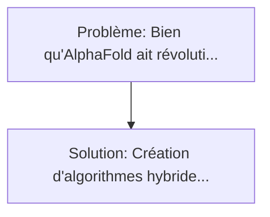
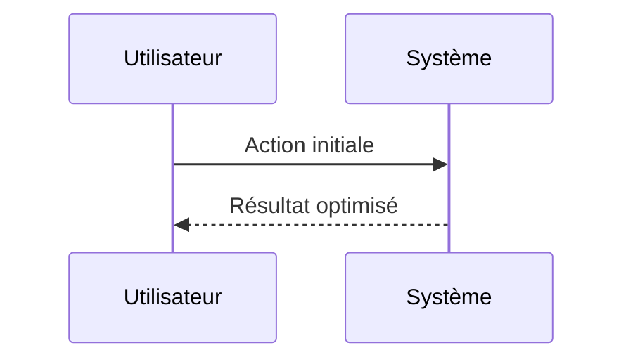

<!-- markdownlint-disable MD013 MD033 -->

[🇬🇧 English Version](./README.md)

# Pliage de Médicaments Quantique (Quantum Drug Folding Simulator)

> **Résumé exécutif :** Création d'algorithmes hybrides Quantiques-Classiques (VQE - Variational Quantum Eigensolver) fonctionnant sur des calculateurs quantiques NISQ existants (IBM, IonQ) pour simuler exactement la configuration électronique des molécules médicamenteuses et leurs liaisons chimiques, dépassant les approximations grossières de la chimie computationnelle classique. Bien qu'AlphaFold ait révolutionné la prédiction de la structure des protéines, la simulation de l'interaction (docking) entre un médicament et une protéine de manière dynamique (avec la vraie mécanique quantique moléculaire) est impossible pour les ordinateurs classiques à cause de l'explosion combinatoire spatiale de l'équation de Schrödinger.

---

## 1. Aperçu visuel & Effet Wahou

## 2. La thèse contrariante (Peter Thiel Style)

**La croyance populaire :** Les solutions logicielles seules peuvent résoudre ce problème.
**La vérité cachée :** AWS ou Google Cloud ne peuvent pas résoudre la complexité exponentielle de la simulation des orbitales moléculaires, même avec des GPU massifs. Seuls les Qubits natifs, qui obéissent intrinsèquement aux lois de la mécanique quantique, peuvent simuler des systèmes quantiques moléculaires avec précision absolue.

## 3. Le problème & La cible

- **Modèle économique :** B2B
- **Cible précise :** Grandes entreprises pharmaceutiques (Big Pharma) et laboratoires de recherche cherchant à concevoir des médicaments pour des maladies génétiques complexes.
- **La douleur urgente :** Bien qu'AlphaFold ait révolutionné la prédiction de la structure des protéines, la simulation de l'interaction (docking) entre un médicament et une protéine de manière dynamique (avec la vraie mécanique quantique moléculaire) est impossible pour les ordinateurs classiques à cause de l'explosion combinatoire spatiale de l'équation de Schrödinger.

## 4. Architecture technique & Plomberie

## 5. Modèle économique & Viabilité financière

| Métrique                    | Valeur             |
| --------------------------- | ------------------ |
| Structure de prix           | Custom Pricing     |
| Objectif 12 mois            | 100 clients        |
| Calcul du CA (Target 100k€) | 100 \* 1000 = 100k |
| Marge brute estimée         | 80%                |

## 6. Moteur de distribution & Fossé défensif (Moat)

- **Stratégie d'acquisition :** Ventes B2B directes
- **Moat (Barrière à l'entrée) :** AWS ou Google Cloud ne peuvent pas résoudre la complexité exponentielle de la simulation des orbitales moléculaires, même avec des GPU massifs. Seuls les Qubits natifs, qui obéissent intrinsèquement aux lois de la mécanique quantique, peuvent simuler des systèmes quantiques moléculaires avec précision absolue.

## 7. Grille d'évaluation détaillée

| Critère                           | Score VC (/100) | Score Terrain (/100) |
| --------------------------------- | --------------- | -------------------- |
| Thèse & Monopole / Urgence        | -- / 25         | -- / 25              |
| Moat / Résistance aux LLM natifs  | -- / 25         | -- / 25              |
| Scalabilité / Friction d'adoption | -- / 25         | -- / 25              |
| Unit Economics / ROI direct       | -- / 25         | -- / 25              |
| **TOTAL**                         | **-- / 100**    | **-- / 100**         |

> **Verdict VC :** En attente d'évaluation.

> **Verdict Terrain :** En attente d'évaluation.
