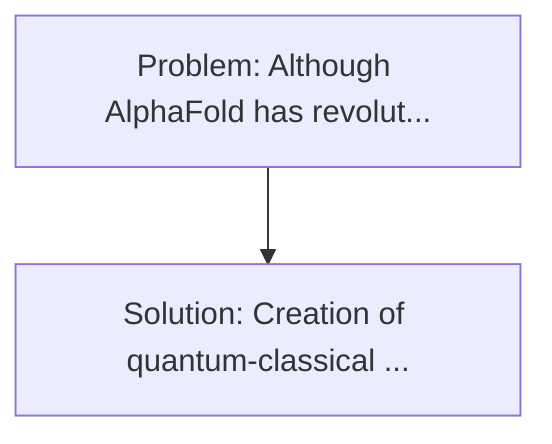
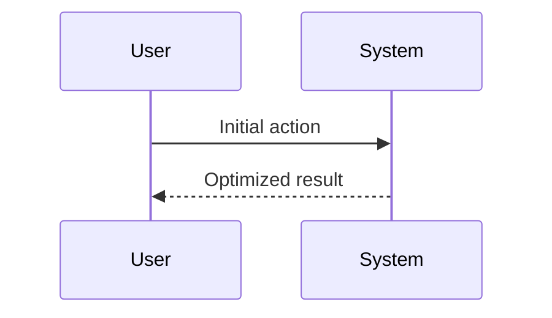

<!-- markdownlint-disable MD013 MD033 -->

[🇫🇷 Version Française](./README.fr.md)

# Quantum Drug Folding Simulator

> **Executive Summary:** Creation of quantum-classical hybrid algorithms (VQE - Variational Quantum Eigensolver) operating on existing NISQ quantum calculators (IBM, IonQ) to simulate exactly the electronic configuration of drug molecules and their chemical bonds, exceeding the coarse approximations of classical computational chemistry. Although AlphaFold has revolutionized the prediction of protein structure, the simulation of the interaction (docking) between a drug and a protein in a dynamic way (with true molecular quantum mechanics) is impossible for conventional computers because of the spatial combinatorial explosion of the Schrödinger equation.

---

## 1. Visual Overview & Wow Effect

## 2. Contrarian Thesis (Peter Thiel Style)

**Popular Belief:** Generic software solutions can solve this.
**Hidden Truth:** AWS or Google Cloud cannot solve the exponential complexity of molecular orbital simulation, even with massive GPUs. Only native Qubits, which obey the laws of quantum mechanics inherently, can simulate molecular quantum systems with absolute precision.

## 3. Problem & Target Market

- **Business Model:** B2B
- **Target Audience:** Major pharmaceutical companies (Big Pharma) and research laboratories seeking to design drugs for complex genetic diseases.
- **Urgent Pain Point:** Although AlphaFold has revolutionized the prediction of protein structure, the simulation of the interaction (docking) between a drug and a protein in a dynamic way (with true molecular quantum mechanics) is impossible for conventional computers because of the spatial combinatorial explosion of the Schrödinger equation.

## 4. Technical Architecture & Infrastructure

## 5. Business Model & Financial Viability

| Metric                 | Value              |
| ---------------------- | ------------------ |
| Pricing Structure      | Custom Pricing     |
| 12-Month Target        | 100 customers      |
| Revenue Formula        | 100 \* 1000 = 100k |
| Estimated Gross Margin | 80%                |

## 6. Distribution Engine & Moat

- **Acquisition Strategy:** Direct B2B Sales
- **Moat (Defensibility):** AWS or Google Cloud cannot solve the exponential complexity of molecular orbital simulation, even with massive GPUs. Only native Qubits, which obey the laws of quantum mechanics inherently, can simulate molecular quantum systems with absolute precision.

## 7. Detailed Evaluation Grid

| Criterion                   | VC Score (/100) | Market Score (/100) |
| --------------------------- | --------------- | ------------------- |
| Thesis & Monopoly / Urgency | -- / 25         | -- / 25             |
| Moat / LLM Immunity         | -- / 25         | -- / 25             |
| Scalability / UX Friction   | -- / 25         | -- / 25             |
| Unit Economics / ROI        | -- / 25         | -- / 25             |
| **TOTAL**                   | **-- / 100**    | **-- / 100**        |

> **VC Verdict:** Pending evaluation.

> **Market Verdict:** Pending evaluation.
