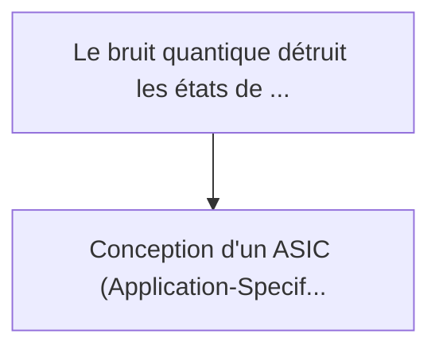
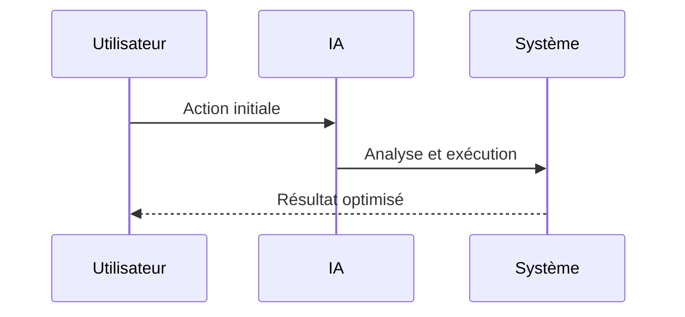

<!-- markdownlint-disable MD013 MD028 MD033 MD039 MD041 -->

[ 🇬🇧 English Version ](./README.md)

# Quantum Error Correction ASIC

> **Résumé exécutif :** Conception d'un ASIC (Application-Specific Integrated Circuit) ultra-basse latence fonctionnant à des températures cryogéniques (4 Kelvin), dédié u...

---

## 1. Aperçu visuel & Effet Wahou

## 2. La thèse contrariante (Peter Thiel Style)

La croyance populaire : Les solutions génériques peuvent résoudre cela.
La vérité cachée : L'approche logicielle CPU/GPU classique est beaucoup trop lente (latence de millisecondes) pour rattraper la décohérence des qubits (microsecondes). Le hardware dédié cryogénique est l'unique solution physique.

## 3. Le problème & La cible

Modèle économique : B2B (Hardware & IP Licensing)
Cible précise : Constructeurs d'ordinateurs quantiques (IBM, Google, startups full-stack), centres de recherche nationaux
La douleur urgente : Le bruit quantique détruit les états de superposition avant qu'un calcul utile ne soit terminé. La correction d'erreurs (QEC - Quantum Error Correction) logicielle classique est trop lente ; si le décodage du syndrome d'erreur prend plus de temps que le temps de cohérence du qubit, l'ordinateur quantique universel (FTQC) est impossible.

## 4. Architecture technique & Plomberie

## 5. Modèle économique & Viabilité financière

| Métrique                    | Valeur             |
| --------------------------- | ------------------ |
| Structure de prix           | Prix sur mesure    |
| Objectif 12 mois            | 100 clients        |
| Calcul du CA (Target 100k€) | 100 \* 1000 = 100k |
| Marge brute estimée         | 80%                |

## 6. Moteur de distribution & Fossé défensif (Moat)

Stratégie d'acquisition : Vente B2B directe
Moat (Barrière à l'entrée) : L'approche logicielle CPU/GPU classique est beaucoup trop lente (latence de millisecondes) pour rattraper la décohérence des qubits (microsecondes). Le hardware dédié cryogénique est l'unique solution physique.

## 7. Grille d'évaluation détaillée

| Critère                           | Score VC (/100) | Score Terrain (/100) |
| --------------------------------- | --------------- | -------------------- |
| Thèse & Monopole / Urgence        | 22 / 25         | -- / 25              |
| Moat / Résistance aux LLM natifs  | 25 / 25         | -- / 25              |
| Scalabilité / Friction d'adoption | 16 / 25         | -- / 25              |
| Unit Economics / ROI direct       | 20 / 25         | -- / 25              |
| **TOTAL**                         | **83 / 100**    | **-- / 100**         |

> **Verdict VC :** Cet ASIC cryogénique à latence ultra-faible s'attaque au goulot d'étranglement fondamental de la suprématie quantique : la vitesse de décohérence. En déplaçant la correction d'erreurs du logiciel vers le matériel dédié, il crée un fossé physique massif et insurmontable contre les avancées logicielles génériques. La mise à l'échelle sera lente et gourmande en capitaux, mais l'obtention d'un monopole sur l'infrastructure de base de l'informatique quantique tolérante aux pannes offre des rendements générationnels inégalés.

> **Verdict Terrain :** En attente d'évaluation.
