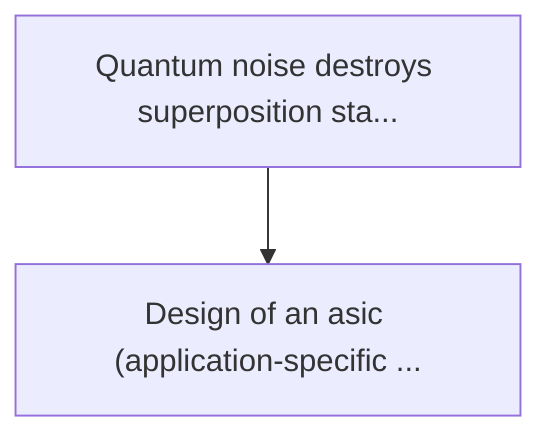
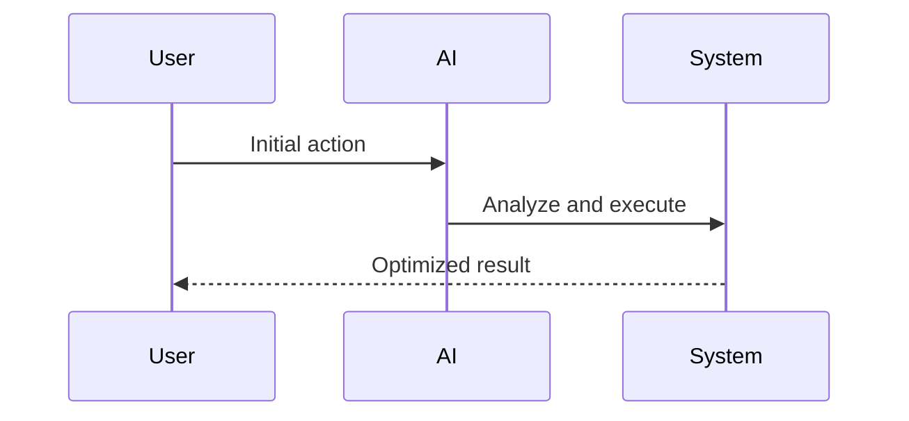

<!-- markdownlint-disable MD013 MD028 MD033 MD039 MD041 -->

[🇫🇷 Version Française](./README.fr.md)

# Quantum error correction asic

> **Executive Summary:** Design of an asic (application-specific integrated circuit) ultra-low latency operating at cryogenic temperatures (4 kelvin), dedicated to...

---

## 1. Visual Overview & Wow Effect

## 2. Contrarian Thesis (Peter Thiel Style)

Popular Belief: Generic solutions can solve this.
Hidden Truth: The classic cpu/gpu software approach is much too slow (millisecond latency) to catch up with the decoherence of qubits (microseconds). cryogenic dedicated hardware is the only physical solution.

## 3. Problem & Target Market

Business Model: B2B (Hardware & IP Licensing)
Target Audience: Quantum computer builders (ibm, google, full-stack startups), national research centres
Urgent Pain Point: Quantum noise destroys superposition states before a useful calculation is completed. error correction (qec - quantum error correction) is too slow; if the decoding of error syndrome takes longer than the consistency time of the qubit, the universal quantum computer (ftqc) is impossible.

## 4. Technical Architecture & Infrastructure

## 5. Business Model & Financial Viability

| Metric                 | Value              |
| ---------------------- | ------------------ |
| Pricing Structure      | Custom Pricing     |
| 12-Month Target        | 100 customers      |
| Revenue Formula        | 100 \* 1000 = 100k |
| Estimated Gross Margin | 80%                |

## 6. Distribution Engine & Moat

Acquisition Strategy: Direct B2B Sales
Moat (Defensibility): The classic cpu/gpu software approach is much too slow (millisecond latency) to catch up with the decoherence of qubits (microseconds). cryogenic dedicated hardware is the only physical solution.

## 7. Detailed Evaluation Grid

| Criterion                   | VC Score (/100) | Market Score (/100) |
| --------------------------- | --------------- | ------------------- |
| Thesis & Monopoly / Urgency | -- / 25         | -- / 25             |
| Moat / LLM Immunity         | -- / 25         | -- / 25             |
| Scalability / UX Friction   | -- / 25         | -- / 25             |
| Unit Economics / ROI        | -- / 25         | -- / 25             |
| **TOTAL**                   | **-- / 100**    | **-- / 100**        |

> **VC Verdict:** Pending evaluation.

> **Market Verdict:** Pending evaluation.
