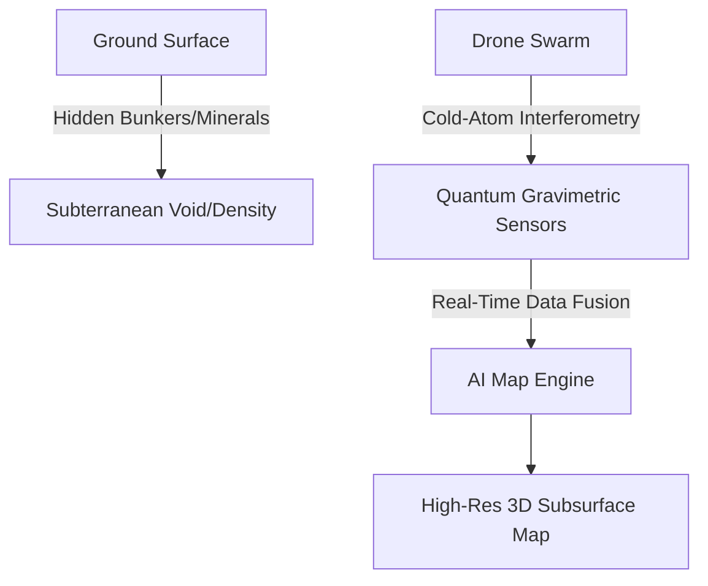
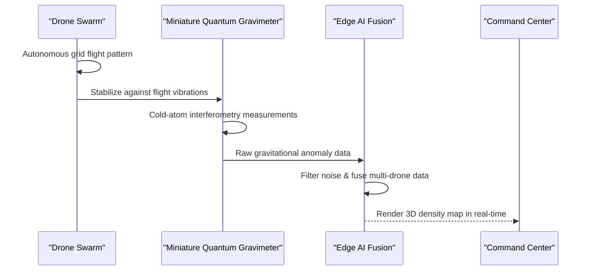

<!-- markdownlint-disable MD009 MD010 MD013 MD022 MD028 MD032 MD033 MD034 MD036 MD037 MD039 MD041 MD060 -->

[ 🇫🇷 Version Française ](./README.fr.md)

# Quantum Gravimetry Drone Swarm

> **Executive Summary:** A swarm of autonomous drones equipped with miniaturized cold-atom quantum gravimeters to instantly and non-invasively map subterranean infrastructure, aquifers, and mineral deposits in high-resolution 3D.

---

## 1. Visual Overview & Wow Effect

## 2. Contrarian Thesis (Peter Thiel Style)

- **Popular Belief:** Mapping the underground requires either physically drilling boreholes, which is destructive and slow, or using ground-penetrating radar, which is inaccurate and severely limited in depth.
- **Hidden Truth:** Quantum physics allows us to measure minute variations in gravity with unprecedented precision. By miniaturizing these sensors and putting them on a drone swarm, we can "see" through solid rock from the air without digging a single hole.

## 3. Problem & Target Market

- **Business Model:** B2B
- **Target Audience:** Geophysical prospecting firms, oil/mining exploration, civil engineering, and defense forces (tunnel detection).
- **Urgent Pain Point:** Mapping the subsurface (invisible infrastructure, aquifers, deposits, bunkers) is extremely expensive, slow, and often physically dangerous. Current geophysical sensors are imprecise and depth-limited.

## 4. Technical Architecture & Infrastructure

## 5. Business Model & Financial Viability

| Metric                     | Value                                         |
| -------------------------- | --------------------------------------------- |
| **Pricing Structure**      | Data-as-a-Service (DaaS) / Survey Contract    |
| **12-Month Target**        | 1-2 major pilot surveys for mining or defense |
| **Revenue Formula**        | 1 Survey Contract \* 100k€                    |
| **Estimated Gross Margin** | ~70% (High CapEx for drones)                  |

## 6. Distribution Engine & Moat

- **Acquisition Strategy:** High-ticket B2B/B2G sales targeting Ministers of Defense and VP Exploration at global mining giants.
- **Moat (Defensibility):** This is a pure quantum hardware challenge. Reducing the size, weight, and power (SWaP) of lasers and magneto-optical traps so they can fly, while compensating for drone vibrations, represents an immense technological barrier that no SaaS or pure AI company can replicate.

## 7. Detailed Evaluation Grid

| Criterion                   | VC Score (/100) | Market Score (/100) |
| --------------------------- | --------------- | ------------------- |
| Thesis & Monopoly / Urgency | -- / 25         | 25 / 25             |
| Moat / LLM Immunity         | -- / 25         | 24 / 25             |
| Scalability / UX Friction   | -- / 25         | 15 / 25             |
| Unit Economics / ROI        | -- / 25         | 22 / 25             |
| **TOTAL**                   | **-- / 100**    | **86 / 100**        |

> **VC Verdict:** Pending evaluation.

> **Market Verdict:** Strong urgency and obvious value for the target market. LLM resistance is high due to strong hardware or physical integration. Despite some adoption friction, B2B monetization is very clear.
