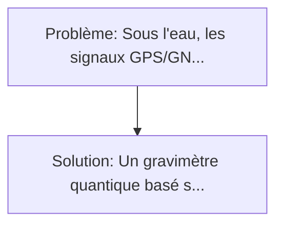
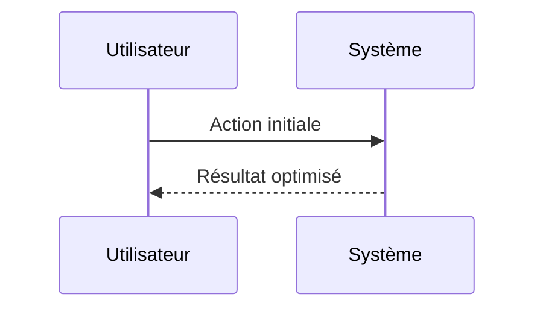

<!-- markdownlint-disable MD013 MD033 -->

[🇬🇧 English Version](./README.md)

# Deep-Sea Quantum Gravimeter

> **Résumé exécutif :** Un gravimètre quantique basé sur l'interférométrie d'atomes froids (Rubidium). Sous l'eau, les signaux GPS/GNSS sont totalement bloqués, et les systèmes de navigation inertielle classiques (gyroscopes laser/fibre) dérivent avec le temps.

---

## 1. Aperçu visuel & Effet Wahou

## 2. La thèse contrariante (Peter Thiel Style)

**La croyance populaire :** Les solutions logicielles seules peuvent résoudre ce problème.
**La vérité cachée :** C'est un hardware quantique extrêmement complexe. Il faut miniaturiser des lasers de refroidissement, des pompes à vide, et des pièges magnéto-optiques (MOT) pour les faire tenir dans un cylindre embarquable sur un AUV, tout en résistant aux vibrations et aux variations thermiques sous-marines.

## 3. Le problème & La cible

- **Modèle économique :** B2B / B2G
- **Cible précise :** Marine militaire (sous-marins), compagnies d'exploration offshore (minerais critiques, énergie), et instituts océanographiques.
- **La douleur urgente :** Sous l'eau, les signaux GPS/GNSS sont totalement bloqués, et les systèmes de navigation inertielle classiques (gyroscopes laser/fibre) dérivent avec le temps. Les sous-marins et AUV (Autonomous Underwater Vehicles) perdent rapidement leur position exacte s'ils ne font pas surface. De plus, cartographier les anomalies de densité sous-marines (gisements, structures tectoniques) nécessite des campagnes sismiques très invasives.

## 4. Architecture technique & Plomberie

## 5. Modèle économique & Viabilité financière

| Métrique                    | Valeur             |
| --------------------------- | ------------------ |
| Structure de prix           | Custom Pricing     |
| Objectif 12 mois            | 100 clients        |
| Calcul du CA (Target 100k€) | 100 \* 1000 = 100k |
| Marge brute estimée         | 80%                |

## 6. Moteur de distribution & Fossé défensif (Moat)

- **Stratégie d'acquisition :** Ventes B2B directes
- **Moat (Barrière à l'entrée) :** C'est un hardware quantique extrêmement complexe. Il faut miniaturiser des lasers de refroidissement, des pompes à vide, et des pièges magnéto-optiques (MOT) pour les faire tenir dans un cylindre embarquable sur un AUV, tout en résistant aux vibrations et aux variations thermiques sous-marines.

## 7. Grille d'évaluation détaillée

| Critère                           | Score VC (/100) | Score Terrain (/100) |
| --------------------------------- | --------------- | -------------------- |
| Thèse & Monopole / Urgence        | -- / 25         | -- / 25              |
| Moat / Résistance aux LLM natifs  | -- / 25         | -- / 25              |
| Scalabilité / Friction d'adoption | -- / 25         | -- / 25              |
| Unit Economics / ROI direct       | -- / 25         | -- / 25              |
| **TOTAL**                         | **-- / 100**    | **-- / 100**         |

> **Verdict VC :** En attente d'évaluation.

> **Verdict Terrain :** En attente d'évaluation.
