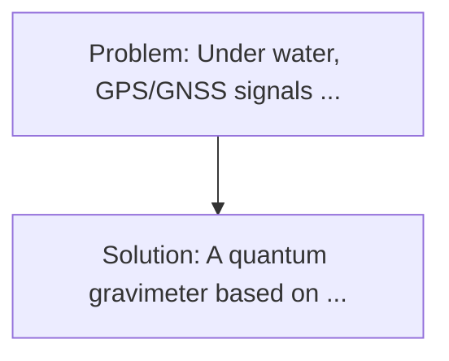
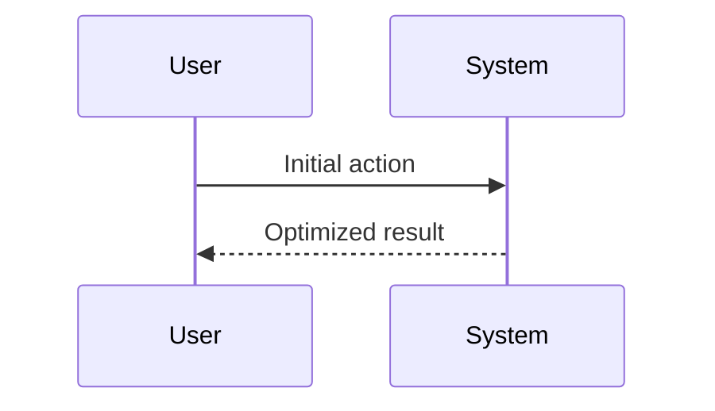

<!-- markdownlint-disable MD013 MD033 -->

[🇫🇷 Version Française](./README.fr.md)

# Deep-Sea Quantum Gravimeter

> **Executive Summary:** A quantum gravimeter based on the interferometry of cold atoms (Rubidium). Under water, GPS/GNSS signals are completely blocked, and conventional inertial navigation systems (laser/fibre gyroscopes) drift over time.

---

## 1. Visual Overview & Wow Effect

## 2. Contrarian Thesis (Peter Thiel Style)

**Popular Belief:** Generic software solutions can solve this.
**Hidden Truth:** It's an extremely complex quantum hardware. Cooling lasers, vacuum pumps, and magneto-optical traps (MOTs) must be miniaturized to hold them in an inboardable cylinder on an AVV, while resisting vibration and underwater thermal variations.

## 3. Problem & Target Market

- **Business Model:** B2B / B2G
- **Target Audience:** Navy (submarines), offshore exploration companies (critical mines, energy), and oceanographic institutes.
- **Urgent Pain Point:** Under water, GPS/GNSS signals are completely blocked, and conventional inertial navigation systems (laser/fibre gyroscopes) drift over time. The submarines and AUV (Autonomous Underwater Vehicles) quickly lose their exact position if they do not surface. In addition, mapping underwater density anomalies (gifts, tectonic structures) requires highly invasive seismic campaigns.

## 4. Technical Architecture & Infrastructure

## 5. Business Model & Financial Viability

| Metric                 | Value              |
| ---------------------- | ------------------ |
| Pricing Structure      | Custom Pricing     |
| 12-Month Target        | 100 customers      |
| Revenue Formula        | 100 \* 1000 = 100k |
| Estimated Gross Margin | 80%                |

## 6. Distribution Engine & Moat

- **Acquisition Strategy:** Direct B2B Sales
- **Moat (Defensibility):** It's an extremely complex quantum hardware. Cooling lasers, vacuum pumps, and magneto-optical traps (MOTs) must be miniaturized to hold them in an inboardable cylinder on an AVV, while resisting vibration and underwater thermal variations.

## 7. Detailed Evaluation Grid

| Criterion                   | VC Score (/100) | Market Score (/100) |
| --------------------------- | --------------- | ------------------- |
| Thesis & Monopoly / Urgency | -- / 25         | -- / 25             |
| Moat / LLM Immunity         | -- / 25         | -- / 25             |
| Scalability / UX Friction   | -- / 25         | -- / 25             |
| Unit Economics / ROI        | -- / 25         | -- / 25             |
| **TOTAL**                   | **-- / 100**    | **-- / 100**        |

> **VC Verdict:** Pending evaluation.

> **Market Verdict:** Pending evaluation.
