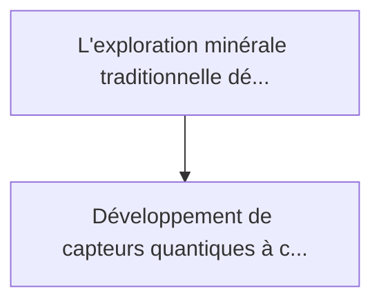
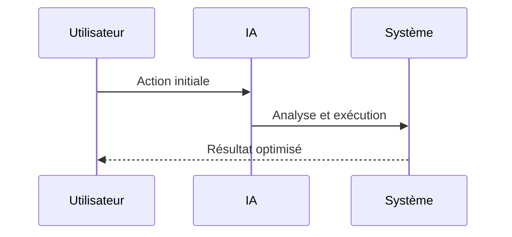

<!-- markdownlint-disable MD013 MD028 MD033 MD039 MD041 -->

[🇬🇧 English Version](./README.md)

# Quantum Magnetometer Exploration

> **Résumé exécutif :** Développement de capteurs quantiques à centres NV (Nitrogen-Vacancy) dans le diamant ou à vapeurs alcalines, montés sur des flottes de drones, capa...

---

## 1. Aperçu visuel & Effet Wahou

## 2. La thèse contrariante (Peter Thiel Style)

La croyance populaire : Les solutions génériques peuvent résoudre cela.
La vérité cachée : Il s'agit d'un problème fondamental de physique de la mesure. Aucun algorithme logiciel ne peut récupérer un signal noyé dans le bruit s'il n'a pas été capté physiquement au départ. Cela nécessite la maîtrise de la physique quantique expérimentale, du hardware de précision et de la cryogénie/miniaturisation.

## 3. Le problème & La cible

Modèle économique : B2B
Cible précise : Entreprises minières de ressources critiques (terres rares, lithium, cobalt), instituts géologiques nationaux, et compagnies d'exploration sous-marine.
La douleur urgente : L'exploration minérale traditionnelle dépend de forages coûteux, destructeurs pour l'environnement, et de relevés géophysiques de faible résolution. Découvrir des gisements profonds ou masqués sous des morts-terrains épais devient exponentiellement plus difficile et cher, ralentissant la transition énergétique.

## 4. Architecture technique & Plomberie

## 5. Modèle économique & Viabilité financière

| Métrique                    | Valeur             |
| --------------------------- | ------------------ |
| Structure de prix           | Prix sur mesure    |
| Objectif 12 mois            | 100 clients        |
| Calcul du CA (Target 100k€) | 100 \* 1000 = 100k |
| Marge brute estimée         | 80%                |

## 6. Moteur de distribution & Fossé défensif (Moat)

Stratégie d'acquisition : Vente B2B directe
Moat (Barrière à l'entrée) : Il s'agit d'un problème fondamental de physique de la mesure. Aucun algorithme logiciel ne peut récupérer un signal noyé dans le bruit s'il n'a pas été capté physiquement au départ. Cela nécessite la maîtrise de la physique quantique expérimentale, du hardware de précision et de la cryogénie/miniaturisation.

## 7. Grille d'évaluation détaillée

| Critère                           | Score VC (/100) | Score Terrain (/100) |
| --------------------------------- | --------------- | -------------------- |
| Thèse & Monopole / Urgence        | -- / 25         | -- / 25              |
| Moat / Résistance aux LLM natifs  | -- / 25         | -- / 25              |
| Scalabilité / Friction d'adoption | -- / 25         | -- / 25              |
| Unit Economics / ROI direct       | -- / 25         | -- / 25              |
| **TOTAL**                         | **-- / 100**    | **-- / 100**         |

> **Verdict VC :** En attente d'évaluation.

> **Verdict Terrain :** En attente d'évaluation.
