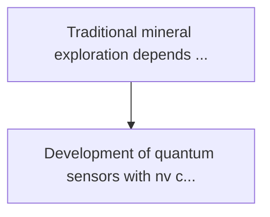
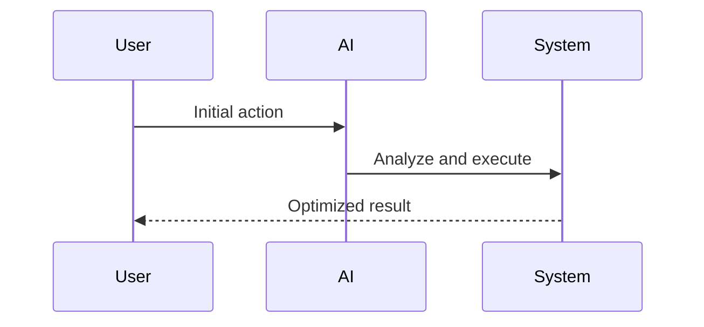

<!-- markdownlint-disable MD013 MD028 MD033 MD039 MD041 -->

[ 🇫🇷 Version Française ](./README.fr.md)

# Quantum magnetometer exploration

> **Executive Summary:** Development of quantum sensors with nv centres (nitrogen-vacancy) in diamond or alkaline vapours, mounted on drone fleets, capa...

---

## 1. Visual Overview & Wow Effect

## 2. Contrarian Thesis (Peter Thiel Style)

Popular Belief: Generic solutions can solve this.
Hidden Truth: This is a fundamental problem of measurement physics. no software algorithm can recover a signal drowned in the noise if it was not physically captured initially. this requires mastering experimental quantum physics, precision hardware and cryogenic/miniaturization.

## 3. Problem & Target Market

Business Model: B2B
Target Audience: Critical resource mining companies (rare lands, lithium, cobalt), national geological institutes, and underwater exploration companies.
Urgent Pain Point: Traditional mineral exploration depends on costly, environmentally destructive drilling and low resolution geophysical surveys. discovering deep or hidden deposits under thick overburdens becomes exponentially more difficult and expensive, slowing the energy transition.

## 4. Technical Architecture & Infrastructure

## 5. Business Model & Financial Viability

| Metric                 | Value              |
| ---------------------- | ------------------ |
| Pricing Structure      | Custom Pricing     |
| 12-Month Target        | 100 customers      |
| Revenue Formula        | 100 \* 1000 = 100k |
| Estimated Gross Margin | 80%                |

## 6. Distribution Engine & Moat

Acquisition Strategy: Direct B2B Sales
Moat (Defensibility): This is a fundamental problem of measurement physics. no software algorithm can recover a signal drowned in the noise if it was not physically captured initially. this requires mastering experimental quantum physics, precision hardware and cryogenic/miniaturization.

## 7. Detailed Evaluation Grid

| Criterion                   | VC Score (/100) | Market Score (/100) |
| --------------------------- | --------------- | ------------------- |
| Thesis & Monopoly / Urgency | -- / 25         | -- / 25             |
| Moat / LLM Immunity         | -- / 25         | -- / 25             |
| Scalability / UX Friction   | -- / 25         | -- / 25             |
| Unit Economics / ROI        | -- / 25         | -- / 25             |
| **TOTAL**                   | **-- / 100**    | **-- / 100**        |

> **VC Verdict:** Pending evaluation.

> **Market Verdict:** Pending evaluation.
