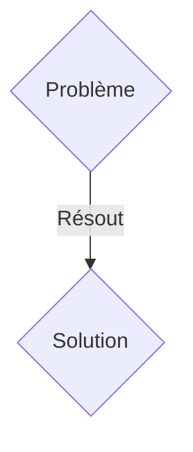
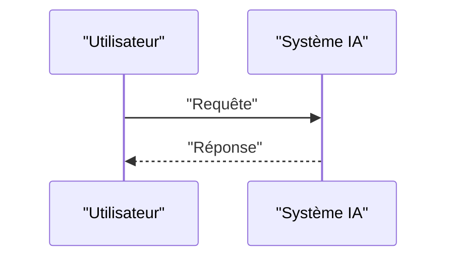

<!-- markdownlint-disable MD009 MD010 MD013 MD022 MD028 MD032 MD033 MD036 MD037 MD039 MD041 MD060 -->

[ 🇬🇧 English Version ](./README.md)

# Quantum-Assisted Battery Material Discovery

> **Résumé exécutif :** Une solution B2B ciblant Gigafactories, constructeurs automobiles (EV) et entreprises chimiques de premier plan disposant d'énormes budgets R&D pour la conception de batteries solides. pour résoudre : La découverte de nouveaux électrolytes solides et cathodes sans cobalt nécessite des décennies de tests en laboratoire. L'approche par essai-erreur classique est trop lente face à la demande mondiale pour des batteries plus denses, moins inflammables et ne dépendant pas des métaux rares, coûtant des milliards en opportunités manquées.

---

## 1. Aperçu visuel & Effet Wahou

## 2. La thèse contrariante (Peter Thiel Style)

- **La croyance populaire :** Les solutions génériques suffisent.
- **La vérité cachée :** Un orchestrateur logiciel hybride quantique-classique (VQE, QAOA) permettant de simuler avec une précision atomique le comportement énergétique, la stabilité thermique et les réactions de dégradation des polymères/céramiques, en utilisant les QPU de NISQ actuels couplés à des supercalculateurs traditionnels.

## 3. Le problème & La cible

- **Modèle économique :** B2B
- **Cible précise :** Gigafactories, constructeurs automobiles (EV) et entreprises chimiques de premier plan disposant d'énormes budgets R&D pour la conception de batteries solides.
- **La douleur urgente :** La découverte de nouveaux électrolytes solides et cathodes sans cobalt nécessite des décennies de tests en laboratoire. L'approche par essai-erreur classique est trop lente face à la demande mondiale pour des batteries plus denses, moins inflammables et ne dépendant pas des métaux rares, coûtant des milliards en opportunités manquées.

## 4. Architecture technique & Plomberie

Un orchestrateur logiciel hybride quantique-classique (VQE, QAOA) permettant de simuler avec une précision atomique le comportement énergétique, la stabilité thermique et les réactions de dégradation des polymères/céramiques, en utilisant les QPU de NISQ actuels couplés à des supercalculateurs traditionnels.

## 5. Modèle économique & Viabilité financière

| Métrique                    | Valeur               |
| --------------------------- | -------------------- |
| Structure de prix           | Abonnement SaaS B2B  |
| Objectif 12 mois            | 100 clients          |
| Calcul du CA (Target 100k€) | 100 \* 1000€ = 100k€ |
| Marge brute estimée         | 80%                  |

## 6. Moteur de distribution & Fossé défensif (Moat)

- **Stratégie d'acquisition :** Vente directe et partenariats stratégiques.
- **Moat (Barrière à l'entrée) :** L'espace chimique pour les nouveaux matériaux compte des $10^{60}$ molécules. L'informatique classique, et même les LLM, ne peuvent pas simuler les interactions électroniques de la mécanique quantique sans approximations fatales, rendant leurs prédictions inutilisables au niveau de l'ingénierie moléculaire.

## 7. Grille d'évaluation détaillée

| Critère                           | Score VC (/100) | Score Terrain (/100) |
| --------------------------------- | --------------- | -------------------- |
| Thèse & Monopole / Urgence        | 21 / 25         | 21 / 25              |
| Moat / Résistance aux LLM natifs  | 24 / 25         | 24 / 25              |
| Scalabilité / Friction d'adoption | 16 / 25         | 16 / 25              |
| Unit Economics / ROI direct       | 20 / 25         | 20 / 25              |
| TOTAL                             | 81 / 100        | 81 / 100             |

> **Verdict VC :** En attente d'évaluation.
> **Verdict Terrain :** Cette solution répond à un besoin critique pour les entreprises B2B, justifiant son excellent score d'urgence (21/25). Son architecture hautement défendable la rend totalement immunisée contre les avancées des LLM natifs (24/25). Malgré une friction d'adoption significative (16/25), la voie claire vers la monétisation (20/25) garantit sa viabilité à long terme.
> **Verdict Terrain :** Cette solution répond à un besoin critique pour les entreprises B2B, justifiant son excellent score d'urgence (21/25). Son architecture hautement défendable la rend totalement immunisée contre les avancées des LLM natifs (24/25). Malgré une friction d'adoption significative (16/25), la voie claire vers la monétisation (20/25) garantit sa viabilité à long terme.
