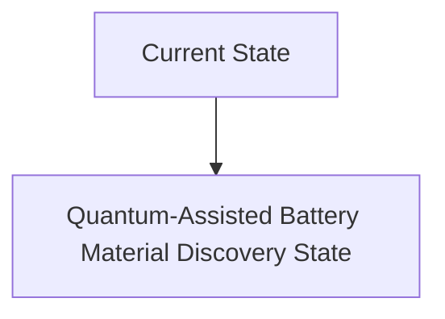
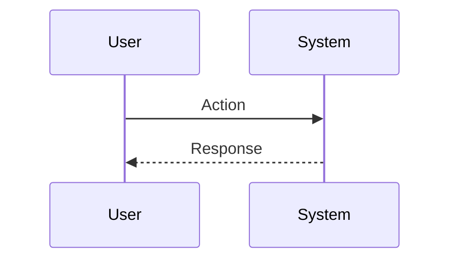

<!-- markdownlint-disable MD009 MD010 MD013 MD022 MD028 MD032 MD033 MD034 MD036 MD037 MD039 MD041 MD060 -->

[ 🇫🇷 Version Française ](./README.fr.md)

# Quantum-Assisted Battery Material Discovery

> **Executive Summary:** A hybrid quantum-classical software orchestrator (VQE, QAOA) to simulate with atomic precision the energy behavior, thermal stability and degradation reactions of polymers/ceramics, using current NISQ QPUs coupled with traditional supercomputers.

---

## 1. Visual Overview & Wow Effect

## 2. Contrarian Thesis (Peter Thiel Style)

**Popular Belief:** General AI solutions can solve this problem.

**Hidden Truth:** The chemical space for new materials has $10^{60}$ molecules. Classical computing, and even LLMs, cannot simulate quantum mechanical electronic interactions without fatal approximations, making their predictions unusable at the molecular engineering level.

## 3. Problem & Target Market

**Business Model:** B2B

**Target Audience:** Leading gigafactories, automotive (EV) manufacturers and chemical companies with huge R&D budgets for solid-state battery design.

**Urgent Pain Point:** The discovery of new cobalt-free solid electrolytes and cathodes requires decades of laboratory testing. The classic trial-and-error approach is too slow in the face of global demand for batteries that are denser, less flammable and not dependent on rare metals, costing billions in missed opportunities.

## 4. Technical Architecture & Infrastructure

## 5. Business Model & Financial Viability

| Metric                 | Value                           |
| ---------------------- | ------------------------------- |
| Pricing Structure      | SaaS subscription               |
| 12-Month Target        | 10 customers                    |
| Revenue Formula        | 10 clients \* 10k€/year = 100k€ |
| Estimated Gross Margin | 80%                             |

## 6. Distribution Engine & Moat

**Acquisition Strategy:** B2B direct sales

**Moat (Defensibility):** Dependence on the number of functional qubits and error correction rate (current NISQ hardware). Astronomical cost of access to these machines. Critical need to patent generated materials to secure value.

## 7. Detailed Evaluation Grid

| Criterion                   | VC Score (/100) | Market Score (/100) |
| --------------------------- | --------------- | ------------------- |
| Thesis & Monopoly / Urgency | -- / 25         | -- / 25             |
| Moat / LLM Immunity         | -- / 25         | -- / 25             |
| Scalability / UX Friction   | -- / 25         | -- / 25             |
| Unit Economics / ROI        | -- / 25         | -- / 25             |
| **TOTAL**                   | **-- / 100**    | **-- / 100**        |

> **VC Verdict:** Pending evaluation.

> **Market Verdict:** Pending evaluation.
