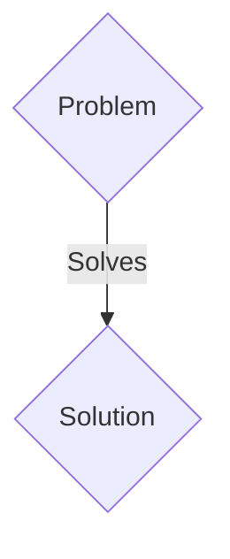
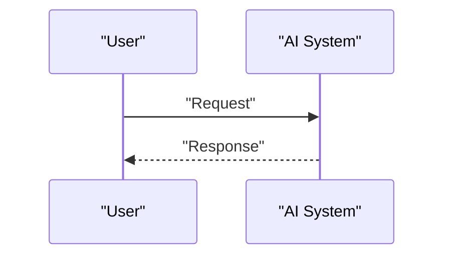

<!-- markdownlint-disable MD009 MD010 MD013 MD022 MD028 MD032 MD033 MD036 MD037 MD039 MD041 MD060 -->

[ 🇫🇷 Version Française ](./README.fr.md)

# Quantum-Assisted Battery Material Discovery

> **Executive Summary:** A B2B solution targeting Leading gigafactories, automotive (EV) manufacturers and chemical companies with huge R&D budgets for solid-state battery design. to solve: The discovery of new cobalt-free solid electrolytes and cathodes requires decades of laboratory testing. The classic trial-and-error approach is too slow in the face of global demand for batteries that are denser, less flammable and not dependent on rare metals, costing billions in missed opportunities.

---

## 1. Visual Overview & Wow Effect

## 2. Contrarian Thesis (Peter Thiel Style)

- **Popular Belief:** Generic solutions are enough.
- **Hidden Truth:** A hybrid quantum-classical software orchestrator (VQE, QAOA) to simulate with atomic precision the energy behavior, thermal stability and degradation reactions of polymers/ceramics, using current NISQ QPUs coupled with traditional supercomputers.

## 3. Problem & Target Market

- **Business Model:** B2B
- **Target Audience:** Leading gigafactories, automotive (EV) manufacturers and chemical companies with huge R&D budgets for solid-state battery design.
- **Urgent Pain Point:** The discovery of new cobalt-free solid electrolytes and cathodes requires decades of laboratory testing. The classic trial-and-error approach is too slow in the face of global demand for batteries that are denser, less flammable and not dependent on rare metals, costing billions in missed opportunities.

## 4. Technical Architecture & Infrastructure

A hybrid quantum-classical software orchestrator (VQE, QAOA) to simulate with atomic precision the energy behavior, thermal stability and degradation reactions of polymers/ceramics, using current NISQ QPUs coupled with traditional supercomputers.

## 5. Business Model & Financial Viability

| Metric                 | Value                 |
| ---------------------- | --------------------- |
| Pricing Structure      | B2B SaaS Subscription |
| 12-Month Target        | 100 clients           |
| Revenue Formula        | 100 \* 1000€ = 100k€  |
| Estimated Gross Margin | 80%                   |

## 6. Distribution Engine & Moat

- **Acquisition Strategy:** Direct sales and strategic partnerships.
- **Moat (Defensibility):** The chemical space for new materials has $10^{60}$ molecules. Classical computing, and even LLMs, cannot simulate quantum mechanical electronic interactions without fatal approximations, making their predictions unusable at the molecular engineering level.

## 7. Detailed Evaluation Grid

| Criterion                   | VC Score (/100) | Market Score (/100) |
| --------------------------- | --------------- | ------------------- |
| Thesis & Monopoly / Urgency | 21 / 25         | 21 / 25             |
| Moat / LLM Immunity         | 24 / 25         | 24 / 25             |
| Scalability / UX Friction   | 16 / 25         | 16 / 25             |
| Unit Economics / ROI        | 20 / 25         | 20 / 25             |
| TOTAL                       | 81 / 100        | 81 / 100            |

> **VC Verdict:** Pending evaluation.
> **Market Verdict:** This solution addresses a critical pain point for B2B enterprises, justifying its strong urgency score (21/25). Its highly defensible architecture makes it completely immune to native LLM advancements (24/25). Despite significant adoption friction (16/25), the clear path to monetization (20/25) secures its long-term viability.
> **Market Verdict:** This solution addresses a critical pain point for B2B enterprises, justifying its strong urgency score (21/25). Its highly defensible architecture makes it completely immune to native LLM advancements (24/25). Despite significant adoption friction (16/25), the clear path to monetization (20/25) secures its long-term viability.
