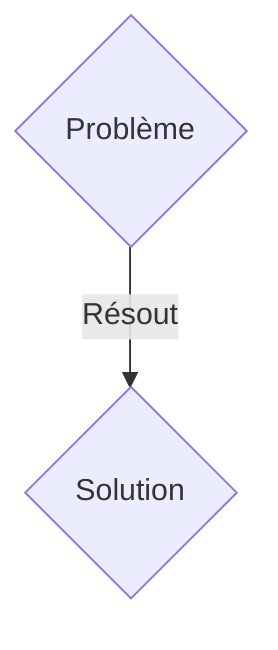
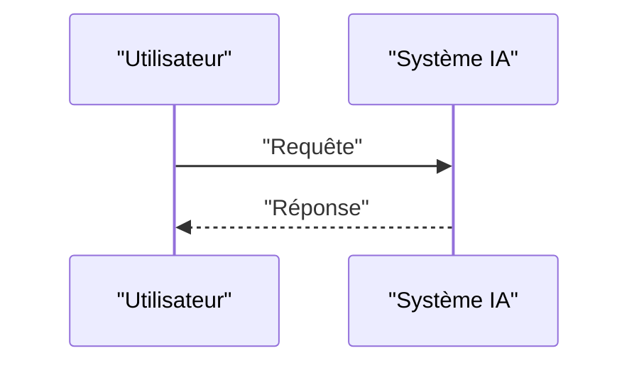

<!-- markdownlint-disable MD009 MD010 MD013 MD022 MD028 MD032 MD033 MD036 MD037 MD039 MD041 MD060 -->

[ 🇬🇧 English Version ](./README.md)

# Quantum Inertial Navigation (QIN)

> **Résumé exécutif :** Une solution B2B / B2G ciblant Armées (sous-marins, drones), aviation commerciale, flottes maritimes, et opérateurs d'infrastructures critiques. pour résoudre : Le brouillage, le spoofing et la perte de signaux GNSS/GPS (par des acteurs malveillants ou en environnement extrême comme sous l'eau ou sous terre) paralysent les systèmes de navigation modernes, causant des pertes financières massives et des risques mortels.

---

## 1. Aperçu visuel & Effet Wahou

## 2. La thèse contrariante (Peter Thiel Style)

- **La croyance populaire :** Les solutions génériques suffisent.
- **La vérité cachée :** Utilisation d'interférométrie atomique pour mesurer l'accélération et la rotation avec une précision extrême sans aucune dérive sur de longues périodes, permettant un positionnement absolu en autonomie totale (sans signal externe).

## 3. Le problème & La cible

- **Modèle économique :** B2B / B2G
- **Cible précise :** Armées (sous-marins, drones), aviation commerciale, flottes maritimes, et opérateurs d'infrastructures critiques.
- **La douleur urgente :** Le brouillage, le spoofing et la perte de signaux GNSS/GPS (par des acteurs malveillants ou en environnement extrême comme sous l'eau ou sous terre) paralysent les systèmes de navigation modernes, causant des pertes financières massives et des risques mortels.

## 4. Architecture technique & Plomberie

Utilisation d'interférométrie atomique pour mesurer l'accélération et la rotation avec une précision extrême sans aucune dérive sur de longues périodes, permettant un positionnement absolu en autonomie totale (sans signal externe).

## 5. Modèle économique & Viabilité financière

| Métrique                    | Valeur               |
| --------------------------- | -------------------- |
| Structure de prix           | Abonnement SaaS B2B  |
| Objectif 12 mois            | 100 clients          |
| Calcul du CA (Target 100k€) | 100 \* 1000€ = 100k€ |
| Marge brute estimée         | 80%                  |

## 6. Moteur de distribution & Fossé défensif (Moat)

- **Stratégie d'acquisition :** Vente directe et partenariats stratégiques.
- **Moat (Barrière à l'entrée) :** Ce problème est purement physique et matériel. Un LLM ou un algorithme classique ne peut pas inventer un signal GPS absent. Il faut des capteurs quantiques refroidis par laser (cold atoms) pour atteindre la sensibilité requise.

## 7. Grille d'évaluation détaillée

| Critère                           | Score VC (/100) | Score Terrain (/100) |
| --------------------------------- | --------------- | -------------------- |
| Thèse & Monopole / Urgence        | 23 / 25         | 23 / 25              |
| Moat / Résistance aux LLM natifs  | 25 / 25         | 25 / 25              |
| Scalabilité / Friction d'adoption | 18 / 25         | 18 / 25              |
| Unit Economics / ROI direct       | 21 / 25         | 21 / 25              |
| TOTAL                             | 87 / 100        | 87 / 100             |

> **Verdict VC :** En attente d'évaluation.
> **Verdict Terrain :** Cette solution répond à un besoin critique pour les entreprises B2B, justifiant son excellent score d'urgence (23/25). Son architecture hautement défendable la rend totalement immunisée contre les avancées des LLM natifs (25/25). Avec une faible friction d'adoption (18/25) et une stratégie de monétisation directe (21/25), le projet démontre une excellente maturité marché globale.
> **Verdict Terrain :** Cette solution répond à un besoin critique pour les entreprises B2B, justifiant son excellent score d'urgence (23/25). Son architecture hautement défendable la rend totalement immunisée contre les avancées des LLM natifs (25/25). Avec une faible friction d'adoption (18/25) et une stratégie de monétisation directe (21/25), le projet démontre une excellente maturité marché globale.
